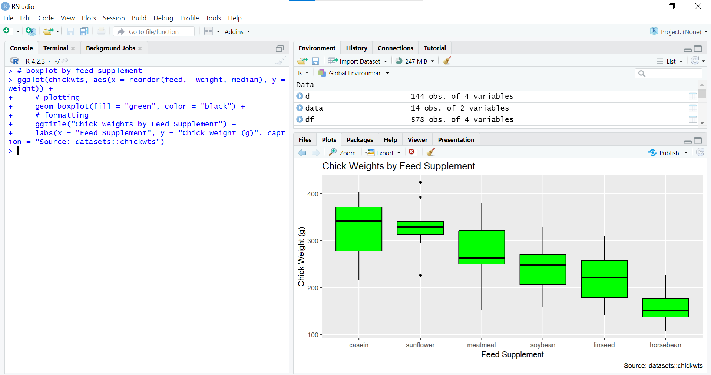



[Go back to the main page](../index.md)

# R

## Index page

---

*Source: own work*

## Introduction

R is a powerful open-source programming language and software environment for statistical computing and graphics. RStudio is an integrated development environment (IDE) for R that provides a user-friendly interface for writing and running R code. Tidyverse is a collection of R packages designed to make data manipulation, visualization, and analysis easier and more intuitive.

These tools provide the flexibility and power needed to handle large and complex data sets, and can be used to create custom analyses, data visualizations, and reports.

With R and tidyverse, it is possible to quickly and easily clean, transform, and visualize data, allowing you to explore and gain insights from their data. RStudio also makes it easy to organize code, data, and analysis results in a single, easy-to-use interface.

### Benefit of R over Excel

R has several benefits over Excel when it comes to data analysis:

- Flexibility: R is a programming language and provides more flexibility and control over data analysis than Excel. R allows for the creation of custom functions and packages to handle complex data manipulations, which can be difficult to do in Excel.

- Large data sets: R can handle larger data sets than Excel, which may struggle with data sets that are too large or complex. R's ability to work with data in memory or via database connections, makes it well suited for working with large data sets.

- Reproducibility: R code is reproducible, meaning that the same code can be run repeatedly to obtain the same results. This is important for ensuring accuracy and transparency in data analysis.

- Open-source and free: R is open-source and free to use, which makes it accessible to a wide range of users. This is in contrast to Excel, which requires a license and may not be affordable or available for everyone.

- Advanced statistical analysis: R provides a wide range of statistical analysis tools and techniques that are not available in Excel. R's statistical capabilities are often more advanced and better suited for complex data analysis tasks.

Overall, while Excel is a powerful tool for data analysis, R provides more flexibility, control, and advanced statistical analysis capabilities, making it a preferred choice for many data analysts and researchers.

### Benefit of Tidyverse over base R

Instead of base R, we will use the [Tidyverse library](https://www.tidyverse.org/) for this course.
The tidyverse is a collection of R packages that are designed to work together seamlessly and provide a consistent grammar and set of tools for data manipulation, visualization, and analysis. Here are some benefits of using tidyverse over base R:

- Consistency: The tidyverse packages have a consistent syntax, making it easier to learn and use them together. This consistency also makes it easier to write readable and maintainable code.

- Ease of data manipulation: The tidyverse packages, such as dplyr and tidyr, provide a set of functions that are designed to make data manipulation tasks easier and more intuitive. These functions allow for the easy reshaping and summarizing of data.

- Improved data visualization: The ggplot2 package provides an easy-to-learn, flexible, and powerful system for creating high-quality data visualizations.

- Improved data handling: The readr package provides faster and more consistent methods for reading in data from a variety of file formats.

- Tidy data: Tidyverse emphasizes the importance of "tidy data" which is a standard format for data that makes it easier to analyze and visualize.

Overall, the tidyverse packages provide a more user-friendly, consistent, and efficient way of working with data, making it a preferred choice for many data analysts and researchers. While base R provides many similar tools and functionality, tidyverse packages provide a more streamlined and intuitive workflow for data analysis.

### Goal of the course:

> The goal of this course is to get you started using R for data analysis. We will not cover all the ins and outs of R programming. Instead, we will minimize the use of basic computer programming. Instead, pre-made R functions will be used as much as possible.

---

## Topics:

- [Basics](./R_02_basics.html)
- [Data Import](./R_03_data_import.html)
- [Data Cleaning](./R_06_data_cleaning.html)
- [Data Analysis](./R_09_data_analysis.html)
- [Data Visualization](./R_12_data_visualization.html)

## Excercises

- [Basics](./R_02_basics_exercises.html)
- [Data Import](./R_04_data_import_exercises.html)
- [Data Cleaning](./R_07_data_cleaning_exercises.html)
- [Data Analysis](./R_10_data_analysis_exercises.html)
- [Data Visualization](./R_13_data_visualization_exercises.html)

## Solutions

- [Basics](./R_02_basics_solutions.html)
- [Data Import](./R_05_data_import_solutions.html)
- [Data Cleaning](./R_08_data_cleaning_solutions.html)
- [Data Analysis](./R_11_data_analysis_solutions.html)
- [Data Visualization](./R_14_data_visualization_solutions.html)

>This web page is distributed under the terms of the Creative Commons Attribution License which permits unrestricted use, distribution, and reproduction in any medium, provided the original author and source are credited.
>Creative Commons License: CC BY-SA 4.0.

