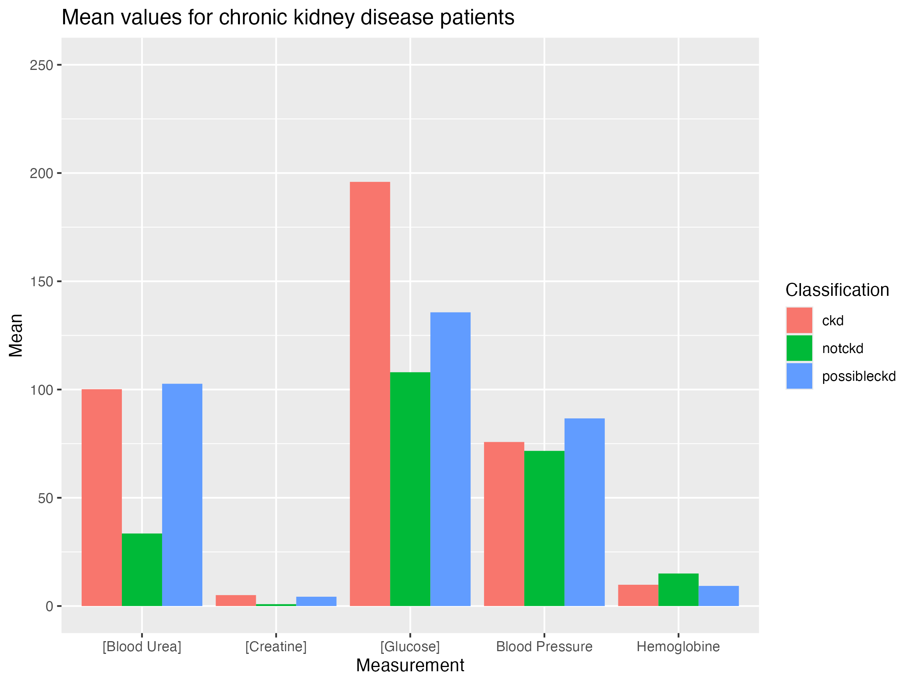



---

[Go back to the main page](../index.md)

---

# R

## Additional exercises Data analysis and visualization

*Source: own work*

---

The following links contain additional exercises for each topic in the course. The exercises follow (more or less) the same structure as the other exercises, but use different data sets.

## Excercises
- [Basics](./R_02_basics_add_exercises.html)
- [Data Import](./R_04_data_import_add_exercises.html)
- [Data Cleaning](./R_07_data_cleaning_add_exercises.html)
- Data Analysis (not available yet)
- Data Visualization (not available yet)

## Solutions

- [Basics](./R_02_basics_add_solutions.html)
- [Data Import](./R_04_data_import_add_solutions.html)
- [Data Cleaning](./R_07_data_cleaning_add_solutions.html)
- Data Analysis (not available yet)
- Data Visualization (not available yet)

---

---

[Go back to the main page](../index.md)  
<a href="#top">⬆️ Back to Top</a>  

---

>This web page is distributed under the terms of the Creative Commons Attribution License which permits unrestricted use, distribution, and reproduction in any medium, provided the original author and source are credited.
>Creative Commons License: CC BY-SA 4.0.

