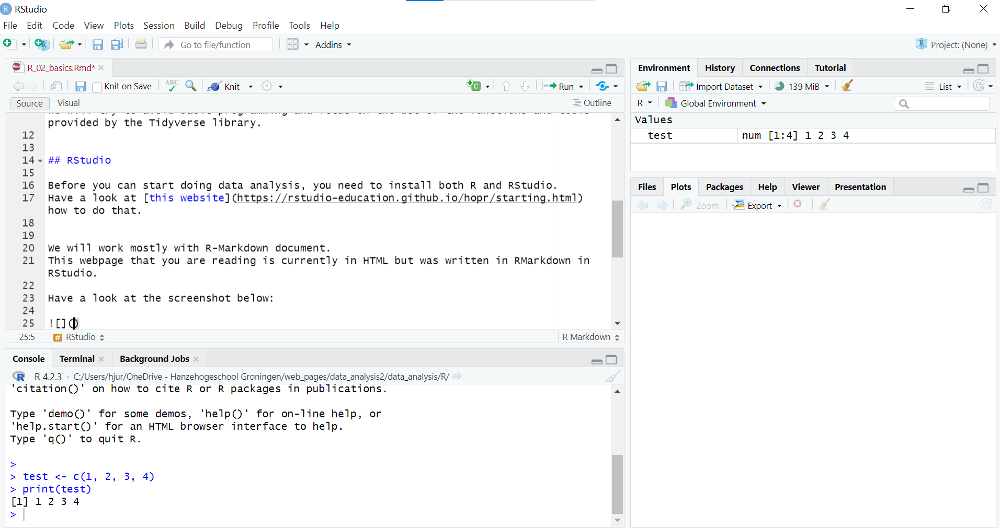

---

[Go back to the main page](../index.html)  
[Go back to the R overview page](../R/R_01_index.md)  

---


```{r setup, include=FALSE} 
knitr::opts_chunk$set(warning = FALSE, message = FALSE) 
```

This file can be downloaded [here](./R_02_basics.Rmd)

# R: Basics of R

## Basics of R

Before we start with importing data, some basics of R will be explained. Remember that we will try to avoid basic programming and focus on the use of the functions and tools provided by the Tidyverse library.
  

## RStudio

Before you can start doing data analysis, you need to install both R and RStudio.
Have a look at [this website](https://rstudio-education.github.io/hopr/starting.html) how to do this.


We will work mostly with R-Markdown documents.
This webpage that you are reading is currently in HTML but was written as a RMarkdown document in RStudio.

Have a look at the screenshot below:



The RStudio user interface has 4 primary panes:
From top left to bottom left in clockwise direction these are:  
- *Source pane*.  
- *Console pane*.  
- *Environment pane*, containing the Environment, History, Connections, Build, VCS , and Tutorial tabs.  
- *Output pane*, containing the Files, Plots, Packages, Help, Viewer, and Presentation tabs.  

Note that these panes might be at a different location on your screen and that you can set the panes to your preference.
RMarkdown is very convenient because you can mix the markdown markup language with R code.

There is very comprehensive documentation about R Markdown. See [this webpage](https://rmarkdown.rstudio.com/).
  

### Some very basics of R

Although we will try to avoid base R as much as possible, you will need a bit of basics.

We can assign a variable in R as follows:

```{r}
x <- 42
print(x)
```

In this example, the number *42* is stored in the variable *x*.  

It is possible to store more than one number in a variable. The very basic data structure of R is the vector, which can contain multiple numbers.

It may contain whole numbers:

```{r}
my_nums <- c(1, 2, 3, 4)
print(my_nums)
```

Or decimals:

```{r}
my_dec <- c(0.1, 0.2, 0.3, 0.4)
print(my_dec)
```

But also text:

```{r}
my_txt <- c("Hello", "World")
print(my_txt)
```

Or Boolean:

```{r}
my_bools <- c(TRUE, FALSE)
print(my_bools)
```

You can write these Boolean values also with a shorthand:

```{r}
my_bools <- c(T, F)
print(my_bools)
```

But what we will use is the data frame. See it as a bunch of columns stitched together:

```{r}
my_df <- data.frame(my_nums, my_dec)
print(my_df)
```

Both the `c` and `data.frame` are functions in R.
You can call them using `function.name()` and pass data to it as arguments.

So in the above code the vectors assigned to the variable names `my_nums` and `my_dec` are transferred as arguments in the `data.frame()` function. 
This function returns a data frame object that is assigned to the `my_df` variable name.

  
## Installing libraries

You can install the Tidyverse library using:

```
install.packages("tidyverse")
```

If you encounter problems with dependencies try:

```
install.packages("tidyverse", dependencies = TRUE)
```
  
## Loading packages:

You can load a package as follows:

```{r}
library(tidyverse)
```

  
## Make a tibble

Now we can make a fancy type of data frame from the `Tidyverse` library:


```{r}
my_tibble <- tibble(my_df)
my_tibble
```

Tibbles do have some advantageous over base R data frames such as:  
- Tibbles only print the first 10 rows and all the columns that fit on a screen.  
- Each column displays its data type.

>As we are using the Tidyverse library during this course, we will use the Tidyverse main data type: The Tibble.
  
## Pimping tibbles

Tibbles look nice in RMarkdown documents but look very basic in html documents.
To create nice looking tibbles, we can use the `kableExtra` library:

See for documentation [this](https://cran.r-project.org/web/packages/kableExtra/vignettes/awesome_table_in_html.html) page.


First we load the library:

```{r}
library(kableExtra)
```

And then we create a nice looking table:

```{r}
kbl(my_tibble) %>%
  kable_material()
```

You can do a lot of styling here. Example of using a dark theme:

```{r}
kbl(my_tibble) %>%
  kable_material_dark()
```

But I prefer the Twitter Bootstrap theme with striped rows that light up when you hover over it and that scales nicely on small screens like phones (you will get a horizontal slider when horizontal space is limited):

```{r}
kbl(my_tibble) %>%
  kable_styling(bootstrap_options = c("striped", "hover", "responsive"))
```


## Functions

In addition to the functions that R and it's packages have to offer, you can write your own functions. While creating your own functions is a bit out of scope of this course, I will provide an example below to re-use code to create the formatted tables as shown above.

```{r}
formatted_table <- function(df){
  kbl(df) %>%
  kable_styling(bootstrap_options = c("striped", "hover", "responsive"))
}
```


Now you can print the formatted table by calling the function and passing the tibble as argument without writing the whole code each time:

```{r}
formatted_table(my_tibble)
```

  
This also shows the power of R over Excel: several repetitive actions can be collected in a function so you can perform the same action on a different data set, while in Excel you will have to do all the actions by hand with each new data set.


## Learn the basics by doing

Go to the [exercises](https://bml-research.github.io/data_analysis_bml/R/R_02_basics_exercises.html) to get yourself familiar with the basics of R. This exercise consists of many small exercises that will guide you step-by-step through all the basics. It is essential that you practice a bit with base R before continuing with tidyverse.  

You can find the solutions [here](https://bml-research.github.io/data_analysis_bml/R/R_02_basics_solutions.html).

---

[Go back to the main page](../index.html)  
[Go back to the R overview page](../R/R_01_index.md)  
<a href="#top">⬆️ Back to Top</a>  

---

>This web page is distributed under the terms of the Creative Commons Attribution License which permits unrestricted use, distribution, and reproduction in any medium, provided the original author and source are credited.
>Creative Commons License: CC BY-SA 4.0.

