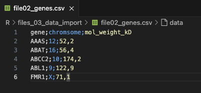

[Go back to the main page](../index.html)

```{r setup, include=FALSE} 
knitr::opts_chunk$set(warning = FALSE, message = FALSE) 
```

This file can be downloaded [here](./R_03_data_import.Rmd)


```{r}
library(kableExtra)
formatted_table <- function(df){
  kbl(df) %>%
  kable_styling(bootstrap_options = c("striped", "hover", "responsive"))
}
```

# R: Data Import

## Introduction

We have dealt with data import in Excel before.
Remember that in data science, data is often stored as csv (comma-separated values) files.
Other formats are tsv (tab-separated values) files.
Data may also come from an SQL or NoSQL database (beyond the scope of this course).
R has powerful functions to deal with plain-text rectangular files such as csv and tsv files.
In addition, R can also import and export Excel files.

Let's start with loading the tidyverse library:

```{r}
library(tidyverse)
```

As shown before, you can create your own data frame in R. 
In R, a tibble is a modern data frame that is optimized for data analysis and provides some additional features beyond the traditional data frame. 
Tibbles are the core data structure of the tidyverse and are used to facilitate the display and analysis of information in a tidy format.

You can use the as_tibble() function in R to convert a data frame, matrix, or list into a tibble
Here we use the tibble function to create a tiblle directly from 3 vectors:


```{r}
gene <- c("AAAS", "ABAT", "ABCC2", "ABL1", "FMR1")
chromosome <- c(12, 16, 10, 9, "X")
mol_weight_kD <- c(52.2, 56.4, 174.2, 122.9, 71.1)

my_tibble <- tibble(gene, chromosome, mol_weight_kD)
formatted_table(head(my_tibble))
```

As you can see, this resembles a bit an Excel worksheet.
Later, you will learn what you can do with a tibble.

## The readr package


Fortunately, you do not need to type data in R.
You can load it using the readr package.

In R, readr is a package that provides a fast and friendly way to read rectangular data (like csv or fixed-width format) into R. It provides a set of functions to simplify reading data from files. The main functions should read most common R data file types without needing any parameters except the file name. Other functions provide simple ways of handling file paths and extensions, and automatically detecting file format and structure.

Let's try it out:

We can try to load the same datafile as we did for Excel.
Here you can see the [Human Genes](https://www.kaggle.com/datasets/mohamedabdullah/human-genes?resource=download) file.

So we have downloaded the csv file (it came as zip so we needed to extract the zip).

It can be found [here](./files_03_data_import/file01_human_genes.csv).

>Like explained under data import in Excel, the first thing you should do is to check your csv file in a text editor.
RStudio is capable of opening text files.
The screenshot below shows you the text file in RStudio:


As you can see, the column separator is a comma. The csv file contains headers.
The function to open the file is the `read_csv()` function.
So we can load it as follows:


```{r}
file_path <- "./files_03_data_import/file01_human_genes.csv"
my_df <- read_csv(file_path)
formatted_table(head(my_df))
```


>Important note for MS Windows users:
R is not able to understand normal windows paths correctly because the backslash has a special meaning as an escape character.
Just replace the backslash with a forward slash for file paths.
This is the common way for Unix systems but also works for R code on Windows systems.


The `read_csv` function reads comma-delimited files. The `read_csv2` function reads semi-colon separated files (used in countries where the comma (,) is the decimal separator like in the Netherlands). The `read_tsv` function reads tab-delimited files. The `read_delim` function reads files with any delimiter.  
You may have noticed that the data frame returned is actually a tibble.  
The `head` function shows only the first 6 rows (by default) in order not to overwhelm the user with data.


Likewise, we can also directly load data from the web. Since the file above is stored on e web server, we can also load it using the URL:

```{r}
URL <- "https://raw.githubusercontent.com/bml-research/data_analysis_bml/main/R/files_03_data_import/file01_human_genes.csv"
my_df <- read_csv(URL)
formatted_table(head(my_df))
```

So in principle, you could also directly load data from Kaggle.
However, since authentication is needed for this, it is slightly more complicated.
You need to connect using the API and unzip the zip file via R code.
Of course, you are welcome to do this but it is beyond the scope of this course.


Now let's explore the other `read_csv` variants.
We have another text file.
It can be found [here](./files_03_data_import/file02_genes.csv)

Exploring it using a text editor:



This shows us that:
- the file contains a header
- the deliminator is a semicolon.
- the decimal separator is a `,`
Thus, the `read_csv2` function should be used to open this file.

```{r}
file_path <- "./files_03_data_import/file02_genes.csv"
my_df <- read_csv2(file_path)
formatted_table(head(my_df))
```

So what would happen if we accidentally used the wrong function?

```{r}
file_path <- "./files_03_data_import/file02_genes.csv"
my_df <- read_csv(file_path) #note that read_csv was used instead of read_csv2
formatted_table(head(my_df))
```

As you can see, the data was not read in separate columns. So always check the file using a text editor.

Now imagine a file without a header.
It can be found [here](./files_03_data_import/file03_genes.csv).


Loading it causes trouble:

```{r}
file_path <- "./files_03_data_import/file03_genes.csv"
my_df <- read_csv2(file_path) 
formatted_table(head(my_df))
```


As you can see, the first row is read as header.
We can find more information about the `read_csv2` function using the following code:

```{r}
?read_csv2
```

The information will be found within the help pane.
Reading the information on read_csv2 learns us that the default setting for headers is TRUE and that R will read (by default) the first row as a header. We can omit this problem by setting the col_names parameter to FALSE:

```{r}
file_path <- "./files_03_data_import/file03_genes.csv"
my_df <- read_csv2(file_path, col_names = FALSE) 
formatted_table(head(my_df))
```

Now we have all the rows correctly loaded but we still miss column names.
We can add them as follows:

```{r}
my_col_names <- c("gene", "chromosome", "mol_weight_kD")
names(my_df) <- my_col_names
formatted_table(head(my_df))
```

What if a dot is used as a decimal separator? In many countries the dot is used as the decimal separator, so there is a chance you will encounter files using the dot as the decimal separator.


An example of this file can be found [here](./files_03_data_import/file04_genes.csv).

Let's see what happens if you try to read a file with `read_csv2` that contains numbers with the comma as delimiter (separator of values) and the dot as decimal separator.

```{r}
file_path <- "./files_03_data_import/file04_genes.csv"
my_df <- read_csv2(file_path) 
formatted_table(head(my_df))
```

As you can see, the values are not separated anymore. In this case, you should use the `read_csv` function to take care of this.

```{r}
file_path <- "./files_03_data_import/file04_genes.csv"
my_df <- read_csv(file_path) 
formatted_table(head(my_df))
```


Often TSV-files are used. These are files where the values are separated by a tab. They can be imported using the `read_tsv` function.  

An example of this file can be found [here](./files_03_data_import/file05_genes.csv).


Note that `read_tsv` can only read numerical values correctly that have the dot as the decimal separator. We can solve this problem using the argument `locale =` in the `read_tsv` function.

```{r}
file_path <- "./files_03_data_import/file05_genes.csv"
my_df <- read_tsv(file_path, locale = locale(decimal_mark = ",")) 
formatted_table(head(my_df))
```


When things get really ugly, such as this file, we need some more tweaking...

An example of this file can be found [here](./files_03_data_import/file06_genes.csv)


```{r}
file_path <- "./files_03_data_import/file06_genes.csv"
my_df <- read_csv2(file_path) 
formatted_table(head(my_df))
```

The data is obviously not correctly loaded.
The delimiter is an asterisk and there seems to be a comment at the first line of the file. So we could use the `read_delim` function here and use the arguments `delim =` and `comment =` to bypass these problems. Also, the `read_delim` function uses the dot as decimal separator by default (as we have seen for the `read_tsv` function).

```{r}
file_path <- "./files_03_data_import/file06_genes.csv"
my_df <- read_delim(file_path, delim = "*", comment = "@", locale=locale(decimal_mark = ",")) 
formatted_table(head(my_df))
```


>Also, always check that the column in your tibble is of the correct data type. You can have a quick overview of the data types in your data frame using the `str()` function.

```{r}
str(my_df)
```
You can see that gene are of the characters type and mol_weight_kD are of the numerical type. Most values in chromosomes are of the numerical type. Because there is a character (chromosome "X") in this column, R converts the other values also to a character. Only one type of values can be stored in a column (in this case all character type).


## Writing csv files

Like reading csv file, you can also write them.
Here is an example:

```{r}
gene <- c("AAAS", "ABAT", "ABCC2", "ABL1","FMR1")
chromosome <- c(12, 16, 10, 9, "X")
mol_weight_kD <- c(52.5, 56.4, 174.2, 122.9, 71.1)

my_tibble <- tibble(gene, chromosome, mol_weight_kD)
write_csv(my_tibble, "./files_03_data_import/file07_genes_tibble.csv")
```

To show that the data was written to file:

```{r}
my_path <- "./files_03_data_import/file07_genes_tibble.csv"
my_df <- read_csv(my_path)
formatted_table(head(my_df))
```


## Reading Excel files

Although csv files and tsv files are often used in data science, Microsoft Excel is arguably the most used software package to analyze data.  
But also a lot of data is directly stored in Excel files. Think about data downloaded from the web.  
Very often, data can be downloaded as Excel file instead of csv or tsv file.  
Instead of converting data from Excel to csv or tsv file, R can handle Excel files directly.

It also gives you the opportunity to first do some analysis in Excel and continue in R, for example if the data set appears to be to big to be handled by Excel.

The `readxl` package is the most used package for reading and writing Excel files.
It comes with tidyverse so there is no need to install it.
If somehow you do not have it, you can install it with the following command:

```
install.packages("readxl")
```

And load it as follows:

```{r}
library(readxl)
```

[Here](./files_03_data_import/file08_human_genes.xlsx) you can find an example of an Excel file.

And here is how you can load in to a tibble:

```{r}
file_path <- "./files_03_data_import/file08_human_genes.xlsx"
my_df <- read_excel(file_path) 
formatted_table(head(my_df))
```

## Write to Excel

Like reading Excel, you can also write it.
But you will need to install another package:

```
install.packages("openxlsx")
```

And load it:

```{r}
library(openxlsx)
```

In the following code you will see an example how to do that.

```{r}
gene <- c("AAAS", "ABAT", "ABCC2", "ABL1","FMR1")
chromosome <- c(12, 16, 10, 9, "X")
mol_weight_kD <- c(52.5, 56.4, 174.2, 122.9, 71.1)

my_tibble <- tibble(gene, chromosome, mol_weight_kD)
write.xlsx(my_tibble, './files_03_data_import/file09_genes_tibble.xlsx')
```


And a screenshot of the file loaded in an Excel spreadsheet:


---


>This web page is distributed under the terms of the Creative Commons Attribution License which permits unrestricted use, distribution, and reproduction in any medium, provided the original author and source are credited.
>Creative Commons License: CC BY-SA 4.0.

