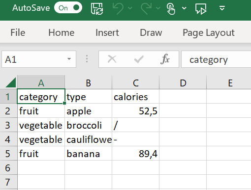

[Go back to the main page](../index.html)

```{r setup, include=FALSE} 
knitr::opts_chunk$set(warning = FALSE, message = FALSE) 
```

# R: Data Cleaning

## Data cleaning methods

Let's start with loading the tidyverse library:

```{r}
library(tidyverse)
```


Whether you use Excel, R or Python, data cleaning will often be required for the data.
So here are some examples of data cleaning:

## Remove rows with missing values

Let's start with creating a tibble with missing data:

```{r}
category <- c("fruit", "vegetable", "vegetable", "fruit")
type <- c("apple", "broccoli", "cauliflower", "banana")
calories <- c(52.5, NA, NA, 89.4)

my_tibble <- tibble(category, type, calories)
my_tibble
```

As you can see, there are two rows with missing values (NA values).
Here is how to drop them:

```{r}
my_tibble <- drop_na(my_tibble)
my_tibble
```

Later on we will perform multiple manipulations on data frames.
To prevent overwriting the same variable each time, we will use a different syntax.
Tidyverse came up with a shorthand to prevent overwriting the same variable each time (called forward chaining):


```{r}
my_tibble <- my_tibble %>% drop_na()
my_tibble
```

The reason to do this will become clear later on.

## Renaming columns

You can rename a column like shown below:

```{r}
category <- c("fruit", "vegetable", "vegetable", "fruit")
x <- c("apple", "broccoli", "cauliflower", "banana")
calories <- c(52.5, 32.2, 25.7, 89.4)

my_tibble <- tibble(category, x, calories)
my_tibble
```

As you can see, the column x is a poor column name.
Here is how to rename column x to type:

```{r}
my_tibble <- my_tibble %>% rename(type = x)
my_tibble
```

## Reordering columns

Below is tibble with a column order that is probably not preferred:

```{r}
category <- c("fruit", "vegetable", "vegetable", "fruit")
type <- c("apple", "broccoli", "cauliflower", "banana")
calories <- c(52.5, 32.2, 25.7, 89.4)

my_tibble <- tibble(category, calories, type)
my_tibble
```

As you can see, calories becomes before type.
You might want to reorder columns. This is how to do that:

```{r}
my_tibble <- my_tibble %>% select(category, type, calories)
my_tibble
```

## Changing a columns data type

Be aware the R uses coercion when data types in a vector is not consistent:

```{r}
category <- c("fruit", "vegetable", "vegetable", "fruit")
x <- c("apple", "broccoli", "cauliflower", "banana")
calories <- c(52.5, 32.2, "25.7", 89.4) # Note that this vector contains a string.

my_tibble <- tibble(category, type, calories)
my_tibble
```

As a result of a single string value the whole column calories is coerced to characters instead of doubles.
You can change that using the `mutate()` function:

```{r}
my_tibble <- my_tibble %>% mutate(calories = as.numeric(calories))
my_tibble
```

## Deal with missing data from csv files

How to deal with missing data from csv files?
Obviously, you can not make up data.
The best thing to do is to "mark"  them with `NA`. 

```{r}
my_path = './files_06_data_cleaning/file01_fruits.csv'
my_df <- read_csv2(my_path)
my_df
```

As you can see, the calorie data for broccoli is missing. Instead a forward slash is included indicating that the data is missing.
Note that the column is coerced to character.
Let's correct that:

```{r}
my_path = './files_06_data_cleaning/file01_fruits.csv'
my_df <- read_csv2(my_path, na = "/")
my_df
```

If multiple types of "empty" data are present in your dataset:

```{r}
my_path = './files_06_data_cleaning/file02_fruits.csv'
my_df <- read_csv2(my_path)
my_df
```

You can use a vector in the `NA =` parameter:

```{r}
my_path = './files_06_data_cleaning/file02_fruits.csv'
my_df <- read_csv2(my_path, na = c("/", "-"))
my_df
```

## Deal with missing data from Excel files

Like csv files, Excel files can have missing data too:


Now if we load the data the following will happen:

```{r}
library(readxl)
my_path = './files_06_data_cleaning/file03_fruits.xlsx'
my_df <- read_excel(my_path)
my_df
```

Like for csv files, we can specify the missing values:

```{r}
my_path = './files_06_data_cleaning/file03_fruits.xlsx'
my_df <- read_excel(my_path, na=  c("/", "-"))
my_df
```

What if cells are left blank?


If we load the data:

```{r}
my_path = './files_06_data_cleaning/file04_fruits.xlsx'
my_df <- read_excel(my_path)
my_df
```

As you can see, the read_excel function deals with them automatically.


## Replace data

Imagine we have a clear erroneous data item:


```{r}
category <- c("fruit", "vegetable", "vegetable", "fruit")
type <- c("apple", "broccoli", "cauliflower", "banana")
calories <- c(52.5, 999,25.7, 89.4)
my_tibble <- tibble(category, type, calories)
my_tibble
```

The 999 calories for broccoli should be replaced with 34.2.

Replacing this specific data point can be done as follows: 

```{r}
my_tibble[2,3] <- 34.2
my_tibble
```

### Adding a row in a tibble

You can insert an entire row like below:

```{r}
my_tibble <- my_tibble %>% add_row(category = "fruit", type = "mango", calories = 104)
my_tibble
```


### Replacing a whole row:

Replacing a row can be performed by deleting a row and subsequently adding a row.
Imagine that you want to delete the row containing `mango` and insert a row pineapple.
You can replace an entire row by first deleting a row:


```{r}
my_tibble <- my_tibble %>% filter(!type == "mango")
my_tibble
```

In the above example, we used dplyr `filter` function to filter for all but mango in the column type.

Now we can add the row for pineapple:

```{r}
my_tibble <- my_tibble %>% add_row(category  = "fruit", type = "pineapple", calories = 105)
my_tibble
```

### Replacing data in a whole column:

If we want to change fruit to fruits (plural) and vegetable to vegetables (plural) we can do that as follows:

```{r}
my_tibble <- my_tibble %>% mutate(category = str_replace(category, "fruit", "fruits"))
my_tibble
```

And next for vegetables:

```{r}
my_tibble <- my_tibble %>% mutate(category = str_replace(category, "vegetable", "vegetables"))
my_tibble
```


### Replacing data in entire data frame:

If you end up with a situation that you want to change all occurrences of a certain value in a tibble you can solve that as follows:

```{r}
category <- c("-", "vegetable", "-", "fruit")
type <- c("apple", "-", "cauliflower", "banana")
calories <- c(52.5, "-", "-", 89.4)

my_tibble <- tibble(category, type, calories)
my_tibble
```

Now we change all occurrences for `-` with `NA` using the `replace` function:

```{r}
my_tibble <- my_tibble %>% replace(. == "-", NA)
my_tibble
```

The . is used as a placeholder for every item in the tibble.


---


>This web page is distributed under the terms of the Creative Commons Attribution License which permits unrestricted use, distribution, and reproduction in any medium, provided the original author and source are credited.
>Creative Commons License: CC BY-SA 4.0.

