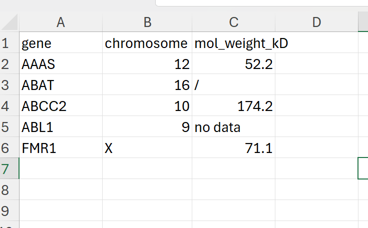
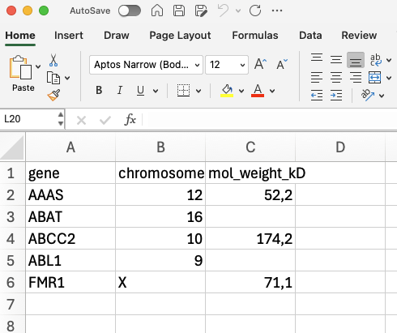

---

[Go back to the main page](../index.html)  
[Go back to the R overview page](../R/R_01_index.html)  
 

---

```{r setup, include=FALSE} 
knitr::opts_chunk$set(warning = FALSE, message = FALSE) 
```

This Rmd file can be downloaded [here](./R_06_data_cleaning.Rmd)  

Files used on this page:  
- [file01_genes.csv](./files_06_data_cleaning/file01_genes.csv)  
- [file02_genes.csv](./files_06_data_cleaning/file02_genes.csv)  
- [file03_genes.xlsx](./files_06_data_cleaning/file03_genes.xlsx)  
- [file04_genes.xlsx](./files_06_data_cleaning/file04_genes.xlsx) 


# R: Data Cleaning

## Data cleaning methods

Let's start with loading the tidyverse library:

```{r}
library(tidyverse)
```

Create a function to create better tibble output for HTML:

```{r}
library(kableExtra)
formatted_table <- function(df){
  kbl(df) %>%
  kable_styling(bootstrap_options = c("striped", "hover", "responsive"))
}
```

Whether you use Excel or R, data cleaning will often be required for the data.
So here are some examples of data cleaning:

## Remove rows with missing values

Let's start with creating a tibble with missing data:

```{r}
gene <- c("AAAS", "ABAT", "ABCC2", "ABL1", "FMR1")
chromosome <- c(12, 16, 10, 9, "X")
mol_weight_kD <- c(52.2, NA, NA, 122.9, 71.1)

my_tibble <- tibble(gene, chromosome, mol_weight_kD)
formatted_table(my_tibble)
```

As you can see, there are two rows with missing values (NA values).
Here is how to drop these missing (NA) values:

```{r}
my_tibble <- drop_na(my_tibble)
formatted_table(my_tibble)
```

Later on we will perform multiple manipulations on data frames.
To prevent overwriting the same variable each time, we will use a different syntax.
Tidyverse came up with a shorthand to prevent overwriting the same variable each time (this is called forward chaining):


```{r}
my_tibble <- my_tibble %>% drop_na()
formatted_table(my_tibble)
```

The reason to do this will become clear later on.

## Renaming columns

You can rename a column like shown below:

```{r}
gene <- c("AAAS", "ABAT", "ABCC2", "ABL1", "FMR1")
x <- c(12, 16, 10, 9, "X")
mol_weight_kD <- c(52.2, 56.4, 174.2, 122.9, 71.1)

my_tibble <- tibble(gene, x, mol_weight_kD)
formatted_table(my_tibble)
```

As you can see, the column x is a poor column name.
Here is how to rename column x to type:

```{r}
my_tibble <- my_tibble %>% rename(chromosome = x)
formatted_table(my_tibble)
```
As you can see, the name of the second column (x) has been replaced (it is now called chromosome).


## Reordering columns

Below is tibble with a column order that is probably not preferred:

```{r}
gene <- c("AAAS", "ABAT", "ABCC2", "ABL1", "FMR1")
chromosome <- c(12, 16, 10, 9, "X")
mol_weight_kD <- c(52.2, 56.4, 174.2, 122.9, 71.1)

my_tibble <- tibble(gene, mol_weight_kD, chromosome)
formatted_table(my_tibble)
```

As you can see, mol_weight_kD becomes before chromosome.
You might want to reorder columns. This is how to do that:

```{r}
my_tibble <- my_tibble %>% select(gene, chromosome, mol_weight_kD)
formatted_table(my_tibble)
```

## Changing a columns data type

Be aware that R uses coercion when data types in a vector is not consistent:

```{r}
gene <- c("AAAS", "ABAT", "ABCC2", "ABL1", "FMR1")
chromosome <- c(12, 16, 10, 9, "X")
mol_weight_kD <- c(52.2, 56.4, "174.2", 122.9, 71.1)

my_tibble <- tibble(gene, chromosome, mol_weight_kD)
formatted_table(my_tibble)
```

As a result of a single string value the whole column mol_weight_kD is coerced to characters instead of doubles (stored numbers as decimals). You can spot this quite easily, since the numbers are now outlined on the left of the column (numbers are outlined on the right of the column). Compare with the previous table to see the difference.
You can change the type of data in the column using the `mutate` function:

```{r}
my_tibble <- my_tibble %>% mutate(mol_weight_kD = as.numeric(mol_weight_kD))
formatted_table(my_tibble)
```

NOTE: you cannot apply the same strategy to the column chromosome (you cannot convert 'X' to a number):

```{r}
my_tibble <- my_tibble %>% mutate(chromosome = as.numeric(chromosome))
formatted_table(my_tibble)
```
The numbers in column chromosome have been converted to the data type `double`. However, as a result the field(s) with non-numeric types of data are removed from the column ('X' has been replaced by `NA`).


## Deal with missing data from csv files

How to deal with missing data from csv files?

Download the example [here](./files_06_data_cleaning/file01_genes.csv).  

Obviously, you can not make up data.
The best thing to do is to "mark" missing data with `NA`. 

```{r}
my_path = './files_06_data_cleaning/file01_genes.csv'
my_df <- read_csv2(my_path)
formatted_table(my_df)
```

As you can see, the molecular weight data for the *ABAT* gene is missing. Instead, a forward slash is included indicating that the data is missing.
Note that the column is coerced to character (numbers in the column are outlined on the left side of the column).
Let's correct that:

```{r}
my_path = './files_06_data_cleaning/file01_genes.csv'
my_df <- read_csv2(my_path, na = "/")
formatted_table(my_df)
```
All data that has the value / will has been replaced with `NA`.

If multiple types of "empty" data are present in your data set:

Download example [here](/files_06_data_cleaning/file02_genes.csv).  

```{r}
my_path = './files_06_data_cleaning/file02_genes.csv'
my_df <- read_csv2(my_path)
formatted_table(my_df)
```

You can use a vector in the `NA =` argument in the `read_csv2` function:

```{r}
my_path = './files_06_data_cleaning/file02_genes.csv'
my_df <- read_csv2(my_path, na = c("/", "no data"))
formatted_table(my_df)
```

## Deal with missing data from Excel files

Like csv files, Excel files can have missing data too:



<br>

Now if we load the data the following will happen:

Download example [here](./files_06_data_cleaning/file03_genes.xlsx).  

```{r}
library(readxl)
my_path = './files_06_data_cleaning/file03_genes.xlsx'
my_df <- read_excel(my_path)
formatted_table(my_df)
```

Like for csv files, we can specify the missing values:

```{r}
my_path = './files_06_data_cleaning/file03_genes.xlsx'
my_df <- read_excel(my_path, na=  c("/", "no data"))
formatted_table(my_df)
```

What if cells are left blank?



<br>

If we load the data:

Download example [here](./files_06_data_cleaning/file04_genes.xlsx).  

```{r}
my_path = './files_06_data_cleaning/file04_genes.xlsx'
my_df <- read_excel(my_path)
formatted_table(my_df)
```

As you can see, the `read_excel` function deals with them automatically.


## Replace data

Imagine we have a clear erroneous data item:


```{r}
gene <- c("AAAS", "ABAT", "ABCC2", "ABL1", "FMR1")
chromosome <- c(14, 16, 10, 9, "X")
mol_weight_kD <- c(52.2, 56.4, 174.2, 0.023, 71.1)

my_tibble <- tibble(gene, chromosome, mol_weight_kD)
formatted_table(my_tibble)
```

The molecular weigth of the *ABL1* gene should be replaced with 122.9.

Replacing this specific data point can be done as follows: 

```{r}
my_tibble[4,3] <- 122.9 #NOTE:my_tibble[row, column]
formatted_table(my_tibble)
```

### Adding a row in a tibble

You can insert an entire row like below:

```{r}
my_tibble <- my_tibble %>% add_row(gene = "PNOC", chromosome = "8", mol_weight_kD = 20.3)
formatted_table(my_tibble)
```

NOTE: the chromosome number is entered as a character, since all the data in this column are characters (because of the 'X' value of the *FMR1* gene which is on the X chromosome).


### Replacing a whole row:

Replacing a row can be performed by deleting a row and subsequently adding a row.
Imagine that you want to delete the row containing the *PNOC* gene and insert a row for the *KTN1* gene.
You can replace an entire row by first deleting a row:


```{r}
my_tibble <- my_tibble %>% filter(!gene == "PNOC")
formatted_table(my_tibble)
```

In the above example, we used the `filter` function to filter for all but PNOC in the column gene

Now we can add the row for the *KTN1* gene:

```{r}
my_tibble <- my_tibble %>% add_row(gene  = "MDM2", chromosome = "14", mol_weight_kD = 56.0)
formatted_table(my_tibble)
```

### Replacing data in a whole column:

There seems to be a mistake in the data. All fields in the column chromosome containing the value 14 should be replaced by the value 12. If we want to make these changes in the column chromosome, we can do that as follows:

```{r}
my_tibble <- my_tibble %>% mutate(chromosome = str_replace(chromosome, "14", "12"))
formatted_table(my_tibble)
```


### Replacing data in entire data frame:

If you end up with a situation that you want to change all occurrences of a certain value in a tibble you can solve that as follows:

```{r}
gene <- c("no data", "ABAT", "no data", "ABL1", "FMR1")
chromosome <- c("no data", 16, 10, 9, "X")
mol_weight_kD <- c(52.2, "no data", 174.2, 0.023, "no data")

my_tibble <- tibble(gene, chromosome, mol_weight_kD)
formatted_table(my_tibble)
```

Now we change all occurrences for `no data` with `NA` using the `replace` function:

```{r}
my_tibble <- my_tibble %>% replace(. == "no data", NA)
formatted_table(my_tibble)
```


In the example above, the `.` (dot) is used as a placeholder for every item in the tibble.


### Making data tidy

As introduces in the introduction to [data section](https://bml-research.github.io/data_analysis_bml/data/data_01_index.html), Tidyverse works best with tidy data. An explanation about Tidy data can be found [here](https://cran.r-project.org/web/packages/tidyr/vignettes/tidy-data.html).  

Now let’s take the following example:


```{r}
gene <- c("AAAS", "ABAT", "ABCC2", "ABL1", "FMR1")
Chromosome <- c(12, 16, 10, 9, "X")
mol_weight_pre_protein_kD <- c(52.2, 56.4, 174.2, 122.9, 71.1)
mol_weight_mature_protein_kD <- c(52.2, 56.4, 124.2, 122.9, 51.6)

my_tibble <- tibble(gene, Chromosome, mol_weight_pre_protein_kD, mol_weight_mature_protein_kD)
formatted_table(my_tibble)
```


We can make the data frame tidy as follows:

```{r}
my_tibble_tidy <- my_tibble %>% 
  pivot_longer(c(mol_weight_pre_protein_kD,mol_weight_mature_protein_kD), names_to = "Mol_Weight_Protein_Type", values_to = "Mol_Weight")
formatted_table(my_tibble_tidy)
```

And we can convert the data frame to the wider format as follows:

```{r}
my_tibble_wider <- my_tibble_tidy %>% 
  pivot_wider(names_from = "Mol_Weight_Protein_Type", values_from = "Mol_Weight")
formatted_table(my_tibble_wider)
```

>You may find the function gather and spread in some examples (on the internet or this website). This function is deprecated in favor of pivot_longer and pivot_wider. See [this link](https://tidyr.tidyverse.org/reference/gather.html).


### Transpose data

You can also transpose data. Imagine we have the following data:

```{r}
record_1 <- c("AAAS", "12", "52.2")
record_2 <- c("ABAT", "16", "56.4")
record_3 <- c("ABCC2", "10", "174.2")
record_4 <- c("ABL1", "9", "122.9")
record_5 <- c("FMR1", "X", "71.1")

my_tibble <- tibble(record_1, record_2, record_3, record_4, record_5)
formatted_table(my_tibble)
```

In the example above records (observations) are in columns but they should be in rows. The features (variables) should be in columns.
You can easily detect this error as the columns do often not represent a single data type (in this case, numbers and text are mixed).

First we create a transposed matrix using the `t` function:

```{r}
trans_matrix <- t(my_tibble)
formatted_table(trans_matrix)
```

Convert it to a tibble:

```{r}
my_tibble_transposed <- tibble(data.frame(trans_matrix))
formatted_table(my_tibble_transposed)
```

And then add the column names:

```{r}
colnames(my_tibble_transposed) <- c("Gene", "Chromosome", "Mol_weight_KD")
formatted_table(my_tibble_transposed)
```

And change the `Mol_weight_KD` data type:

```{r}
my_tibble_transposed <- my_tibble_transposed %>% mutate(Mol_weight_KD = as.numeric(Mol_weight_KD))
formatted_table(my_tibble_transposed)
```

### Separate a column into two columns

Sometimes you will find that people put units in the cells from a column:  

```{r}
gene <- c("AAAS", "ABAT", "ABCC2", "ABL1", "FMR1")
chromosome <- c(12, 16, 10, 9, "X")
mol_weight_kD <- c("52.2 kd", "56.4 kd", "174.2 kd", "122.9 kd", "71.1 kd")

my_tibble <- tibble(gene, chromosome, mol_weight_kD)
formatted_table(my_tibble)
```

Of course, the column will be of character type. We can solve this using the `separate_wider_delim` function:  

```{r}
my_tibble <- my_tibble %>% 
  separate_wider_delim(mol_weight_kD, delim = " ", names = c("mol_weight_kD", "waste")) 
formatted_table(my_tibble)
```

And we can throw away the column named waste:  

```{r}
my_tibble <- my_tibble %>% select(-waste)
formatted_table(my_tibble)
```

And trim any remaining white space:

```{r}
my_tibble <- my_tibble %>%
  mutate(
    mol_weight_kD = str_trim(mol_weight_kD), # will trim any whitespace
    mol_weight_kD = as.numeric(mol_weight_kD)
  )
formatted_table(my_tibble)
```


---

[Go back to the main page](../index.html)  
[Go back to the R overview page](../R/R_01_index.html)  
<a href="#top">⬆️ Back to Top</a>  

---


>This web page is distributed under the terms of the Creative Commons Attribution License which permits unrestricted use, distribution, and reproduction in any medium, provided the original author and source are credited.
>Creative Commons License: CC BY-SA 4.0.

