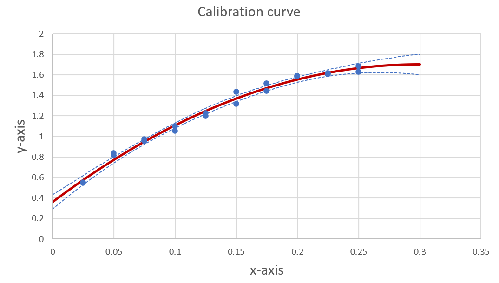
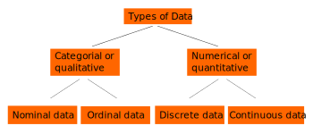
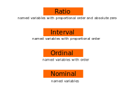
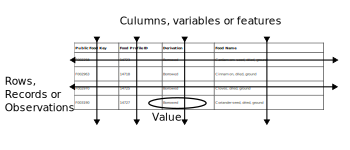



[Go back to the main page](../index.md)

# Data

## Index page

---

*Source: https://commons.wikimedia.org/wiki/File:US_Food_Consumption_Over_Time.svg*

## Introduction

### Categorial data and numerical data

In statistics and data analysis, there are several ways to categorize different types of data. Two main categories of data are categorical and numerical.

**Categorical data**, also known as qualitative data, is data that can be divided into categories. There are two main types of categorical data: 
- nominal
- ordinal 

Nominal data is data that can be placed into categories without any inherent ordering. For example, "eye color" is a nominal data type, as there is no inherent order to the different categories (e.g. blue, brown, green, etc.).  
Ordinal data, on the other hand, is data that can be placed into categories and those categories have an order to them. Example ordinal data can be a "rating scale" in questionares, like "unsatisfied", "satisfied" and "very satisfied". 

**Numerical data**, also known as quantitative data, is data that can be measured and represented by numbers. There are two main types of numerical data: 
- discrete
- continuous

Discrete data can only take on specific, distinct values, such as whole numbers. Continuous data, on the other hand, can take on any value within a certain range.

*Figure 1. Data types. Source: own work*

### Data scales

In statistics, data can be measured on different scales, which refers to the level of measurement of the data. The most commonly used scales of measurement are nominal, ordinal, interval, and ratio.

Nominal scale: This is the lowest level of measurement and is used for categorical data that can be divided into distinct groups or categories, with no inherent order or ranking. Examples include eye color, gender, or nationality.

Ordinal scale: This level of measurement is used for categorical data that can be ranked or ordered. Examples include surveys, where respondents are asked to rate their agreement with a statement on a scale from strongly disagree to strongly agree, or biological taxonomic ranks such as kingdom, phylum, class, order, family, genus and species.

Interval scale: This level of measurement is used for numerical data that can be ordered and has a meaningful zero point, but no true ratio comparisons between values. Examples include temperatures measured in Celsius or Fahrenheit, time in hours and minutes.

Ratio scale: This is the highest level of measurement, and it is used for numerical data that can be ordered and has a meaningful zero point, and true ratio comparisons between values. Examples include weight measured in kilograms, height measured in centimeters, or income measured in dollars.

It is important to note that ratio data allows for meaningful statement about the value of x is twice the value of y and interval data allows for meaningful statement about the distance of x and y but it doesn't allow statement like x is twice the value of y.

>Thus, for temperature it is appropriate to say that 20 degrees Kelvin is twice the temperature of 10 degrees Kelvin but you can not do this for temperature expressed in degrees Celsius as there is no absolute zero point.

*Figure 2. Scales of measurement in statistics. Source: own work*

### Calculations and visualization methods on different data types

It is not possible to perferm all types of calculations, comparisons and visualizations on all data types. As explained above, you can not perform ratio comparisons on interval data. Obviously, you can not (directly) create bar graphs or histograms on nominal or ordinal data. However, you can calculate frequencies and a proportion (by dividing the frequency by the total number of events) on nominal and ordinal data. Proper visualisations of nominal and ordinal data are Pie Charts and Bar Charts. Because nominal data is categorical data that can take on a limited number of values that don't have an inherent order or numerical meaning, some types of visualizations that are used to represent quantitative data, such as continuous data, are not suitable for representing nominal data. 

Some examples of visualization types that are not suitible on certain data types are listed below:

**Nominal data:**

Line graph: This type of visualization is used to display the changes in a continuous variable over time, and doesn't work well with nominal data.

- Scatter plot: A scatter plot represents the relationship between two continuous variables by plotting individual data points. It doesn't work well with nominal data because it doesn't have any quantitative meaning.

- Boxplot: boxplots are used to show the distribution of a continuous variable. It doesn't make sense to use it with categorical variables.

- Histogram: Histograms are used to represent the distribution of continuous variables, so it is not suitable for categorical data.

**Ordinal data**

While ordinal data is more structured than nominal data, some types of visualizations are not suitable for ordinal data. These include:

- Scatter plot: Scatter plots are used to show the relationship between two continuous variables by plotting individual data points. Since ordinal data is not continuous, it doesn't make sense to use a scatter plot to represent it.

- Heatmap: Heatmap is a way to visualize matrix data as color intensity on a grid. It works well with continuous and numerical data, but ordinal data doesn't have quantitative values and therefore doesn't work well with this type of visualization

- Pie Chart: a Pie chart is useful to show the proportion of each category within the total dataset. However, it may not be the best way to show the ordinal relationship between categories, especially if the number of categories is large.

**Discrete data**

Some examples of visualization that are not suitable for discrete data are:

- Line graph: Line graphs are commonly used to display the changes in a continuous variable over time. While a line graph can be used to represent discrete data by plotting individual points, it doesn't make sense to draw a line between the points since it could imply continuity. 

- Histogram: Histograms are used to represent the distribution of continuous variables, so it is not suitable for discrete data. 

These are some examples, but there are many other visualizations that can be used to represent discrete data. Examples of visualizations that are well suited for discrete data include bar charts, dot plots, pie charts, and stacked bar charts. These visualizations can help to effectively display the frequency or count of specific values in a dataset.

**Continous data**

Even continuous data has some types of visualization that is not suitable or recommanded. Some examples include:

- Stacked bar chart: This visualization is typically used to show the distribution of different categories within each category. Because continuous data is not necessarily divided into distinct categories, a stacked bar chart doesn't make sense to use.  

- Dot plot: A dot plot is a simple visualization that plots individual points on a graph. This visualization works well with discrete data, but with continuous data it would plot a large number of points, which can make the graph difficult to read and interpret.  

>So to summarize: Always make sure that the visualization type is appropriate for your data type.

### Data tables

Scientist often organise data in a table such as:

|Public Food Key   |Food Profile ID  |Derivation   |Food Name                     |
|:-----------------|:----------------|:------------|:-----------------------------|
|F002258           |14723            |Borrowed     |Cardamom seed, dried, ground  |
|F002963           |14718            |Borrowed     |Cinnamon, dried, ground       |
|F002970           |14725            |Borrowed     |Cloves, dried, ground         |
|F003190           |14727            |Borrowed     |Coriander seed, dried, ground |

The text "Public Food Key", "Food Profile ID", "Derivation" and "Food Name" are all found on the first line of the table. This is the table header. All of the remaining lines are rows. `Rows` are also called `records`, `observations` or trials which corresponds to the statistical unit of the dataset. Since the table above is about food products, each row represents a different food product. 

Columns:

`Columns` are also called `variables` or `features`. For example, this first column contains the public food key, a unique identifyer for each food item. The third column represents information about the type of food but also contains information about the processing. You could argue that this column should be be separated in two columns (food name and processing).

`Values` are found on the cross-section of columns and rows in csv files or other tabulated text file formats. In Excell, each cell contains a value. Values may represent tekst strings, whole numbers (integers), decimal values (floats) or booleans (true, false). Other values do excist as well but are beyond the scope of this course.

>Do not put records in columns and variables in rows like this:

|Variable             |Item 1       |Item 2       |Item 3      |Item 4        |
|:--------------------|:------------|:------------|:-----------|:-------------|
|Public Food Key      |F002258      |F002963      |F002970     |F003190       |
|Food Profile ID      |14723        |14718        |14725       |14727         |
|Derivation           |Borrowed     |Borrowed     |Borrowed    |Borrowed      |
|Food Name            |Cardamom seed dried, ground|Cinnamon, dried, ground|Cloves, dried, ground|Coriander seed, dried, ground|

>When you encounter this, the data need to be transposed. Data analysis software contains functions to assist with this.

*Figure 3. Variables, Observations and Values. Source: own work*

### Untidy data versus tidy data:

In data science, a lot of time is spent on data cleaning and data organisation.
A more standardized way to structure data is the [tidy data format](https://cran.r-project.org/web/packages/tidyr/vignettes/tidy-data.html).

So what is tidy data?
Tidying data is a common method of relating a dataset's meaning to its structure. Depending on how rows, columns, and tables are matched with observations, variables, and types, a dataset might be unorganized or well-organized. 

Rules for tidy data:
- Each dataset should have a single column  
- Each feature/variable should have its own column  
- Each observation must have its own row  
- Each value must be in its own cell  

Let's first have a look at untidy data.

|Public Food Key   |Food Profile ID  |
|:-----------------|:----------------|
|F002258           |14723            |
|F002963           |14718            |
|F002970           |14725            |
|F003190           |14727            |

|Public Food Key   |Derivation   |Food Name                     |
|:-----------------|:------------|:-----------------------------|
|F002258           |Borrowed     |Cardamom seed, dried, ground  |
|F002963           |Borrowed     |Cinnamon, dried, ground       |
|F002970           |Borrowed     |Cloves, dried, ground         |
|F003190           |Borrowed     |Coriander seed, dried, ground |

As you can see, there are two tables and the `Public Food Key` column is repeated.

Another example of untidy data:

|Public Food Key   |Food Profile ID  |Type          |Data                          |
|:-----------------|:----------------|:-------------|:-----------------------------|
|F002258           |14723            |Derivation    |Borrowed                      |
|F002258           |14723            |Food Name     |Cardamom seed, dried, ground  |
|F002963           |14718            |Derivation    |Borrowed                      |
|F002963           |14718            |Food Name     |Cinnamon, dried, ground       |

As you can see in this example, not each variable has its own column and as a result, not each observation has its own row.

But even organization of the data from Kaggle can be improved.
The column food name can arguable be better splitted in a column `Food name` and a column `Processing`:

|Public Food Key   |Food Profile ID  |Derivation   |Food Name     |Processing     |
|:-----------------|:----------------|:------------|:-------------|:--------------|
|F002258           |14723            |Borrowed     |Cardamom seed |dried, ground |
|F002963           |14718            |Borrowed     |Cinnamon      |dried, ground  |
|F002970           |14725            |Borrowed     |Cloves        |dried, ground  |
|F003190           |14727            |Borrowed     |Coriander seed|dried, ground |

>In summary: always make sure that your data are well organized. This will consume time and effort but it will be worth the time and effort as the data analysis later on will be much more straightforward.

---

### Exersises and Solutions:

- [Exercises](./data_02_exersises.md)
- [Solutions](./data_03_solutions.md)

>This web page is distributed under the terms of the Creative Commons Attribution License which permits unrestricted use, distribution, and reproduction in any medium, provided the original author and source are credited.
>Creative Commons License: CC BY-SA 4.0.

