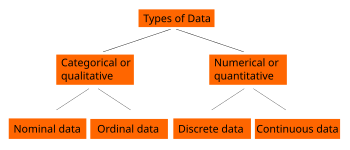
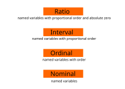
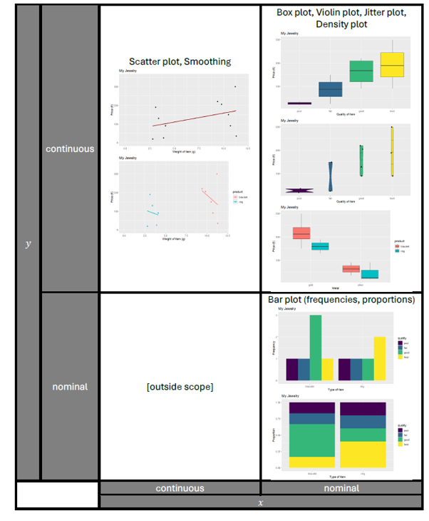
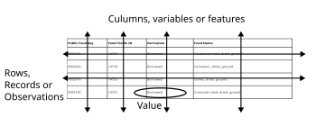



---

[Go back to the main page](../index.md)

---

# Data

--- 

## Exercises and Solutions:

- [Exercises](./data_02_exercises.md)
- [Solutions](./data_03_solutions.md)

---

**Index**  

- [Data](#data)
  - [Exercises and Solutions:](#exercises-and-solutions)
  - [Introduction](#introduction)
    - [Categorical data and numerical data](#categorical-data-and-numerical-data)
    - [Data scales](#data-scales)
    - [Calculations and visualization methods on different data types](#calculations-and-visualization-methods-on-different-data-types)
    - [Visualizing Different Data Types](#visualizing-different-data-types)
    - [Data tables](#data-tables)
    - [Untidy data versus tidy data:](#untidy-data-versus-tidy-data)
    - [Wide versus long format](#wide-versus-long-format)
    - [Data types](#data-types)
      - [Microsoft Excel](#microsoft-excel)
      - [R](#r)

---

## Introduction

### Categorical data and numerical data

In statistics and data analysis, there are several ways to categorize different types of data (figure 1). Two main categories of data are categorical and numerical.

**Categorical data**, also known as qualitative data, is data that can be divided into categories. There are two main types of categorical data: 
- nominal
- ordinal 

Nominal data is data that can be placed into categories without any inherent ordering. For example, "eye color" is a nominal data type, as there is no inherent order to the different categories (e.g. blue, brown, green, etc.).  
Ordinal data, on the other hand, is data that can be placed into categories and those categories have an order to them. Example ordinal data can be a "rating scale" in questionnaires, like "unsatisfied", "satisfied" and "very satisfied". 

**Numerical data**, also known as quantitative data, is data that can be measured and represented by numbers. There are two main types of numerical data: 
- discrete
- continuous

Discrete data can only take on specific, distinct values, such as whole numbers. Example of discrete data are cell counts or the number of colonies growing on an agar plate. Continuous data, on the other hand, can take on any value within a certain range. Examples include measurements such as length, temperature and concentration.  

*Figure 1. Data types. Source: own work*

### Data scales

In statistics, data can be measured on different scales, which refers to the level of measurement of the data (figure 2). The most used scales of measurement are nominal, ordinal, interval, and ratio.  

Nominal scale: This is the lowest level of measurement. It is used for categorical data that can be divided into distinct groups or categories, with no inherent order or ranking. Examples include eye color, gender, or nationality.  

Ordinal scale: This level of measurement is used for categorical data that can be ranked or ordered. Examples include surveys, where respondents are asked to rate their agreement with a statement on a scale from strongly disagree to strongly agree, or biological taxonomic ranks such as kingdom, phylum, class, order, family, genus and species.  

Interval scale: This level of measurement is used for numerical data that can be ordered and has an arbitrary zero point (no absolute zero), meaning it allows for equal distances between values but no true ratio comparisons. Examples include temperatures measured in Celsius or Fahrenheit. Time as a measurement of a point in a day (e.g., 2 PM or 14:00) is also considered an interval scale. This is because you can quantify the difference between two points in time, but there is no true or meaningful zero point.  

Ratio scale: This is the highest level of measurement, and it is used for numerical data that can be ordered and has a meaningful zero point, and true ratio comparisons between values. Examples include weight measured in kilograms, height measured in centimeters, or income measured in dollars.

*Figure 2. Scales of measurement in statistics. Source: own work*

### Calculations and visualization methods on different data types

It is not possible to perform all types of calculations, comparisons and visualizations on all data types.  
For example, ratio data allow for meaningful statements such as “the value of x is twice the value of y”, whereas and interval data allow meaningful statement about the distance of x and y but do not support statements like “x is twice the value of y”. 
To illustrate: for temperature it is appropriate to say that 20 degrees Kelvin is twice the temperature of 10 degrees Kelvin but you can not do this for temperature expressed in degrees Celsius as there is no absolute zero point.

### Visualizing Different Data Types 

In biological and biomedical research, data plotting is used to explore and communicate complex data. A plot is a graphical representation that helps visualize possible relationships between two or more variables, making it easier to observe patterns, trends, or correlations in the data. There are many types of plots, each presenting data in a different way. The type of plot you choose depends on the type of data and the relationship you want to show. For accurate interpretation and communication of the results, it is important to choose an appropriate plot type.
Often, a plot has an x-axis and a y-axis. The y-value is the dependent variable, meaning that it changes when the x-value changes. The x-value is the independent variable that may “cause” changes in y.

*Figure 3. The anatomy of a 2D-plot*

Plots that use an x-axis and a y-axis are called Cartesian plots. Common examples include bar graphs, histograms, scatter plots, and box plots. In contrast, there are also non-Cartesian charts, such as pie charts and radar charts, which represent data using visual features such as area, angle, or position rather than an x-axis and y-axis.  

In the section above, we distinguished two main categories of data: categorical and numerical. The appropriate choice of plot type depends on the data type and, for Cartesian plots, on the specific combination of data types assigned to the x-axis and y-axis.  

In a Cartesian plot, both the x-axis and the y-axis can represent either type of data, resulting in four possible combinations, each associated with specific plot types (illustrated in figure 4). In practice, however, certain combinations are more commonly used, such as numerical versus numerical data in scatter plots and categorical versus numerical data in bar charts.
Non-Cartesian plots are particularly suited for representing categorical data, especially when showing proportions or relative contributions of categories, as in pie charts, or when comparing multiple variables across categories using a radial layout, as in radar charts (illustrated in figure 4).
The representation of data in different chart types will be further explored in the section Data Analysis Using Excel.  

*Figure 4. Examples of Cartesian plots.*

### Data tables

Scientist often organize data in a table such as:

|Gene Name         |Gene ID          |Chromosome # |Protein length (# aa)         |
|:-----------------|----------------:|------------:|-----------------------------:|
|DNAJB1            |3337             |19           |340                           |
|DNAJB2            |3300             |2            |277                           |
|DNAJB3            |414061           |2            |NA (pseudogene)               |
|DNAJB4            |11080            |1            |337                           |

The text "Gene Name", "Gene ID", "Chromosome #" and "Protein length" are all found on the first line of the table. This is the table header. All of the remaining lines are rows. `Rows` are also called `records`, `observations` or `trials` which corresponds to the statistical unit of the dataset. Since the table above is about human genes, each row represents a different gene. 

Columns:

`Columns` are also called `variables` or `features`. For example, the second column contains the Gene ID, a unique identifier for each Gene. The third column represents the chromosome number and the fourth column the length of the protein in amino acids.

`Values` are found on the cross-section of columns and rows in csv files or other tabulated text file formats (figure 5). In Excel, each cell contains a value. Values may represent text strings, whole numbers (integers), decimal values (floats) or booleans (true, false). Other values do exist as well but are beyond the scope of this course.

>Do not put records in columns and variables in rows like this:

|Variable             |Item 1       |Item 2       |Item 3         |Item 4        |
|:--------------------|:------------|:------------|:--------------|:-------------|
|Gene Name            |DNAJB1       |DNAJB2       |DNAJB3         |DNAJB4        |
|Gene ID              |3337         |3300         |414061         |11080         |
|Chromosome #         |19           |2            |2              |1             |
|Protein length (# aa)|340          |277          |NA (pseudogene)|337           |

>When you encounter this, the data need to be transposed. Data analysis software contains functions to assist with this.

*Figure 5. Variables, Observations and Values. Source: own work*

### Untidy data versus tidy data:

In data science, a lot of time is spent on data cleaning and data organization.
A more standardized way to structure data is the [tidy data format](https://cran.r-project.org/web/packages/tidyr/vignettes/tidy-data.html).

So what is tidy data?
Tidying data is a common method of relating a dataset's meaning to its structure. Depending on how rows, columns, and tables are matched with observations, variables, and types, a dataset might be unorganized or well-organized. 

Rules for tidy data: 
- Each feature/variable should have its own column  
- Each observation must have its own row  
- Each value must be in its own cell  

In addition: There should be one spreadsheet (table) for each type of data. 

Let's first have a look at untidy data.

|Gene Name         |Gene ID          |
|:-----------------|:----------------|
|DNAJB1            |3337             |
|DNAJB2            |3300             |
|DNAJB3            |414061           |
|DNAJB4            |11080            |

 

|Gene Name         |Chromosome # |Protein length (# aa)         |
|:-----------------|------------:|-----------------------------:|
|DNAJB1            |19           |340                           |
|DNAJB2            |2            |277                           |
|DNAJB3            |2            |NA (pseudogene)               |
|DNAJB4            |1            |337                           |

As you can see, there are two tables and the `Gene Name` column is repeated.

Another example of untidy data:

|Gene Name         |Gene ID          |Type                 |Data                          |
|:-----------------|:----------------|:--------------------|:-----------------------------|
|DNAJB1            |3337             |Chromosome #         |19                            |
|DNAJB1            |3337             |Protein length (# aa)|340                           |
|DNAJB2            |3300             |Chromosome #         |2                             |
|DNAJB2            |3300             |Protein length (# aa)|277                           |
|DNAJB3            |414061           |Chromosome #         |2                             |
|DNAJB3            |414061           |Protein length (# aa)|NA (pseudogene)               |
|DNAJB4            |11080            |Chromosome #         |1                             |
|DNAJB4            |11080            |Protein length (# aa)|337                           |

As you can see in this example, not each variable has its own column and as a result, not each observation has its own row.

The data above in tidy format:

|Gene Name         |Gene ID          |Chromosome # |Protein length (# aa)         |
|:-----------------|:----------------|------------:|-----------------------------:|
|DNAJB1            |3337             |19           |340                           |
|DNAJB2            |3300             |2            |277                           |
|DNAJB3            |414061           |2            |NA (pseudogene)               |
|DNAJB4            |11080            |1            |337                           |

>In summary: always make sure that your data are well organized. This will consume time and effort but it will be worth the time and effort as the data analysis later on will be much more straightforward.

### Wide versus long format

Data tables can be in wide versus long format.

Wide:  

| City | Temp_Day1 | Temp_Day2 | Temp_Day3 |
|---|---|---|---|
| Amsterdam | 18 | 21 | 19 |
| Groningen | 16 | 19 | 17 |

Long:  

| City | Day | Temperature |
|---|---|---|
| Amsterdam | Day1 | 18 |
| Amsterdam | Day2 | 21 |
| Amsterdam | Day3 | 19 |
| Groningen | Day1 | 16 |
| Groningen | Day2 | 19 |
| Groningen | Day3 | 17 |

>Note that only the long format is tidy

- Each variable must have its own column.
- Each observation must have its own row.
- Each value must have its own cell.

In the wide format, the column headers (Temp_Day1, Temp_Day2, Temp_Day3) actually contain values of a variable (Day) rather than distinct variables themselves. Because the variable "Day" is spread across the column names, it violates rule 1.  

In the long format, every column corresponds to a distinct variable (City, Day, Temperature), and every single row represents a single observation (a temperature reading for a specific city on a specific day).  

>The Tidyverse package in R has powerful functions to reshape tables in wide format to tables in long format.  

### Data types

In data science, several data types can be distinguished.

#### Microsoft Excel

You can find four data types in Microsoft Excel.

- **Numeric data**. Numbers like whole numbers, decimal numbers, dates, percentages and times.
- **Text data (character data)**. Characters such as alphabetic, numeric, and special symbols are included in this type of data. The main distinction between text and numeric data is that while text cannot be calculated on, numerical data can.
- **Logical data (boolean)**. These are just the booleans TRUE and FALSE.
- **Error data**. Excel uses several error data types such as #NAME?, #DIV/0, #REF!, #NUM!, #N/A, #VALUE!. For example, #DIV/0 will arise if you try dividing a number by zero. #N/A represents an empty value if data is missing during a data import action.

#### R

In R, there are 6 basic data types. Some of them explained below (rest is beyond the scope of this course).
- **Logical**. The Boolean values True and False.  
- **Numeric**. All numbers, whole and decimal.  
- **Character**. Text strings like "a" and "hello".

The Excel and R section contain more about the particular data types. 

---

[Go back to the main page](../index.md)  
<a href="#top">⬆️ Back to Top</a>

---

>This web page is distributed under the terms of the Creative Commons Attribution License which permits unrestricted use, distribution, and reproduction in any medium, provided the original author and source are credited.
>Creative Commons License: CC BY-SA 4.0.

