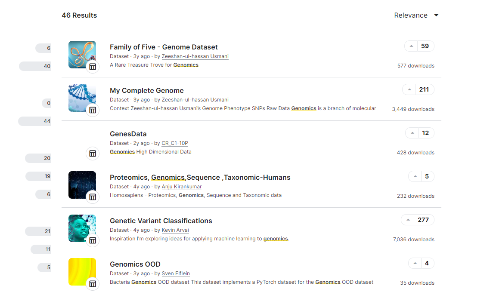



[Go back to the main page](../index.md)

# Data Analysis and Visualization

## Data Sets

---

*Source: own work*

## Data sets

### Genetics

- [SARS-CoV-2 Genetics](https://www.kaggle.com/datasets/rtwillett/sarscov2-genetics)
- [Covid-19 Original RNA Sequence (Wu et al., 2020)](https://www.kaggle.com/datasets/protobioengineering/covid-19-original-rna-sequence-wu-et-al-2020)
- [Of Genomes And Genetics - HackerEarth ML](https://www.kaggle.com/datasets/imsparsh/of-genomes-and-genetics-hackerearth-ml)
- [Predict the genetic disorders dataset-of genomes](https://www.kaggle.com/datasets/aibuzz/predict-the-genetic-disorders-datasetof-genomes)
- [Arabidopsis thaliana Short Reads](https://www.kaggle.com/datasets/usharengaraju/district-wise-crop-production-statistics)
- [My Complete Genome](https://www.kaggle.com/datasets/zusmani/mygenome)
- [Human Genes](https://www.kaggle.com/datasets/mohamedabdullah/human-genes)
- [Genetic Variant Classifications](https://www.kaggle.com/datasets/kevinarvai/clinvar-conflicting)

### Gene Expression

- [Mice Protein Expression](https://www.kaggle.com/datasets/ruslankl/mice-protein-expression)
- [Breast Cancer Gene Expression Profiles (METABRIC)](https://www.kaggle.com/datasets/raghadalharbi/breast-cancer-gene-expression-profiles-metabric)
- [Gene expression dataset (Golub et al.)](https://www.kaggle.com/datasets/crawford/gene-expression)
- [RNA-Seq reveals an unprecedented complexity](https://www.kaggle.com/datasets/mohsenghahremani/rna-seq-reveals-an-unprecedented-complexity)
- [Human liver RNA-Seq gene expression (903 samples)](https://www.kaggle.com/datasets/lachmann12/human-liver-rnaseq-gene-expression-903-samples)

### Genotyping and Phenotyping

- [Rice Genotype and Phenotype Data](https://www.kaggle.com/datasets/saurabhshahane/rice-genotype)
- [ALS Samples with Genotyping Data](https://www.kaggle.com/datasets/mpwolke/cusersmarildownloadsbramcsv)
- [SNP dataset for GWAS](https://www.kaggle.com/datasets/seascape/snp-dataset-for-gwas)
- [Medulloblastoma omics data](https://www.kaggle.com/datasets/alexandervc/medulloblastoma-omics-data)

### Pharmacology and Molecular Interventions

- [Cancer Inhibitors](https://www.kaggle.com/datasets/xiaotawkaggle/inhibitors)
- [Comprehensive Drug Information Dataset](https://www.kaggle.com/datasets/anoopjohny/comprehensive-drug-information-dataset)
- [Properties of ATC accepted medicines](https://www.kaggle.com/datasets/tonibois/properties-of-atc-accepted-medicines)
- [Beta-Lactamase](https://www.kaggle.com/datasets/thedataprof/betalactamase)
- [Dihydrofolate Reductase Inhibitors Data - dhfr](https://www.kaggle.com/datasets/shashwatwork/dihydrofolate-reductase-inhibitors-data-dhfr)
- [Cytokine inhibition, production and autoimmunity](https://www.kaggle.com/datasets/mpwolke/cusersmarildownloadscytokinecsv)

### Health, disease risk and population studies

- [Heart Disease Health Indicators Dataset](https://www.kaggle.com/datasets/alexteboul/heart-disease-health-indicators-dataset)
- [Cervical Cancer Risk Classification](https://www.kaggle.com/datasets/loveall/cervical-cancer-risk-classification)
- [Dementia Patient Health,Prescriptions ML Dataset](https://www.kaggle.com/datasets/kaggler2412/dementia-patient-health-and-prescriptions-dataset)
- [Predict lifespan of a comet goldfish](https://www.kaggle.com/datasets/stealthtechnologies/predict-lifespan-of-a-comet-goldfish)
- [Predicting Heart Disease Using Clinical Variables](https://www.kaggle.com/datasets/thedevastator/predicting-heart-disease-risk-using-clinical-var)
- [Multiple Sclerosis Disease](https://www.kaggle.com/datasets/desalegngeb/conversion-predictors-of-cis-to-multiple-sclerosis)
- [Age Assessment & Disease Risk Prediction](https://www.kaggle.com/datasets/marquis03/age-assessment-and-disease-risk-prediction)
- [Lung Cancer](https://www.kaggle.com/datasets/mysarahmadbhat/lung-cancer)

### Imaging

- [Brain MRI Scan Images - Tumor Detection](https://www.kaggle.com/datasets/volodymyrpivoshenko/brain-mri-scan-images-tumor-detection)
- [Skin Cancer MNIST: HAM10000](https://www.kaggle.com/datasets/kmader/skin-cancer-mnist-ham10000)
- [Breast Cancer Wisconsin (Diagnostic) Data Set](https://www.kaggle.com/datasets/uciml/breast-cancer-wisconsin-data)
- [Melanoma Cancer Image Dataset](https://www.kaggle.com/datasets/bhaveshmittal/melanoma-cancer-dataset)
- [Apple Tree Leaf Disease Dataset](https://www.kaggle.com/datasets/nirmalsankalana/apple-tree-leaf-disease-dataset)

### Metagenomics, Microbiomes and Classification

- [Microbes Dataset](https://www.kaggle.com/datasets/sayansh001/microbes-dataset)
- [Human gut microbiome of the children with ASD](https://www.kaggle.com/datasets/antaresnyc/human-gut-microbiome-with-asd)
- [Mushroom classification](https://www.kaggle.com/datasets/mathieuduverne/mushroom-classification)

### Food Health, Allergens, allergies and hygiene:
- [food-allergens-and-allergies](https://www.kaggle.com/datasets/boltcutters/food-allergens-and-allergies)
- [uk-food-hygiene-rating-data-london](https://www.kaggle.com/datasets/datota/uk-food-hygiene-rating-data-london)
- [fried-food-consumption-and-mortality](https://www.kaggle.com/datasets/jleibow27/fried-food-consumption-and-mortality)
- [covid19-healthy-diet-dataset](https://www.kaggle.com/datasets/mariaren/covid19-healthy-diet-dataset)
- [eating-health-module-dataset](https://www.kaggle.com/datasets/bls/eating-health-module-dataset)
- [foodborne-diseases](https://www.kaggle.com/datasets/cdc/foodborne-diseases)

---

>This web page is distributed under the terms of the Creative Commons Attribution License which permits unrestricted use, distribution, and reproduction in any medium, provided the original author and source are credited.
>Creative Commons License: CC BY-SA 4.0.

