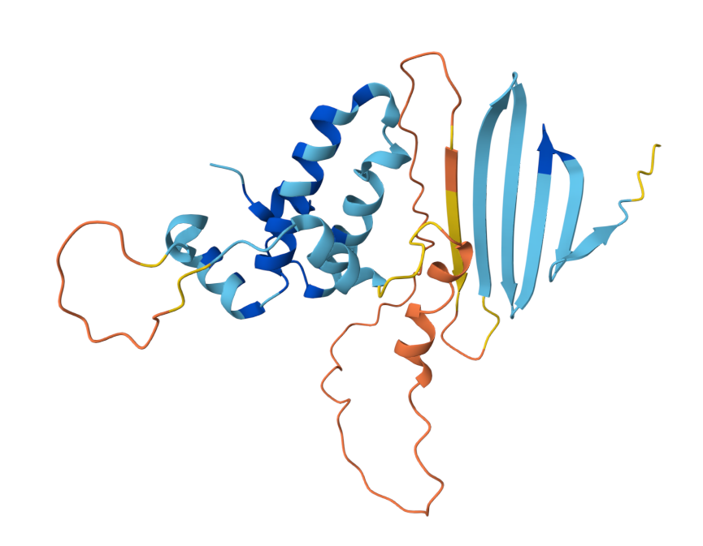
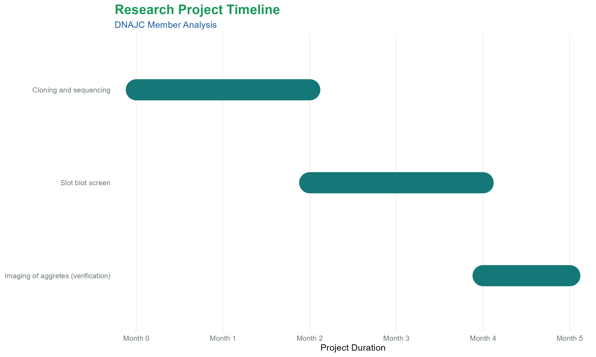



[Go back to the main page](../index.md)

# DNAJC project

---

## Introduction

[Huntington’s disease](https://www.huntington.nl/) is a fatal neurodegenerative disorder caused by a genetic mutation that produces an expanded polyglutamine tract in the Huntingtin protein. This mutation causes proteins to misfold and form toxic aggregates that destroy neurons in the brain. To manage this, cells utilize molecular chaperones, which act as a quality control system to ensure proper protein folding. These chaperones are essential for preventing the buildup of misfolded proteins and maintaining cellular health. Among these, DNAJ proteins, or Hsp40s, serve as vital co-chaperones that direct the activity of the Hsp70 folding machinery. They are identified by a conserved J-domain that allows them to bind specifically to client proteins.  

## What have we done?

We have studied specific molecular chaperones that effectively combat the misfolding and toxicity associated with polyglutamine diseases like Huntington's. We have engineered [a series of tetracycline-inducible expression plasmids](https://www.sciencedirect.com/science/article/pii/S1355814523018850?via%3Dihub) using the pcDNA5 FRT/TO vector system (figure 1). By cloning various chaperone coding sequences in frame with a V5 tag, we have created fusion proteins to track expression and localization of these chaperones. Our cloning process utilized cDNA derived from a diverse pool of human cell lines to ensure broad tissue representation, thereby maximizing the probability of capturing the target mRNA sequences. We have cloned nearly all members of the HSP70, HSP110, DNAJA and DNAJB chaperone family (but not the DNAJC members). The generated library is available via [AddGene](https://www.addgene.org/search/catalog/plasmids/?q=kampinga+Hageman+et+al+Cell+Stress+Chaperones.+2009+Jan&page_number=4) (at non-profit costs).  

*Figure 1. The pcDNA5 FRT/TO vector system. Source: [Hageman *et al.*](https://www.sciencedirect.com/science/article/pii/S1355814523018850?via%3Dihub)*

After sequence verification and Western blot validation, the functional screening [revealed that members of the DNAJB subclass (specifically DNAJB6b and DNAJB8)](https://www.sciencedirect.com/science/article/pii/S1097276510000262?via%3Dihub) are exceptionally potent at suppressing protein aggregation and cellular toxicity (figure 1). These findings highlight these specific DNAJ proteins as critical components of the cellular protein quality control network. In fact, DNAJB6 exists in two forms. DNAJB6b is expressed in the cytosol and the nucleus whereas DNAJB6a is expressed exclusively in the nucleus. For simplicity, we will refer to DNAJB6b as DNAJB6.  

*Figure 2. The result of the previous screen showing that DNAJB6b and DNAJB8 are the most effective suppressors of huntingtin aggregation. Source: [Hageman *et al.*](https://www.sciencedirect.com/science/article/pii/S1097276510000262?via%3Dihub)*

Identifying DNAJB6 as a suppressor was an important breakthrough as it enabled subsequent research that provided mechanistic evidence of a chaperone that directly targets primary nucleation, the very first step of protein aggregation. DNAJB6 uses a specific serine/threonine-rich motif to bind and neutralize mutant Huntingtin "seeds" before they can form larger amyloid fibrils. DNAJB6’s ability to prevent the earliest stages of misfolding makes it a prime therapeutic target, as inducing its expression pharmaceutically could provide a natural cellular defense mechanism to reduce the progression of Huntington’s disease.  

DNAJB6 exists as a functional monomer (figure 3) or dimer that utilizes its J-domain to recruit HSP70 and a specific C-terminal motif to bind amyloid-prone clients. To increase its efficiency, it assembles into high-molecular-weight oligomeric "shells" that provide a high density of binding sites to trap disordered peptides. Once bound to a substrate, it forms a stable complex that effectively stalls the nucleation process, preventing the formation and spread of toxic protein aggregates.

*Figure 3. AlphaFold predicted structure of DNAJB6. Source: [AlphaFold server.](https://alphafoldserver.com/fold/6513fd66c075b29d)*

## What we want to do: Finalize cloning and screening of the entire DNAJC subfamily

We would like to complete our study of the chaperone family by cloning and screening the DNAJC family members. While some members like DNAJC5 and DNAJC13 are well-documented, the majority of the DNAJC subclass is understudied in neurodegeneration research. Up till now, no systematic, comprehensive screening to rank the relative potency of the DNAJC family was performed. Consequently, it remains unknown if these less-studied DNAJC proteins possess unique or superior abilities to suppress mutant Huntingtin toxicity.

*Table 1. Overview of cloned DNAJC members in the pcDNA5 FRT/TO vector system.*

| DNAJ    | Alternative Name  | Cloned |
|---------|------------------ |--------|
| DNAJC1  | MTJ1, ERDJ1       | Yes    |
| DNAJC2  | MPP11, ZRF1       | No     |
| DNAJC3  | P58IPK            | Yes    |
| DNAJC4  | HSP40             | No     |
| DNAJC5* | CSP,CLN4, CLN4B   | No     |
| DNAJC5b*| CSP-alpha         | Yes    |
| DNAJC5g*| CSP-gamma         | Yes    |
| DNAJC6  | Auxilin-1         | Yes    |
| DNAJC7  | TPR2              | Yes    |
| DNAJC8  | HSPC331, SPF31    | No     |
| DNAJC9  | HDJC9, JDD1, SB73 | Yes    |
| DNAJC10 | ERDJ5             | No     |
| DNAJC11 | dJ126A5.1         | Yes    |
| DNAJC12 | JDP1              | Yes    |
| DNAJC13 | RME-8             | No     |
| DNAJC14 | DRIP78            | Yes    |
| DNAJC15 | MCJ               | Yes    |
| DNAJC16 | ERdj8             | Yes    |
| DNAJC17 | —                 | No     |
| DNAJC18 | —                 | Yes    |
| DNAJC19 | TIM14             | Yes    |
| DNAJC20 | HSCB              | No     |
| DNAJC21 | BMFS3, DNAJA5, GS3| No     |
| DNAJC22 | wus               | No     |
| DNAJC23 | SEC63, ERdj2      | No     |
| DNAJC24 | DPH4, JJJ3, ZCSL3 | Yes    |
| DNAJC25 | bA16L21.2.1       | Yes    |
| DNAJC26 | GAK               | No     |
| DNAJC27 | RBJ               | Yes    |
| DNAJC28 | C21orf55, C21orf78| No     |
| DNAJC29 | SACS, ARSACS      | No     |
| DNAJC30 | LHONAR, MC1DN38   | No     |

*DNAJC5, DNAJC5B and DNAJC5G do have different genomic locations and are paralogs instead of different splice variants of the same gene.

## Need for funding and budgeting

To enable a comprehensive screen with the aim of identifying the most effective therapeutic targets within the DNAJC family for Huntington’s disease, funding is required. Over the past years we have already cloned a substantial amount of the library of DNAJC proteins in the pcDNA5 FRT/TO vector system. See the table below. Financial resources will be utilized to clone the remaining DNAJC candidates and complete the expression library.  

The expected total costs of around €50,000 are divided in the following expenses:

- Completion of DNAJC construct library. Cloning & Synthesis of the remaining ~15 DNAJC genes in the expression plasmid. Genes will be ordered and/or cloned from cDNA and  subcloned to the pcDNA5 FRT/TO vector system. Subsequently the DNAJC library will be sequence verified. The costs are estimated at €5,000 (materials).

- Systematic Screening of construct library. Running a comprehensive screen across the full ~30-member DNAJC family using a high-throughput cell-based infrastructure comprising reagents & consumables (specialized plates, transfection reagents, and slot-blot) as well as an imaging/quantification setup for measuring Huntingtin aggregation. This would cost approximately €10,000 (materials).

- Labor: Dedicated time for a PhD-level researcher and/or technician to optimize and execute the screen (6 months) is budgeted at €35,000.

*Figure 4. Gantt Chart of the project.*

## Sharing research materials

To facilitate open science and support global research efforts, the newly generated vectors will be submitted to the non-profit plasmid repository [Addgene](https://www.addgene.org/) to share these materials with the scientific community. By providing access to this complete DNAJC library, we aim to accelerate discoveries and collaborative studies into protein quality control and neurodegenerative diseases.

---

This is an initiative of [Biomolecules & Health](https://www.hanze.nl/en/research/centres/research-centre-biobased-economy/professorships/biomolecules-and-health) in collaboration with the UMCG research group [Protein Quality Control in Health and Disease](https://umcgresearch.org/w/protein-quality-control-in-health-and-disease).

Information about:
- [Jurre Hageman](https://jurrehageman.github.io/cv/)
- [Fin Milder](https://www.hanze.nl/en/about-hanze/organization/employees/professors/fin-milder)

---

>This web page is distributed under the terms of the Creative Commons Attribution License which permits unrestricted use, distribution, and reproduction in any medium, provided the original author and source are credited.
>Creative Commons License: CC BY-SA 4.0.

