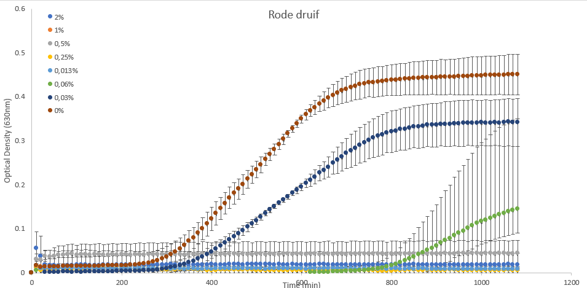
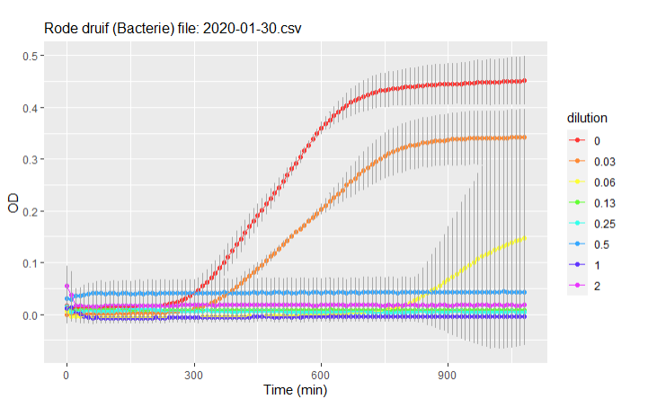



[Go back to the main page](../index.md)

# Master Gezonde en Duurzame Voeding

## Voorbeeld opdracht

---

## Opdrachtbeschrijving

### Inleiding

Anthocyanen zijn in water oplosbare flavonoïden. Anthocyanen hebben een diverse functie in planten. Ze lokken insecten zoals bijen voor bestuiving maar ze hebben ook antioxidant en antimicrobiële eigenschappen. Hoewel anthocyanen in de Europese Unie zijn goedgekeurd als kleurstof voor voedingsmiddelen en dranken, zijn ze nog niet goedgekeurd voor gebruik als voedseladditief omdat ze niet als veilig zijn geverifieerd bij gebruik als voedsel- of supplementingrediënten. Het bedrijf waar ik mee samenwerk (projectpartner) wil anthocyanen gebruiken als voedseladditief in voedingsmiddelen om bacteriebederf tegen te gaan. Er heeft een laboratoriumonderzoek plaatsgevonden waarbij de groei van een bacterie is onderzocht in media met verschillende concentraties anthocyanen uit rode en groene druiven.

### Onderzoeksvraag

Werken anthocyanen uit rode druiven of groene druiven antimicrobiëel?

### Het experiment

Anthocyanen zijn uit rode en groene druiven geextraheerd. Daarna is een experiment ingezet om te testen of de anthocyanen ingezet kunnen worden als conserveringsmiddel.  
Er is een verdunningsreeks gebruikt van anthocyanen namelijk:  
- 0,000%
- 0,031%
- 0,062%
- 0,125%
- 0,250%
- 0,500%
- 1,000%
- 2,000%

De helft van elk welletje (100 µl) bevat de verdunde anthocyanen oplossing. De andere helft (100 µl) een vaste verdunning van de bacterie.  
De plaat werd geïncubeerd in een spectrofotometer die kan verwarmen en de optische dichtheid werd elke 10 minuten gemeten bij 600 nm.  

### Experiment setup

In het figuur hieronder is de plate setup te zien van het experiment. 

### Opdracht

Maak plots van de data (bedenk zelf welk type het meest geschikt is) en analyseer of de geïsoleerde anthocyanen antimicrobieel werken.  

### Data

De ruwe data zijn [hier](./sample_data/2020-01-30.csv) te downloaden.

### Uitwerkingen

Uitwerkingen zijn hieronder te downloaden:
- [Uitwerking in Excel](./example_analysis/analysis_excel.xlsx)
- [Uitwerking in R](.//example_analysis/analysis_r.Rmd)
- [Uitwerking in Python (optioneel)](./example_analysis/analysis_python.ipynb)

De volledige uitwerking is ook te vinden op deze [Github](https://github.com/jurrehageman/master_food_data_analysis) pagina.  

#### Voorbeeld plot uitwerking Excel

#### Voorbeeld plot uitwerking R

[Volledige uitwerking van de Rmd file in html](./example_analysis/analysis_r.html)

#### Voorbeeld plot uitwerking Python

>Let op: Python is geen onderdeel van deze module maar een uitwerking in Python mag wel.
>Deze uitwerking is hier ter inspiratie gegeven.

[Volledige uitwerking van het Jupyter Notebook in html](./example_analysis/analysis_python.html)

### Conclusie

De steriliteitscontroles zijn allemaal negatief voor bacteriegroei.

Uit de data blijkt verder dat de anthocyanen van de rode druif het sterkst antimicrobieel werken. De groene druif werkt ook antimicrobieel maar de negatieve controle niet. Er is een duidelijke dosis-afhankelijke remming van de groei waar te nemen bij de anthocyanen van de rode en de groene druif.

---

>This web page is distributed under the terms of the Creative Commons Attribution License which permits unrestricted use, distribution, and reproduction in any medium, provided the original author and source are credited.
>Creative Commons License: CC BY-SA 4.0.

