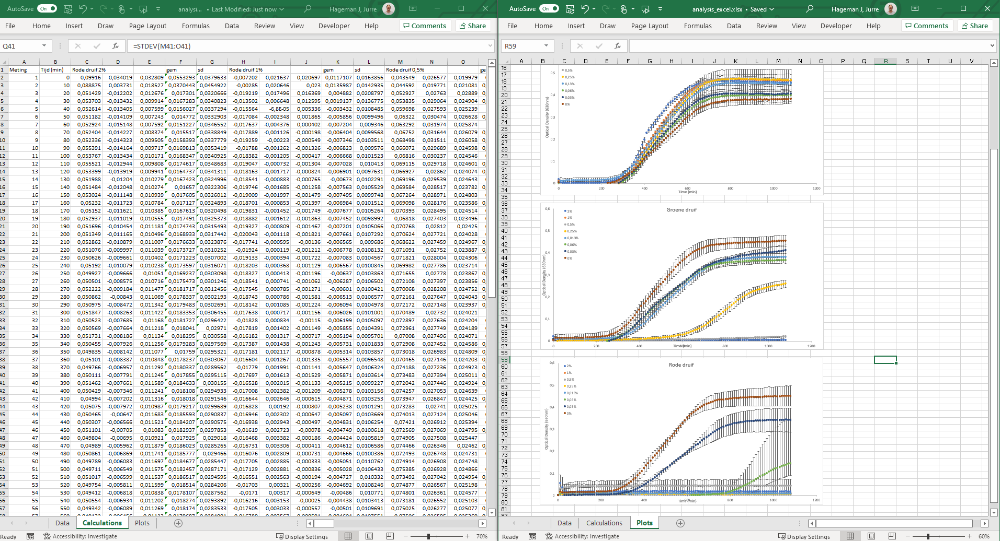



---

[Go back to the main page](../index.md)

---

# Excel

## Index page

*Source: own work*

---

## Topics:

- [Data Import](./excel_02_data_import.md)
- [Data Cleaning](./excel_05_data_cleaning.md)
- [Data Analysis](./excel_08_data_analysis.md)
- [Data Visualization](./excel_11_data_visualization.md)

## Excercises

- [Data Import](./excel_03_data_import_exercises.md)
- [Data Cleaning](./excel_06_data_cleaning_exercises.md)
- [Data Analysis](./excel_09_data_analysis_exercises.md)
- [Data Visualization](./excel_12_data_visualization_exercises.md)

## Solutions

- [Data Import](./excel_04_data_import_solutions.md)
- [Data Cleaning](./excel_07_data_cleaning_solutions.md)
- [Data Analysis](./excel_10_data_analysis_solutions.md)
- [Data Visualization](./excel_13_data_visualization_solutions.md)

---

## Introduction

Excel is a spreadsheet software that can be used to organize, store, and manipulate data. It is commonly used in a variety of fields, including data science, to perform tasks such as data cleaning, analysis, and visualization.

**Data Import**: Excel can import tabulated text files such as csv files. The `Text to Columns` feature in Excel allows you to split a single column of text into multiple columns, based on a delimiter such as a comma or a tab. This can be useful when you have data that is not organized in a way that is easy to work with, and you want to split it up into more manageable chunks.

**Data Cleaning**: Excel has a variety of functions that can be used to clean and transform data, such as the `TRIM` function to remove leading and trailing spaces, the `SUBSTITUTE` function to replace specific text with other text, and the `IFERROR` function to handle errors.

**Data Analysis**: Excel has a number of built-in functions for performing statistical analyses, such as the `AVERAGE` function to calculate the mean of a range of cells, the `MAX` and `MIN` functions to find the highest and lowest values in a range, and the `STDEV` function to calculate the standard deviation. In addition, `SUMIF` adds numbers in a range based on a single condition, while `AVERAGEIF` calculates the average of numbers in a range, also based on a single condition. `SUMIFS` and `AVERAGEIFS` are advanced versions of SUMIF and AVERAGEIF in Excel. They allow you to sum or average numbers based on multiple criteria simultaneously. Excel also makes use of array functions. An array function in Excel is a formula that can process multiple values simultaneously, either returning a single result or spilling multiple results into a range of cells. An example of an often used array function is `UNIQUE`. UNIQUE is an Excel dynamic array function that extracts a list of distinct values from a range, automatically "spilling" the results into adjacent cells.  

**Data Visualization**: Excel has a range of chart types that can be used to visualize data, such as line charts, bar charts, and scatter plots. It also has a number of formatting options that can be used to customize the appearance of the charts.

Overall, Excel is a useful tool for data science because it is widely available, easy to use, and has a variety of functions and features that can be used to work with and analyze data.

Excel also has its limit for data analysis and visualization though. Although R and Python have a steeper learning curve, data analysis with R and Python is much more powerful.

There are several factors to consider when deciding whether to use Excel, Python, or R for a particular task. Here are some points to consider:

Size of data: Excel is limited in the amount of data it can handle. If you have a large dataset (e.g., millions of rows), Excel may become slow or crash. In such cases, using Python or R may be more efficient.  

Complexity of analysis: Excel is a good choice for simple data analysis tasks, such as sorting and filtering data, creating pivot tables, and performing basic calculations. However, if you need to perform more complex tasks, such as machine learning, Python or R may be a better choice, as they have more advanced statistical and analytical capabilities.  

Automation: If you need to perform the same analysis repeatedly, or if you need to automate the analysis of a large number of datasets, Python or R may be a better choice, as they allow you to write scripts that can be run automatically.  

Ultimately, the choice between Excel, Python, and R will depend on your specific needs and the resources you have available. It may be useful to use a combination of these tools, depending on the requirements of your project.  

---

[Go back to the main page](../index.md)  
<a href="#top">⬆️ Back to Top</a>  

---

>This web page is distributed under the terms of the Creative Commons Attribution License which permits unrestricted use, distribution, and reproduction in any medium, provided the original author and source are credited.
>Creative Commons License: CC BY-SA 4.0.

