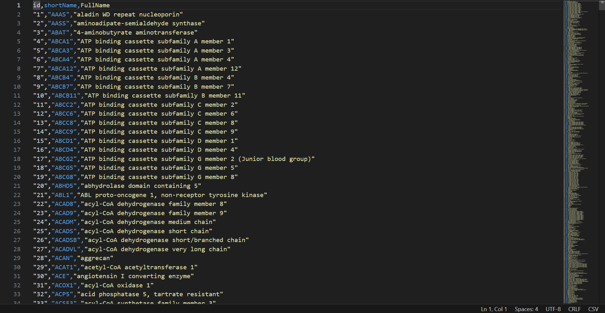
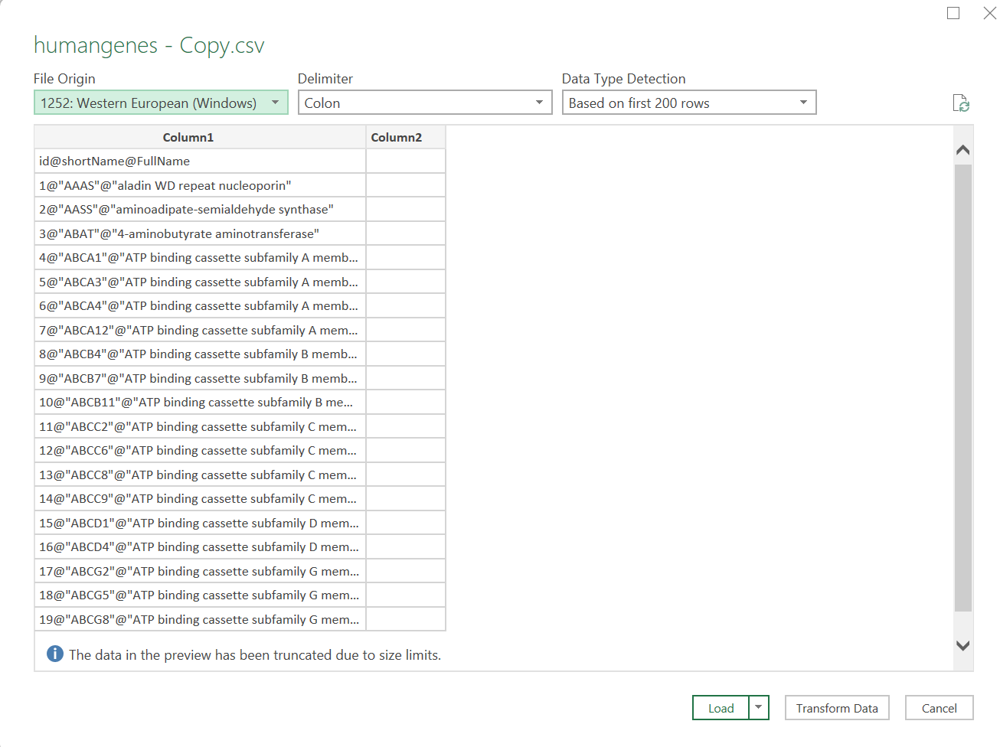



[Go back to the main page](../index.md)

# Excel: Data Import

## Introduction

In data science, data is typically organized in a structured format, such as a table or a spreadsheet. This allows for easy manipulation and analysis of the data.

A common way to organize data for data science is to use a tabular format, with each row representing a record (e.g., a measurement) and each column representing a feature or attribute (e.g., protein concentration, mass of product, date of product purchased). This format is commonly used in data storage and retrieval systems, such as databases.

In many cases, data is organised in CSV and TSV files.

A delimited text file is a plaintext file that uses a special character, called the delimiter, to separate the fields (columns) within each line of the file. Delimited text files can use any character as a delimiter, but the most common delimiter is the tab character (also known as the tab-separated values or TSV file format). Other common delimiters include the comma (used in CSV files), the semicolon, and the pipe symbol. Like CSV files, delimited text files are often used to store data that can be imported into a spreadsheet or database program.

Another important aspect of text files are character encoding formats. The most widely used is UTF-8. UTF-8 is a character encoding format that is used to represent text as a sequence of bytes for storage or transmission. It is part of the Unicode standard, which defines a unique number for every character in the world's scripts, including Latin, Greek, Chinese, and emoji. It is the default character encoding format for the web and is often used as the default character encoding format in software and applications. 

Another important aspect of text files is the BOM. A BOM (Byte Order Mark) is a special character that can be placed at the beginning of a text file to indicate the endianness (byte order) of the file's encoding. It is often used in Unicode encoding formats, such as UTF-8. The BOM character is not visible when the text file is opened in a text editor, but it can be detected by software that is specifically designed to look for it. The BOM is used to ensure that text files are interpreted correctly when they are transferred between systems.

At last, you should realize that there are different types of line endings in text files. CRLF stands for "Carriage Return" (CR) and "Line Feed" (LF). In text files, these characters are used to indicate the end of a line of text. The CR character moves the cursor to the beginning of the current line, while the LF character moves the cursor to the next line. In Windows and DOS operating systems, the CRLF sequence (CR+LF) is used to represent the end of a line of text. In Unix-based systems, such as Linux and macOS, the LF character (also known as a newline) is used to represent the end of a line of text. When text files are transferred between systems that use different line endings, it can cause problems if the line endings are not interpreted correctly. For example, if a text file created on a Windows system is transferred to a Unix system, the CRLF line endings will not be recognized and the text file may appear to be a single, long line of text. To fix this, the line endings must be converted to the appropriate format for the target system.

Regardless of the specific format used, it is important to ensure that the data is well-organized, accurate, and consistent, as this will make it easier to manipulate and analyze.

## Check your data file

The first step in data import is to check your data using a text editor.
There are many text editors and all operating systems do have a default build-in text editor.
However, I do recommend [Visual Studio Code](https://code.visualstudio.com/) as it allows you to view and manipulate text files on all main operating systems.

Open your text file and check how the data are organised.

Here you can see the [Food Composition](https://www.kaggle.com/datasets/vinitshah0110/food-composition?resource=download&select=Food+Composition.csv) file.

*Figure 1: a csv file in Visual Studio Code*

As can be seen from the screenshot above, the csv file contains a header and the column seperator that is used is a comma. It can also be seen that the file is UTF-8 encoded and contains a BOM.

## Import CSV files in Excel

To import a CSV file into Microsoft Excel, follow these steps:

- Open Microsoft Excel.
- Click on the Data tab in the ribbon.
- In the Get & Transform Data group, click on the "From Text/CSV" button.
- In the Import Data dialog box that appears, navigate to the location of the CSV file that you want to import and select it.
- Click the "Import" button.
- In the Text Import Wizard that appears, select the "Delimited" option and click the "Next" button.
- On the next page of the wizard, select the "Comma" option as the delimiter and click the "Next" button.
- On the final page of the wizard, you can specify how you want Excel to handle the data in the CSV file. You can specify the data type for each - column, whether the first row of the CSV file contains column headings, and other options. Once you have made your selections, click the "Finish" button to import the data into Excel.
- The imported data will be displayed in a new worksheet in the current workbook. You can then use the data as you would any other data in Excel, such as sorting, filtering, and performing calculations on it.

Here are some screenshots of the import process:

*Figure 2: Loading a csv file in Excel*

*Figure 3: Loaded csv file in Excel*

As you can see from above, the data is loaded in a Table with filters to sort rows. 

>Note that the file is still a csv file. To save Excel features such a tables and plots, you should save in the `xlsx` format.

## Import TSV and other text file in Excel

As mentioned above, sometimes text files use another column seperator such as a tab or a pipe `|` symbol.
These are fairly easy to load in Excel as well:

*Figure 4: a TSV file in Visual Studio Code*

Loading this file in Excel is easy as it will recognize the tabs.
However, if in case you run into trouble, you can may need to help with file loading

Consider the [this](./files/file01.txt) file.

*Figure 5: a text file in Visual Studio Code that uses the `@` symbol as a column seperator*

As you can see, it uses the `@` symbol as the column seperator.
It will not easily load in Excel:

|
*Figure 6: a text file loaded in Excel that uses the pipe symbol `@` symbol as a column seperator*

You need to spicify the file type (UTF-8). But even then it will not load well:

|
*Figure 7: a difficult file to load in Excel*

However, using the "Text to columns" feature, you can easily seperate the columns.
Than, remove the unwanted top rows and format as table.

|
*Figure 8: a difficult file loaded in Excel*

---

## Topics:

- [Data Import](link here)
- [Data Cleaning](link here)
- [Data Analysis](link here)
- [Data Visualization](link here)

>This web page is distributed under the terms of the Creative Commons Attribution License which permits unrestricted use, distribution, and reproduction in any medium, provided the original author and source are credited.
>Creative Commons License: CC BY-SA 4.0.

