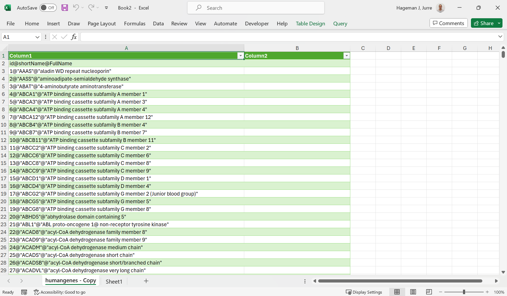
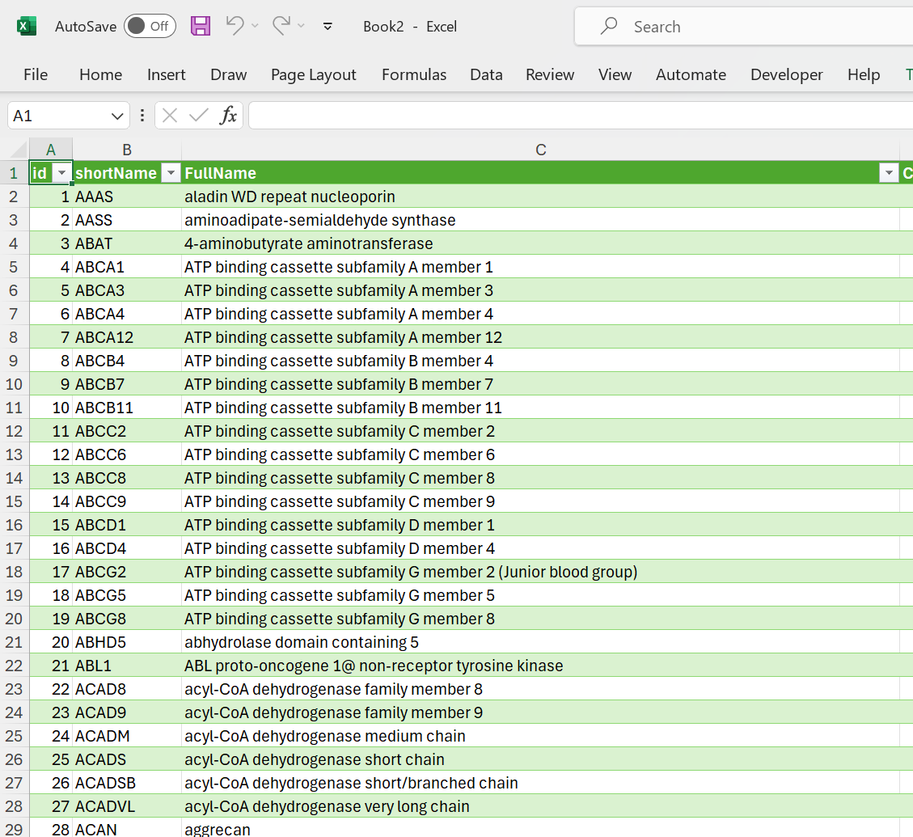
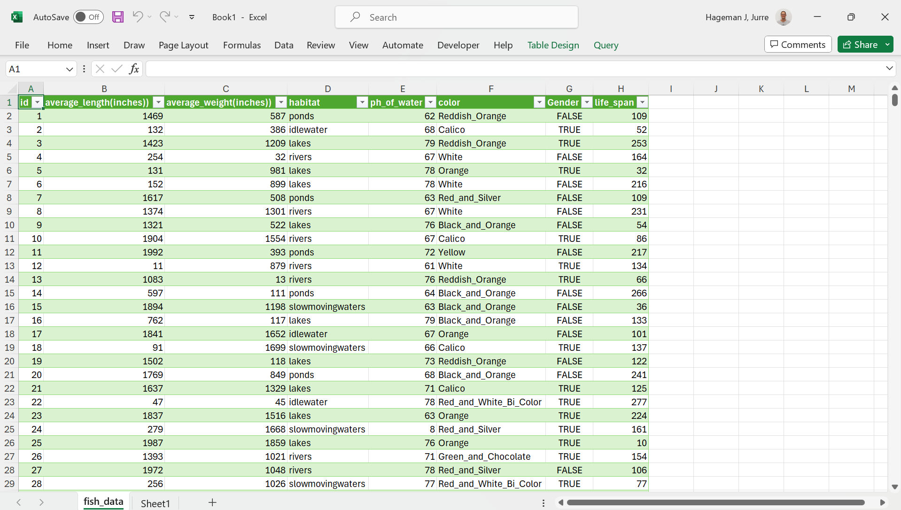
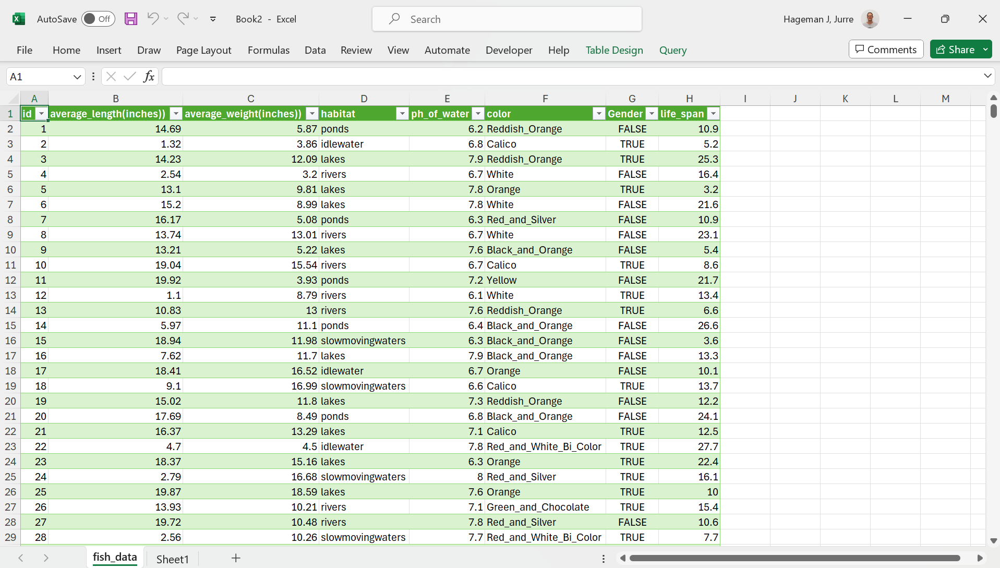



---

[Go back to the main page](../index.md)  
[Go back to the Excel overview page](../excel/excel_01_index.md)  

---

Files used on this page:  
- [file01_humangenes.csv](./files_02_data_import/file01_humangenes.csv)  
- [file02_fish_data.csv](./files_02_data_import/file02_fish_data.csv)  

# Excel: Data Import

## Introduction

In data science, data is typically organized in a structured format, such as a table or a spreadsheet. This allows for easy manipulation and analysis of the data.

A common way to organize data for data science is to use a tabular format, with each row representing a record (e.g., a measurement) and each column representing a feature or attribute (e.g., protein concentration, mass of product, date of product purchased). This format is commonly used in data storage and retrieval systems, such as databases.

In many cases, data is organized in `CSV` and `TSV` files.

A delimited text file is a plaintext file that uses a special character, called the delimiter, to separate the fields (columns) within each line of the file. Delimited text files can use any character as a delimiter, but the most common delimiter is the tab character (also known as the tab-separated values or TSV file format). Other common delimiters include the comma (`,`)used in CSV files, the semicolon (`;`), and the pipe (`|`) symbol. Like CSV files, delimited text files are often used to store data that can be imported into a spreadsheet or database program.

Another important aspect of text files are character encoding formats. The most widely used is `UTF-8`. UTF-8 is a character encoding format that is used to represent text as a sequence of bytes for storage or transmission. It is part of the Unicode standard, which defines a unique number for every character in the world's scripts, including Latin, Greek, Chinese, and emoji. It is the default character encoding format for the web and is often used as the default character encoding format in software and applications. 

Another important aspect of text files is the `BOM`. A BOM (Byte Order Mark) is a special character that can be placed at the beginning of a text file to indicate the byte order of the file's encoding. It is often used in Unicode encoding formats, such as UTF-8. The BOM character is not visible when the text file is opened in a text editor, but it can be detected by software that is specifically designed to look for it. The BOM is used to ensure that text files are interpreted correctly when they are transferred between systems.

Another important aspect is that you should realize that there are different types of line endings in text files. `CRLF` stands for "Carriage Return" (`CR`) and "Line Feed" (`LF`). In text files, these characters are used to indicate the end of a line of text. The CR character moves the cursor to the beginning of the current line, while the LF character moves the cursor to the next line. In Windows and DOS operating systems, the CRLF sequence (CR+LF) is used to represent the end of a line of text. In Unix-based systems, such as Linux and macOS, the LF character (also known as a newline) is used to represent the end of a line of text. When text files are transferred between systems that use different line endings, it can cause problems if the line endings are not interpreted correctly. For example, if a text file created on a Windows system is transferred to a Unix system, the CRLF line endings will not be recognized and the text file may appear to be a single, long line of text. To fix this, the line endings must be converted to the appropriate format for the target system.

At last, always make sure that you are aware of decimal numbers in the csv file and be sure what decimal and thousands separator is used. These differ by region.  

Regardless of the specific format used, it is important to ensure that the data is well-organized, accurate, and consistent, as this will make it easier to manipulate and analyze. In the United States, the period (`.`) is used as the standard decimal separator. In the Netherlands, a comma (`,`) is used. As a thousands separator, the comma (`,`) is used in many English speaking countries while the period (`.`) is used in many non-English speaking countries. As a consequence, csv files from English speaking countries often use the comma as a column separator, while "csv" files from non-English speaking countries often use a semi-colon as a column separator.

## Check your data file

The first step in data import is to check your data using a text editor.
There are many text editors and all operating systems do have a default build-in text editor.
However, I do recommend [Visual Studio Code](https://code.visualstudio.com/) as it allows you to view and manipulate text files on all main operating systems. In addition, it features the [rainbow csv plugin](https://marketplace.visualstudio.com/items?itemName=mechatroner.rainbow-csv) that allows you to see the csv file with color highlighting to discriminate between the columns (this only works for comma separated files).

Open your text file and check how the data are organized.

Here you can see the [Human Genes](https://www.kaggle.com/datasets/mohamedabdullah/human-genes) file.

Or [here](./files_02_data_import/file01_humangenes.csv) directly as csv file.  

  
*Figure 1: a csv file in Visual Studio Code*

As can be seen from the screenshot above, the csv file contains a header and the column separator that is used is a comma. It can also be seen that the file is UTF-8 encoded and contains a CRLF encoding for newlines.

## Check the decimal separator

On Windows, the decimal separator is set at the OS level.
To set this, click the Windows button and type `intl.cpl`.
Then click `Additional settings`. Here you can specify your decimal separator at the OS level.

*Figure 2: Change the decimal separator at the OS level.*

Another level where you can set the decimal separator is in Excel.
In `File > Options > Advanced` you can set the decimal separator.
You can either set it to `Use system separators` or choose your own.

*Figure 3: Change the decimal separator in Excel.*

A last level to choose the decimal separator is during the import of a csv file using either Power Query or the csv import wizard. This is described below.

## Import CSV files in Excel

There are several ways to import a csv file in Excel.
The most common ways are:
- Using Power Query (also known as Get & Transform in Excel)
- Using the csv import wizard
- Open the csv file with Excel directly (all bets are off using this option). Unless you are pretty sure about the content of the csv file, this is not recommended.  

> Although Power Query is a very convenient way to import csv files in Excel, it can cause major problems with the decimal separator and thousands separator (independent of your OS settings and the Excel settings for the separator signs). You need to set the region correct (see below). Always check the result of the import and compare with the csv file in a text editor. 

## Import csv files using Power Query

To import a CSV file into Microsoft Excel, follow these steps:

- Open Microsoft Excel.
- Click on the Data tab in the ribbon.
- In the Get & Transform Data group, click on the "From Text/CSV" button.
- In the Import Data dialog box that appears, navigate to the location of the CSV file that you want to import and select it.
- Click the "Import" button.
- In the Text Import Wizard that appears, select the correct "Delimiter".
- Click on "Transform Data".
- Here you can specify how you want Excel to handle the data in the CSV file. You can specify the data type for each column, whether the first row of the CSV file contains column headings, and other options. Once you have made your selections, click the "Close & Load" button to import the data into Excel.
- The imported data will be displayed in a new worksheet in the current workbook. You can then use the data as you would any other data in Excel, such as sorting, filtering, and performing calculations on it.

Here are some screenshots of the import process:

*Figure 4: Loading a csv file in Excel*

*Figure 5: Loaded csv file in Excel*

As you can see from above, the data is loaded in a Table with filters to sort rows. 

### Import TSV and other text file in Excel with Power Query

As mentioned above, sometimes text files use another column separator such as a tab or a pipe `|` symbol.
These are fairly easy to load in Excel as well:

*Figure 6: a TSV file in Visual Studio Code*

Loading this file in Excel is easy as it will recognize the tabs.
However, if in case you run into trouble, you can may need to help with file loading

Consider this file:

*Figure 7: a text file in Visual Studio Code that uses the `@` symbol as a column separator*

As you can see, it uses the `@` symbol as the column separator.
It will not easily load in Excel:

|
*Figure 8: a text file loaded in Excel that uses the`@` symbol symbol as a column separator*

You need to specify the file type (UTF-8). But even then it will not load well:

|
*Figure 9: a difficult file to load in Excel*

However, after clicking "From txt/csv" and selecting the csv file, you can specify the delimiter by choosing "--Custom--" and then enter the `@` symbol. Then click "Transform Data", click "Use First Row as Headers" and click " Close & Load".  

|
*Figure 10: a difficult file loaded in Excel*

### Power Query and decimal separators

As mentioned above, alway check if the decimal separator is set correctly.
As an example we will have a look at [this dataset](https://www.kaggle.com/datasets/stealthtechnologies/predict-lifespan-of-a-comet-goldfish) about predictor variables in order to predict lifespan in Goldfish.

You can also download the csv file [here](./files_02_data_import/file02_fish_data.csv).  

The data contains the period (.) as a decimal separator:

|
*Figure 11: This file contains the period as a decimal separator*

Note that the import with Power Query goes wrong (see column `average length (inches)`):

|
*Figure 12: Data is imported in Power Query but decimal settings where not correct.*

This is because the region settings where on Dutch (the Netherlands). Change the language to English (United States).

You can set this at `Data > Get Data > Query Options > regional Settings`.

|
*Figure 13: Change region settings.*

As you can see, the data is now loaded correctly (see column `average length (inches)`):

|
*Figure 14: Import with correct region settings.*

## Import csv files using the Text Import Wizard.

>Note: to force excel to use the text file import wizard, make a copy of your file and change the file extension to txt instead of csv. If the file extension is csv, Excel will try to load the file directly and you will have less control over the import process.  

As mentioned above, you can also import your txt files using the txt import wizard. Use `File > open > browse` and browse to the location of your txt file. Change the dropdown box from `All Excel Files` to `All Files`. Open your file and select Delimited from the wizard:

|
*Figure 15: Import with the Text Import Wizard.*

Hit `Next` and click on `Advanced` to specify the Decimal and Thousands Separator.

|
*Figure 16: Specify the decimal separator.*

The csv file is now imported but not yet formatted in a data table.

|
*Figure 17: Result of the import.*

After formatting the dataset in a table you can start your analysis (preferentially on a separate worksheet).

|
*Figure 18: Data in a table format.*

## Import csv files directly using open with from the file explorer in your OS.

If you feel lucky, you can directly open een csv file in Excel. Only do this if you are pretty aware of the organization of the particular Excel file. It can save a lot of time if you are working with a lot of similar excel files.  

---

[Go back to the main page](../index.md)  
[Go back to the Excel overview page](../excel/excel_01_index.md)  
<a href="#top">⬆️ Back to Top</a>  

---

>This web page is distributed under the terms of the Creative Commons Attribution License which permits unrestricted use, distribution, and reproduction in any medium, provided the original author and source are credited.
>Creative Commons License: CC BY-SA 4.0.

