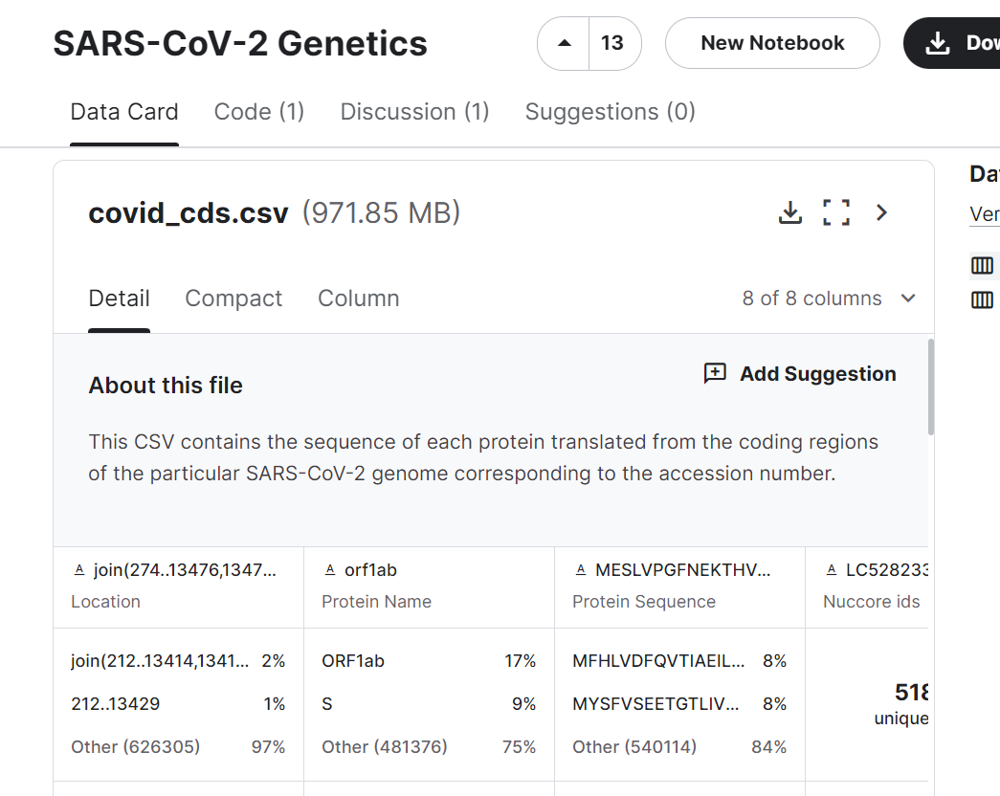



[Go back to the main page](../index.md)

# Excel Data Import

## Solutions

---

### Exercise 1

- File 1: ,
- File 2: ;
- File 3: \|
- File 4: @

### Exercise 2

Find the solution in the link below.

[food-composition](./files_04_import_solutions/exercise02/food_composition.xlsx)

### Exercise 3

Find the solution in the link below.

[nutritional-values-for-common-foods-and-products](./files_04_import_solutions/exercise03/nutrition.xlsx)

As you can see from this file, the units are in the cells instead of the column headers.

Therefore, all fileds are strings instead of numbers.
This requires cleaning before you can do any calculations!

### Exercise 4

During the import, the column headers where not placed as such.
See figure below:

To fix this, click `Transform Data` and then `Use First Row as Headers`.

The column headers are now loaded well:

The solution can be found [here](./files_04_import_solutions/exercise04/food_data.xlsx)

### Exercise 5

This file is rather easy to load.

The solution can be found [here](./files_04_import_solutions/exercise05/Food_Product_Emissions.xlsx)

### Exercise 6

This file is easy to load as well:

The solution can be found [here](./files_04_import_solutions/exercise06/FAOSTAT_data_10-23-2018.xlsx)

---

>This web page is distributed under the terms of the Creative Commons Attribution License which permits unrestricted use, distribution, and reproduction in any medium, provided the original author and source are credited.
>Creative Commons License: CC BY-SA 4.0.

