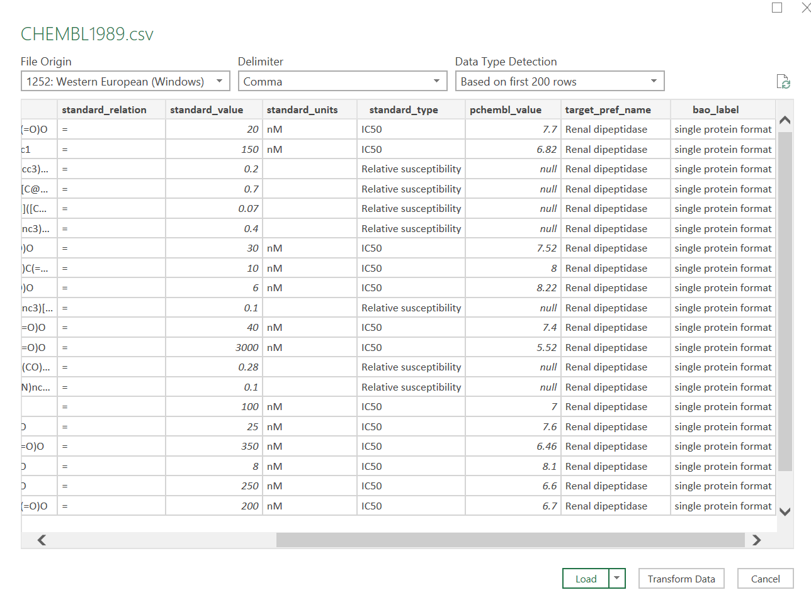



---

[Go back to the main page](../index.md)  
[Go back to the Excel overview page](../excel/excel_01_index.md)  

---

# Excel Data Import

## Solutions

---

### Exercise 1

- File 1: ,
- File 2: ;
- File 3: \|
- File 4: @

### Exercise 2

Find the solution in the link below.

[Heart Disease Health Indicators Dataset](./files_04_import_solutions/exercise02/heart_disease_health_indicators.xlsx)

### Exercise 3

Find the solution in the link below.

[Properties of ATC accepted medicines](./files_04_import_solutions/exercise03/KEGG_DRUG_ATC_PROPERTIES_PED_FP.xlsx)

As you can see from this file, decimal separator is a dot.

>Make sure that you properly import the file with the correct decimal separator selected. You can do this by setting the Regional Setting correctly to English (United States).  

### Exercise 4

During the import, the column headers where not placed as such.
See figure below:

To fix this, click `Transform Data` and then `Use First Row as Headers`.

The column headers are now loaded well:

The solution can be found [here](./files_04_import_solutions/exercise04/food_data.xlsx)

### Exercise 5

Note that this file uses the dot as a decimal separator. In addition, some cells contain `null` values (something that we will deal with later on).

The solution can be found [here](./files_04_import_solutions/exercise05/CHEMBL1989.xlsx).

### Exercise 6

As you probably noted, there are no column headers in covid_cds. You can add these manually after the import. You can find information about the column headers at Kaggle: [SARS-CoV-2 Genetics](https://www.kaggle.com/datasets/rtwillett/sarscov2-genetics)

See a screenshot below:

You can rename the column headers to: Location, Protein Name, Protein Sequence etc.

>As you might have observed, this is a very large dataset (one of the csv files is almost 1 GB in size). Excel has a lot of trouble in rendering the data in real-time. You are probably way better off doing analysis of such large datasets in R or Python. The solution is not included as the file size is to large to include on the website.  

### Exercise 7

Use PowerQuery to load the csv files.  
Data tab > `From Text/CSV`.  
Here you can select the delimiter (tab, comma, custom).
Click `Transform Data` for more import options.  
You can click remove Rows to remove top rows.  
`Replace Values` can be used to replace text to indicate missing values.  
You can manually enter Column names.  
You can click `Use First Rows as Headers` to use the first row as a header.   
Decimal separator can be changed by changing the regional settings under `File` > `Options and Settings` > `Query Options` > `Regional Settings`.  

---

[Go back to the main page](../index.md)  
[Go back to the Excel overview page](../excel/excel_01_index.md)  

---

>This web page is distributed under the terms of the Creative Commons Attribution License which permits unrestricted use, distribution, and reproduction in any medium, provided the original author and source are credited.
>Creative Commons License: CC BY-SA 4.0.

