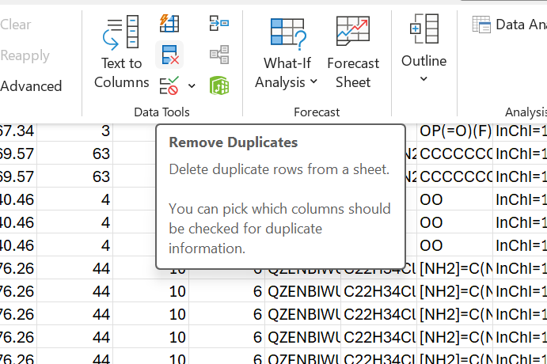
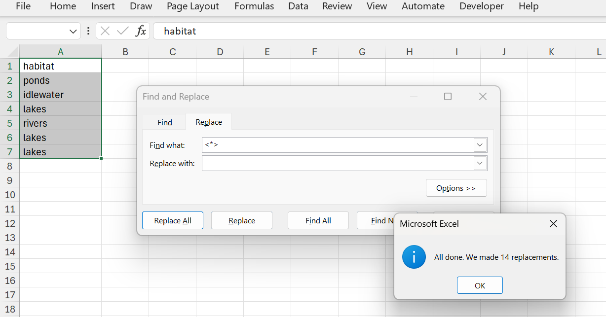
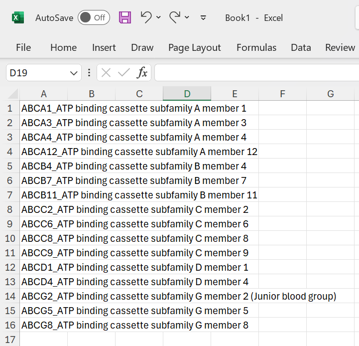
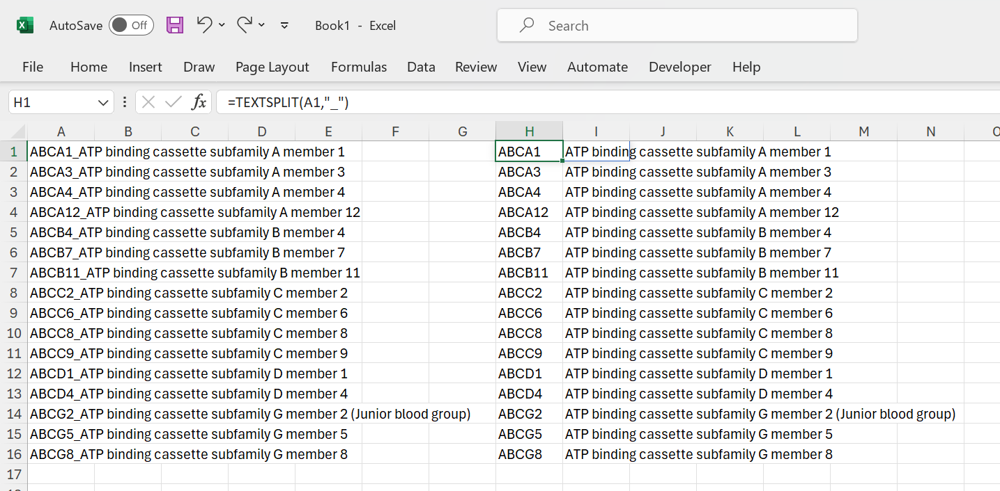
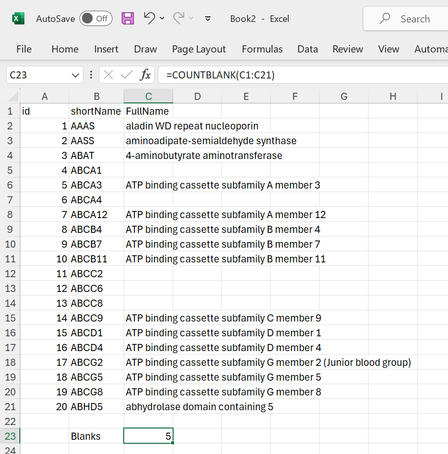
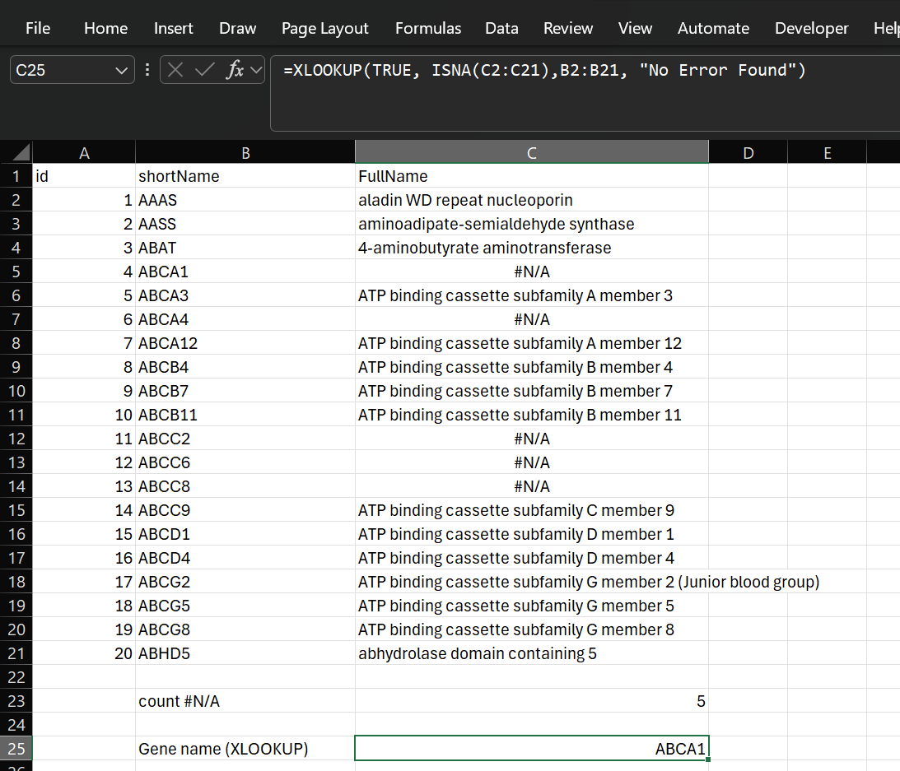
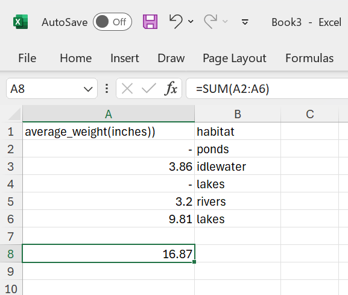



[Go back to the main page](../index.md)

# Excel: Data Cleaning

## Introduction

In data science, data is typically organized in a structured format, such as a table or a spreadsheet. This allows for easy manipulation and analysis of the data.

However, a lot of data coming from external sources such as lab equipment and factory equipment will not be directly suitable for data analysis. In that case, data cleaning en reorganization might me required.

Excel lacks behind Python and R in capabilities of data reorganization and cleaning. Nevertheless, Excel has some features that are worth explaining. We will discuss them here.

## Text to column feature

If your csv data import fails, you can manually parse your text to various columns. Take a look at the following example:

*Figure 1: All data in a single column*

As you can see, all data is loaded in the first column. You can use the `text to columns` functionality that can be found on the data tab in the ribbon.

*Figure 2: Select the delimiter*

Here the correct culumn separator is selected to parse the text. The result is as follows:

*Figure 3: Text separated to columns*

As you can see from the picture above, the text is now separated in different columns based on the correct column separator.

## Remove duplicates

On the data tab in the ribbon, you will find an option to remove duplicate rows:

*Figure 4: Remove duplicates feature*

As can be seen from the picture below, row ID 2 is a duplicate.

*Figure 5: Two duplicate rows*

You can select columns to compare. In the case below, all columns were selected.

*Figure 6: Columns selected to compare*

Excel reports the removal of 1 duplicate row.

*Figure 7: 1 duplicate value removed.*

And the result is 1 duplicate row removed.

*Figure 8: 1 duplicate row removed.*

## Trimming text

Often, data will contain extra whitespace such as spaces. Extra spaces are notoriously difficult to spot, especially those at the end. Those extra spaces may interfere with later analysis. 

*Figure 9: Only 1 Milk counted as one cell contains Milk with a tailing space.*

The `TRIM` function will remove trailing whitespace:

*Figure 10: The TRIM function in action.*

As a result, the tailing whitespace is now removed and the `COUNTIF` function returns the expected result.

## Find and replace

Find and replace is usefull to clean data. This example shows some HTML tags in cells:

*Figure 11: HTML tags in cells.*

Removing them is easy using find and replace:

*Figure 12: Remove HTML tags in cells.*

The `*` is a wildcard that represents any text. Note that you do not need to exlicitely specify an empty string in the `replace with` field. Excel will take care of this.

*Figure 13: HTML tags removed.*

There are some other handy functions that work on strings that can help you:

| **Function** | **Explanation**                                                                                                                                                                                                                |
|--------------|--------------------------------------------------------------------------------------------------------------------------------------------------------------------------------------------------------------------------------|
| FIND         | FIND and FINDB locate one text string within a second text string, and return the number of the starting position of the first text string from the first character of the second text string.                                 |
| SEARCH       | The SEARCH and SEARCHB functions locate one text string within a second text string, and return the number of the starting position of the first text string from the first character of the second text string.               |
| REPLACE      | REPLACE replaces part of a text string, based on the number of characters you specify, with a different text string.                                                                                                           |
| SUBSTITUTE   | Substitutes new_text for old_text in a text string. Use SUBSTITUTE when you want to replace specific text in a text string; use REPLACE when you want to replace any text that occurs in a specific location in a text string. |
| LEFT         | LEFT returns the first character or characters in a text string, based on the number of characters you specify.                                                                                                                |
| RIGHT        | RIGHT returns the last character or characters in a text string, based on the number of characters you specify.                                                                                                                |
| LEN          | LEN returns the number of characters in a text string.                                                                                                                                                                         |
| MID          | MID returns a specific number of characters from a text string, starting at the position you specify, based on the number of characters you specify.                                                                           |

## Splitting and concatenating strings

Sometimes tou want to split data on a certain character:

*Figure 14: Split on a character.*

The TEXTSPLIT function can handle this:

*Figure 15: Split on a character.*

The reciprocal function is CONCAT.
Here you can see it in action:

*Figure 16: Concatenate text strings.*

## Dealing with missing data

Often, data analysts are dealing with missing data in datasets. Data fields may be simply empty, contain a dash (-) or may contain an `#N/A` error. There are various approaches one can take when dealing with missing data. For example, you can throw out all the data for any sample missing one or more data elements. However, be aware that missing data might not be randomly distribured. 

The approaches that can be taken are:
- Delete the samples (rows) with one or more missing data elements;
- Input values for missing data elements;
- Remove a complete variable (column) that has a lot of missing values.

Plain Excel does not have a lot of support to drop rows or columns with missing values. A simple approach would be to create a table, filter the data and then manually delete rows that contain empty values. 

You can find empty cells using the `COUNTBLANK` function:

*Figure 17: Counting blank cells.*

Likewise, it is also possible to count the `#N/A` values:

*Figure 18: Counting #N/A cells.*

Or check if they are equal to #N/A using the `ISNA` function:

*Figure 19: Validate if cell equals #N/A.*

This is, cumbersome and error prone. You can work with third party add-ons, use VBA script or just use R or Python instead. Both R and Python do have powerfull functions to deal with missing data.

In any case, it is best to convert cells with "empty" values (whether it is truly blank, contains a dash or any other character to mark empty) to #N/A. #N/A is the error value of Excel that means "no value is available." To avoid accidentally including empty cells in your calculations, enter #N/A in the cells where you are missing information. (A formula that references a cell that contains #N/A will return the #N/A error value.)

Use simply find and replace to insert #N/A in "empty" cells.

*Figure 20: The `SUM` function still works, ignoring missing data.*

As you can see, the `SUM` function still works. This might look appealing at first sight, but it also can cause a lot of troubles when you deal with larger datasets. It masks missing data!

So convert to #N/A:

*Figure 21: The `SUM` function does not work when #N/A is included.*

As a result, the `SUM` function does not work. It does notify you that there are missing data. Now you can deal with the #N/A using the `SUMIF` function:

*Figure 22: The `SUMIF` function does not work when #N/A is included.*

In the above example, `<>` is a shorthand for the `NOT` operator. So the formula reads as: Only sum cells that are not equal to #N/A and ignore the #N/A's. This is a strategy that is very similar to what is used in R and Python. Your are dealing with missing data in an explicit way instead of implicit.

>Like many things in real life, datasets are often imperfect. Very often, datapoints will be missing. This is just reality and there is not much that you can do about the fact that you will encounter missing data. What is important though, is how you deal with missing data. Make it explicit that data is missing in your analysis and deal with it in a transparant way.

---

>This web page is distributed under the terms of the Creative Commons Attribution License which permits unrestricted use, distribution, and reproduction in any medium, provided the original author and source are credited.
>Creative Commons License: CC BY-SA 4.0.

