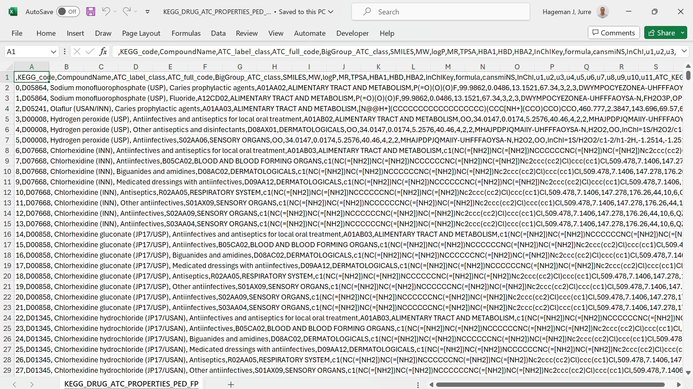
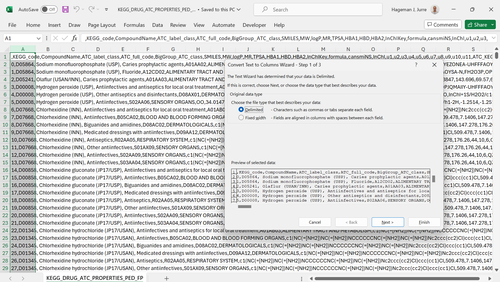



[Go back to the main page](../index.md)

# Excel: Data Cleaning

## Introduction

In data science, data is typically organized in a structured format, such as a table or a spreadsheet. This allows for easy manipulation and analysis of the data.

However, a lot of data coming from external sources such as lab equipment and factory equipment will not be directly suitable for data analysis. In that case, data cleaning en reorganization might me required.

Excel lacks behind Python and R in capabilities of data reorganization and cleaning. Nevertheless, Excel has some features that are worth explaining. We will discuss them here.

## Text to column feature

If your csv data import fails, you can manually parse your text to various columns. Take a look at the following example:

*Figure 1: All data in a single column*

As you can see, all data is loaded in the first column. You can use the `text to columns` functionality that can be found on the data tab in the ribbon.

*Figure 2: Select the delimiter*

Here the correct culumn separator is selected to parse the text. The result is as follows:

*Figure 3: Text separated to columns*

As you can see from the picture above, the text is now separated in different columns based on the correct column separator.

## Remove duplicates

On the data tab in the ribbon, you will find an option to remove duplicate rows:

*Figure 4: Remove duplicates feature*

As can be seen from the picture below, row ID 2 is a duplicate.

*Figure 5: Two duplicate rows*

You can select columns to compare. In the case below, all columns were selected.

*Figure 6: Columns selected to compare*

Excel reports the removal of 1 duplicate row.

*Figure 7: 1 duplicate value removed.*

And the result is 1 duplicate row removed.

*Figure 7: 1 duplicate row removed.*

## Trimming text

## Find and replace

## Dealing with missing data

https://real-statistics.com/descriptive-statistics/missing-data/

### Exersises and Solutions:

- [Exercises]()
- [Solutions]()

---

>This web page is distributed under the terms of the Creative Commons Attribution License which permits unrestricted use, distribution, and reproduction in any medium, provided the original author and source are credited.
>Creative Commons License: CC BY-SA 4.0.

