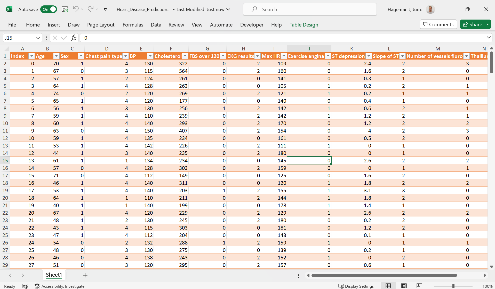
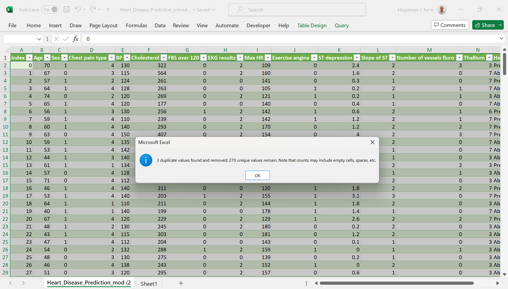



[Go back to the main page](../index.md)

# Excel Data Cleaning

## Solutions

---

### Exercise 1

Use the text to column feature. Separator is the dollar symbol `$`.
Then, create a data table with the first row as headers.

The solution can be found [here](./files_07_data_cleaning_solutions/exercise01/Heart_Disease_Prediction.xlsx).

### Exercise 2

Use the following steps to clean the data:
- First, load the data as previously mentioned using the `text-to-column` feature. Delimiter is a pipe symbol `|`.
- Remove the header row.
- Split the last two columns using the `text-to-column` feature with a space as deliminator.
- Remove the columns containing the units.
- Split the columns that contains the `g` from grams using the `text-to-column` feature with a `g` as deliminator.
- Add the column headers again.
- Format as data table

See example below:

The solution can be found [here](./files_07_data_cleaning_solutions/exercise02/calories.xlsx)

>Note that alternative approaches are possible.
>For example `=LEFT(C1,LEN(C1)-1)` will strip the g from the numbers.
>Use whatever gets the job done!

### Exercise 3

Indeed the dataset contains duplicate rows.
Use the button on the data tab of the ribbon to remove the duplicate rows:

The solution can be found [here](./files_07_data_cleaning_solutions/exercise03/Heart_Disease_Prediction_solved.xlsx).

### Exercise 4

You can find the solution [here](./files_07_data_cleaning_solutions/exercise04/CHEMBL1989.xlsx)

|Condition                  |Number of cells|
|--------------------------:|--------------:|
|Number of data fields      |504            |
|Number of non empty fields |442            |
|Number of empty fields     |62             |

---

>This web page is distributed under the terms of the Creative Commons Attribution License which permits unrestricted use, distribution, and reproduction in any medium, provided the original author and source are credited.
>Creative Commons License: CC BY-SA 4.0.

