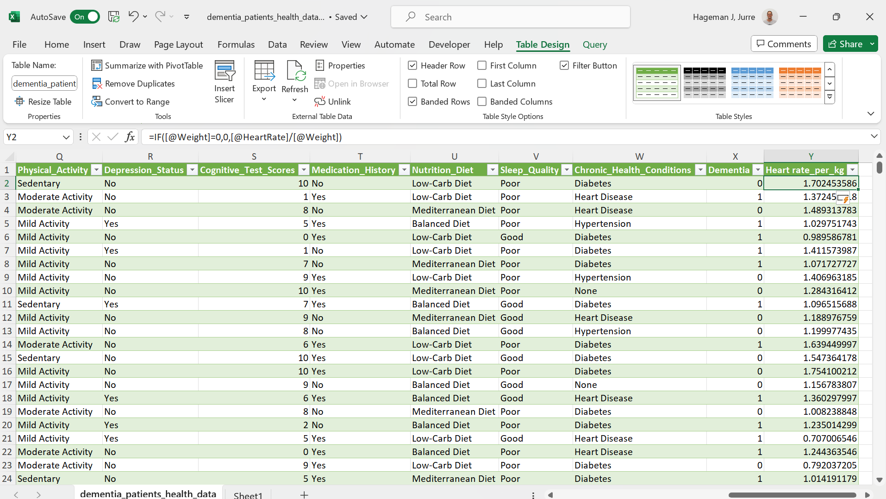



[Go back to the main page](../index.md)

# Excel: Data Analysis

*Figure 1: Data analysis of the flu pandemic around 1918. Source: New York Times*

## Introduction

Now that the data is imported and cleaned. It is time to analyse the data. 
This means that, depending on your specific question, you can do all sorts of calculations using Excel formulas (you can even create custom formulas), sort data, perform conditional formatting and create pivot tables. The creation of plots will be dealt with in the next chapter.

## How to organise your worksheet

Lets first discuss how to organize a worksheet.
[Nutrition facts data](https://www.kaggle.com/datasets/mcdonalds/nutrition-facts) from a fastfood restaurant was imported using the csv import function in Excel:

*Figure 2: Nutrition facts fastfood menu. Source: https://www.kaggle.com/datasets/mcdonalds/nutrition-facts*

Imagine that you would like to calculate the total percentage. Obviously, the easiest way to do this is to add a column to the table and calculate the sum of percentages using the `SUM` formula:

We first resize the table to the appropriate dimension:

*Figure 3: Resizing a table*

And then we can type the appropriate formula:

*Figure 4: Adding the formula*

However, it is better to get the output of calculations on whole columns on another sheet.
First of all, there might be new furure data records and you can perform calculations on whole columns (not restricted to a block of rows).
In addition, all the values from the column-based analysis can be linked to a variable.

Let's take the `AVERAGE` with `STDEV` and `MEDIAN` with `IQR` as an example:

*Figure 5: Data analysis on a seperate tab.*

---

### Exersises and Solutions:

- [Exercises](./excel_09_data_analysis_exersises.md)
- [Solutions](./excel_10_data_analysis_solutions.md)

---

>This web page is distributed under the terms of the Creative Commons Attribution License which permits unrestricted use, distribution, and reproduction in any medium, provided the original author and source are credited.
>Creative Commons License: CC BY-SA 4.0.

