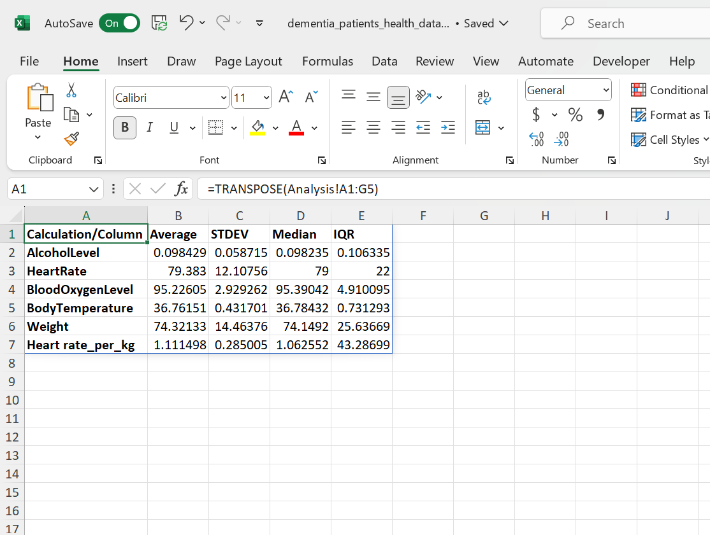
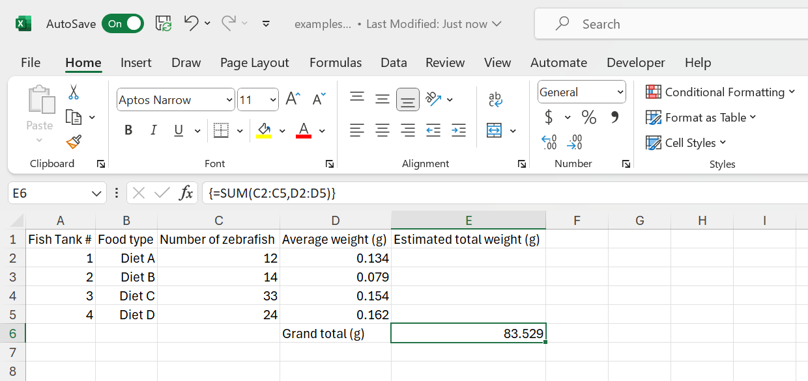
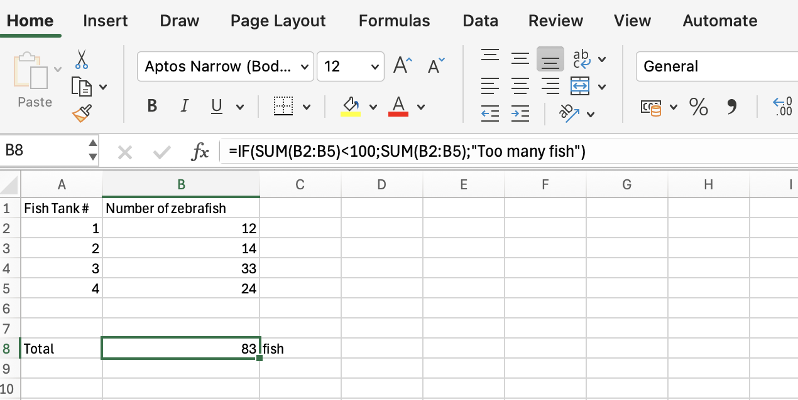
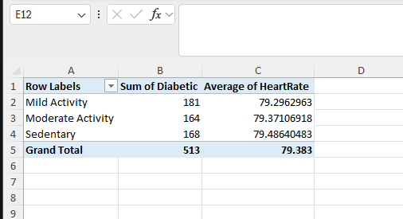




[Go back to the main page](../index.md)


# Excel: Data Analysis
 


*<sub>Figure 1: Data loaded and ready to be analyzed. Source: https://www.kaggle.com/datasets/zusmani/mygenome</sub>*


## Introduction

Now that the data is imported and cleaned. It is time to analyze the data.  
This means that, depending on your specific question, you can do all sorts of calculations using Excel formulas (you can even create custom formulas), sort data, perform conditional formatting and create pivot tables. The creation of plots will be dealt with in the next chapter.

## How to organize your worksheet

Lets first discuss how to organize a worksheet.
[This file](./files_08_data_analysis/file01_dementia_patients_health_data.csv) was imported using the csv import function in Excel:


*<sub>Figure 2: Dementia Patient Health,Prescriptions ML Dataset.</sub>*


Imagine that you would like to calculate the heart rate per kg body weight (there is a well known correlation between heart rate and body weight). Obviously, the easiest way to do this is to add a column to the table and divide the heart rate by weight:  

We first resize the table to the appropriate dimension (to add an extra column):


*<sub>Figure 3: Resizing a table</sub>*

And then we can type the appropriate formula:


*<sub>Figure 4: Adding the formula</sub>*

Note that the `IF` function was used to prevent a division by zero error (`#DIV/0!`).

```
=IF([@Weight]=0,0,[@HeartRate]/[@Weight])
```

If the denominator is zero, the result will be 0. In this way, a division by zero error will be prevented. Although a 0 is not to be expected here, it is always a good idea to prevent such errors from occurring.

Now we will calculate averages of some whole columns (such ast the average heart rate, the average weight etc.). You might be tempted to put the output below the table. However, it is better to get the output of calculations on whole columns on another sheet (name the new sheet "analysis").
First of all, there might be new future data records and you can perform calculations on whole columns (not restricted to a block of rows).
In addition, all the values from the column-based analysis can be linked to a variable.

Let's take the `AVERAGE` with `STDEV` and `MEDIAN` with `IQR` as an example:


*<sub>Figure 5: Data analysis on a separate tab.</sub>*

Probably, you have noticed a problem with the organization of this spreadsheet: Records should be in rows and variables in columns.
This is swabbed in the sheet above. So we should transpose the data. 

We can use the `TRANSPOSE` function to accomplish this.
The `TRANSPOSE` function is an array formula which means that it can perform multiple calculations on one or more items in an array. The result is shown below:


*<sub>Figure 6: Result of the transposition of rows and columns.</sub>*

## The anatomy of a function

Excel has a lot of functions ready to use like the `SUM` function, the `AVERAGE` function and the `COUNTIF` function. You can even [create your own function in Excel](https://support.microsoft.com/en-us/office/create-custom-functions-in-excel-2f06c10b-3622-40d6-a1b2-b6748ae8231f) (which is beyond the scope of this course). If you frequently need to create your own function, you are probably better off with R or Python. But what is a function?

>In Microsoft Excel, a function is a built-in formula that is designed to perform a specific calculation. Functions can help you perform a wide range of calculations, from simple arithmetic operations such as addition, subtraction, and multiplication to more complex calculations such as statistical analysis and data manipulation.  

Excel functions are identified by their names, which begin with the equal sign (=) followed by the function name and any required arguments. For example, the `SUM` function adds up a range of numbers and is written as:

```
=SUM(A1:A10) 
```

where A1:A10 is the range of cells to be added.

Other functions require multiple arguments. For example, the `COUNTIF` function requires 2 arguments. An example notation for the `COUNTIF` function is written as:

```
=COUNTIF(A1:A10;">10")
```

where A1:A10 (the first argument) is the range of cells to be evaluated and ">10" (the second argument) is the condition to be evaluated.

 
So the basic anatomy of a function is:

```
FUNCTIONNAME(ARGUMENT1;ARGUMENT2)
```

Note that Excel provides some help. Let's consider the `COUNTIFS` function.
The COUNTIFS function counts cells in a range based on one or more true or false condition. It is typed as:

```
=COUNTIFS(criteria_range1, criteria1, [criteria_range2, criteria2], ...)
```
Note that some functions have arguments between brackets (`[]`). These arguments are optional.


*<sub>Figure 7: Excel provides suggestions for the arguments.</sub>*


The arguments are filled in and the function returns the result in cell A12:


*<sub>Figure 8: The result of the function is returned and shown in cell A12.</sub>*

So to summarize:

>In Microsoft Excel, a function is a built-in formula that is designed to perform a specific calculation. Arguments go in the function. This can be the value of one cell or a range of cells. Excel performs the calculation and the result will be returned in the cell where the formula was typed.

This is the standard behavior of Excel but some functions in Excel are array functions. And they behave a bit different.

## Named ranges

When you separate the analysis from the data, selecting ranges will be quite cumbersome. Either you need to click another worksheet first and then create the selection or you need to type a lot (the name of the worksheet plus the range).

>Note that you can easily create a selection of a whole column by clicking the first cell. Then hit `Ctrl` + `Shift` + `Downarrow`. 

Instead of typing or clicking a lot you can assign variable names to selections and store them in memory. See [this link](https://support.microsoft.com/en-us/office/create-a-named-range-from-selected-cells-in-an-excel-worksheet-fd8905ed-1130-4cca-9bb0-ad02b7e594fd). Once you assigned a variable name for a range, you can simply type the (short) variable name instead of clicking a lot (or typing a lot). On the `Formulas` tab, you can click the `Name Manager` to get an overview of all the assigned selections and also rename them.

>When you import csv files using Power Query, Excel will automatically assign a selection name for the whole table. You can rename this selection under `Formulas > Name Manager`.

## Array formulas

Excel now has the capability of array formulas. A single array formula can perform multiple calculations at once.

Let's have a look at an example:


*<sub>Figure 9: Small dataset to perform a calculation.</sub>*

What we would like to calculate is the total weight from all the fish in all of the fish tanks. Of course we can first calculate the total weight per tank and calculate the sum, but by using array formulas, we can do it all at once:

```
=SUM(C2:C5*D2:D5)
```


*<sub>Figure 10: The result of the array formula.</sub>*

As you can see, the answer is directly calculated. If you are not interested in the total weight of the fish within the individual fish tanks but just the total weight of all the fish (in all the tanks) this will save you adding an extra column. You can put the calculation directly on an analysis tab.

There is just one detail left out. Although the formula works, it is advised to press the keyboard shortcut CTRL + SHIFT + ENTER to complete the array formula. As a result, Microsoft Excel surrounds the formula with curly braces (`{}`), which is an indication of an array formula, so that people know that we are dealing with an array formula.


*<sub>Figure 11: Curly braces are a visual indication for an array formula.</sub>*

>Thus: An array formula is a formula that gets applied to more than one cell. But although an array formula always gets applied to more than one cell, array functions can return the result in a single cell (as the example above) or in multiple cells (see below).

```
=ROW(1:10)
```


*<sub>Figure 12: Array function with a multiple cell output.</sub>*

Or the example that we have seen before:

```
=TRANSPOSE(A1:A10)
```


*<sub>Figure 13: Another array function with a multiple cell output.</sub>*


## Nesting functions

It is possible to nest functions (use a function as an argument in a function). Although this is allowed in some cases, be aware that this becomes very complex easily.

Example:

```
=IF(AVERAGE(B2:B5)<100;SUM(B2:B5);"Too many fish")
```


*<sub>Figure 14: Nesting functions.</sub>*


*<sub>Figure 15: Nesting functions.</sub>*

>Nested functions are hard to read. It is often better to split up nested functions in different cells.


## Examples of useful functions

There are more than 300 functions in Excel. Fortunately, there are online resources that you can use to select functions.
For example [this one from Microsoft](https://support.microsoft.com/en-us/office/excel-functions-alphabetical-b3944572-255d-4efb-bb96-c6d90033e188).

Excel functions can get complicated easily if you need to nest them.
Fortunately, also an AI-driven [Excel Formulator](https://excelformulator.com/) that creates a formula syntax from a description exists.

Here is a small selection of some useful functions:

### IF

The `IF` function is one of the most popular functions in Excel, and it allows you to make logical comparisons between a value and what you expect.


*<sub>Figure 16: The IF function.</sub>*

### COUNTIF

`COUNTIF` can be used to count the number of cells that meet a criterion; for example, to count the number of overweight fish that appears in a list.


*<sub>Figure 17: The COUNTIF function.</sub>*

There is also a `COUNTIFS` function for multiple arrays and conditions.

### XLOOKUP

The `XLOOKUP` function searches a range or an array, and then returns the item corresponding to the first match it finds. 


*<sub>Figure 18: The XLOOKUP function.</sub>*

So the `XLOOKUP` function checks the position of a lookup key and returns the corresponding value.

These are just some examples. Use the online resources or the recommended Excel book to find more useful functions.

## List of functions

This course will familiarize you with using Excel functions. While this [link](https://support.microsoft.com/en-us/office/excel-functions-alphabetical-b3944572-255d-4efb-bb96-c6d90033e188) provides a comprehensive list of all Excel functions, the functions listed below are mandatory for this course and you must master them. Learning these core functions will make it easier to understand and use others. Practice these essential functions with small datasets to build your skills. Since, this is not a statistics oriented course, many statistical functions are omitted (e.g. T.TEST).

| **Function**   | **Explanation**                                                                                                                                                                 |
|----------------|---------------------------------------------------------------------------------------------------------------------------------------------------------------------------------|
| ABS            | Returns the absolute value of a number                                                                                                                                          |
| AND            | Returns TRUE if all of its arguments are TRUE                                                                                                                                   |
| AVERAGE        | Returns the average of its arguments                                                                                                                                            |
| AVERAGEIF      | Returns the average (arithmetic mean) of all the cells in a range that meet a given criteria                                                                                    |
| AVERAGEIFS     | Returns the average (arithmetic mean) of all cells that meet multiple criteria.                                                                                                 |
| CELL           | Returns information about the formatting, location, or contents of a cell                                                                                                       |
| CLEAN          | Removes all nonprintable characters from text                                                                                                                                   |
| CONCATENATE    | Joins several text items into one text item                                                                                                                                     |
| COUNT          | Counts how many numbers are in the list of arguments                                                                                                                            |
| COUNTA         | Counts how many values are in the list of arguments                                                                                                                             |
| COUNTBLANK     | Counts the number of blank cells within a range                                                                                                                                 |
| COUNTIF        | Counts the number of cells within a range that meet the given criteria                                                                                                          |
| COUNTIFS       | Counts the number of cells within a range that meet multiple criteria                                                                                                           |
| DATEDIF        | Calculates the number of days, months, or years between two dates. This function is useful in formulas where you need to calculate an age.                                      |
| FIND           | Finds one text value within another (case-sensitive)                                                                                                                            |
| FLOOR          | Rounds a number down, toward zero                                                                                                                                               |
| IF             | Specifies a logical test to perform                                                                                                                                             |
| IFNA           | Returns the value you specify if the expression resolves to #N/A, otherwise returns the result of the expression                                                                |
| INDEX          | Uses an index to choose a value from a reference or array                                                                                                                       |
| ISBLANK        | Returns TRUE if the value is blank                                                                                                                                              |
| ISNA           | Returns TRUE if the value is the #N/A error value                                                                                                                               |
| ISNUMBER       | Returns TRUE if the value is a number                                                                                                                                           |
| LEFT           | Returns the leftmost characters from a text value                                                                                                                               |
| LEN            | Returns the number of characters in a text string                                                                                                                               |
| LN             | Returns the natural logarithm of a number                                                                                                                                       |
| LOG            | Returns the logarithm of a number to a specified base                                                                                                                           |
| LOG10          | Returns the base-10 logarithm of a number                                                                                                                                       |
| LOWER          | Converts text to lowercase                                                                                                                                                      |
| MATCH          | Looks up values in a reference or array                                                                                                                                         |
| MAX            | Returns the maximum value in a list of arguments                                                                                                                                |
| MAXIFS         | Returns the maximum value among cells specified by a given set of conditions or criteria                                                                                        |
| MEDIAN         | Returns the median of the given numbers                                                                                                                                         |
| MIN            | Returns the minimum value in a list of arguments                                                                                                                                |
| MINIFS         | Returns the minimum value among cells specified by a given set of conditions or criteria.                                                                                       |
| NA             | Returns the error value #N/A                                                                                                                                                    |
| OR             | Returns TRUE if any argument is TRUE                                                                                                                                            |
| PERCENTILE.EXC | Returns the k-th percentile of values in a range, where k is in the range 0..1, exclusive                                                                                       |
| PERCENTILE.INC | Returns the k-th percentile of values in a range                                                                                                                                |
| POWER          | Returns the result of a number raised to a power                                                                                                                                |
| RANDBETWEEN    | Returns a random number between the numbers you specify                                                                                                                         |
| RANK           | Returns the rank of a number in a list of numbers                                                                                                                               |
| RIGHT          | Returns the rightmost characters from a text value                                                                                                                              |
| ROUND          | Rounds a number to a specified number of digits                                                                                                                                 |
| ROUNDDOWN      | Rounds a number down, toward zero                                                                                                                                               |
| ROUNDUP        | Rounds a number up, away from zero                                                                                                                                              |
| ROW            | Returns the row number of a reference                                                                                                                                           |
| ROWS           | Returns the number of rows in a reference                                                                                                                                       |
| SORT           | Sorts the contents of a range or array                                                                                                                                          |
| SQRT           | Returns a positive square root                                                                                                                                                  |
| STDEV.P        | Calculates standard deviation based on the entire population                                                                                                                    |
| STDEV.S        | Estimates standard deviation based on a sample                                                                                                                                  |
| SUM            | Adds its arguments                                                                                                                                                              |
| SUMIF          | Adds the cells specified by a given criteria                                                                                                                                    |
| SUMIFS         | Adds the cells in a range that meet multiple criteria                                                                                                                           |
| TEXT           | Formats a number and converts it to text                                                                                                                                        |
| TEXTJOIN       | Combines the text from multiple ranges and/or strings                                                                                                                           |
| TEXTSPLIT      | Splits text strings by using column and row delimiters                                                                                                                          |
| TRANSPOSE      | Returns the transpose of an array                                                                                                                                               |
| TRIM           | Removes spaces from text                                                                                                                                                        |
| TRUE           | Returns the logical value TRUE                                                                                                                                                  |
| UNIQUE         | Returns a list of unique values in a list or range                                                                                                                              |
| UPPER          | Converts text to uppercase                                                                                                                                                      |
| VALUE          | Converts a text argument to a number                                                                                                                                            |
| XLOOKUP        | Searches a range or an array, and returns an item corresponding to the first match it finds. If a match doesn't exist, then XLOOKUP can return the closest (approximate) match. |


## Statistics

Excel has many functions for statistics like `STDEV.P`, `T.TEST`, `F.TEST` and `CHISQ.DIST.RT`. 
A comprehensive list can be found [here](https://support.microsoft.com/en-us/office/statistical-functions-reference-624dac86-a375-4435-bc25-76d659719ffd).

In addition, Excel has a a [statistics analysis pack](https://support.microsoft.com/en-gb/office/load-the-analysis-toolpak-in-excel-6a63e598-cd6d-42e3-9317-6b40ba1a66b4) available as plugin.


Here is an example of a diet intervention. Because the same subjects are measured twice, a paired T-test was used. This is a one-tailed test as we are looking for a weight reduction (alpha = 0.05).


*<sub>Figure 19: A paired T-test in Excel.</sub>*

The result is significant so H1 (hypothesis 1) is true. The diet resulted in a significant weight reduction (alpha = 0.05).
Note that the result is static. If we change the values, we need do redo the test.

Statistics in Excel is limited. For example, non-parametric tests like the Mann–Whitney U test are not included in Excel. If you need to do more complex statistics, use R or Python instead.

The actual content of statistics is beyond the scope of this course. Attend a statistics course if you need more background on this subject.


## Sorting of data and filtering of data

Excel has multi-level sorting capabilities.

Have a look at the earlier used [dataset](./files_08_data_analysis/file01_dementia_patients_health_data.csv):


*<sub>Figure 20: Data to be sorted.</sub>*

Imagine that we would like to know which person from the Category Physical Activity value "Mild Activity" has the highest weight.
We can do a multi-level sort to accomplish this.
- First level: Physical Activity
- Second level: Weight sorted descending.


*<sub>Figure 21: Sorting data.</sub>*

Here is the result (note that some columns are hidden):


*<sub>Figure 22: Sorting data.</sub>*

We can accomplish the same using the filters:


*<sub>Figure 23: Filtering data.</sub>*

The result:


*<sub>Figure 24: Filtering data.</sub>*


## Conditional formatting

Conditional formatting makes it easy to highlight certain values.
Here is an example for heart rates higher then 90.


*<sub>Figure 25: Conditional formatting.</sub>*

And the result:


*<sub>Figure 26: Conditional formatting applied.</sub>*


## Pivot tables

Pivot tables come in handy to analyze data quickly and in an organized manner.
Let's pretend that we are interested in comparing the average heart rate and the count of diabetics for each activity category (sedentary, mild and moderate activity) from the earlier used [dataset](./files_08_data_analysis/file01_dementia_patients_health_data.csv).

We can select the table. Than choose `Insert > Pivot table`:


*<sub>Figure 27: Pivot table.</sub>*

And than select the categorie `Physical_Activity` as well as the columns `Diabetic` and `HeartRate`. We also change `SUM` in `AVERAGE` and `Count`.


*<sub>Figure 28: Pivot table showing the average heart rate and diabetic status for different Physical Activity categories.</sub>*

As you can see, there is no clear correlation between a sedentary life style, mild activity and moderate activity and the number of diabetics in this dataset (though there is convincing evidence in the literature, so physical exercise is highly recommended).    


---


>This web page is distributed under the terms of the Creative Commons Attribution License which permits unrestricted use, distribution, and reproduction in any medium, provided the original author and source are credited.
>Creative Commons License: CC BY-SA 4.0.

