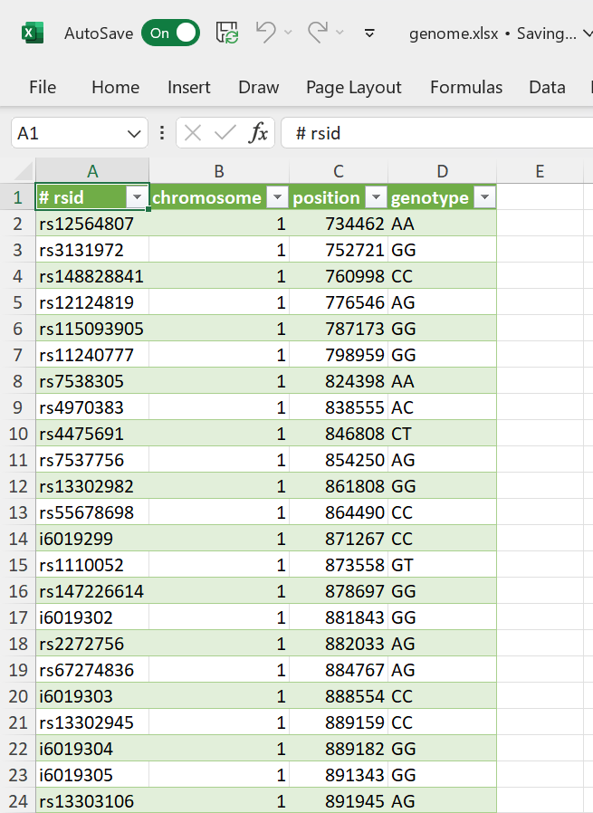
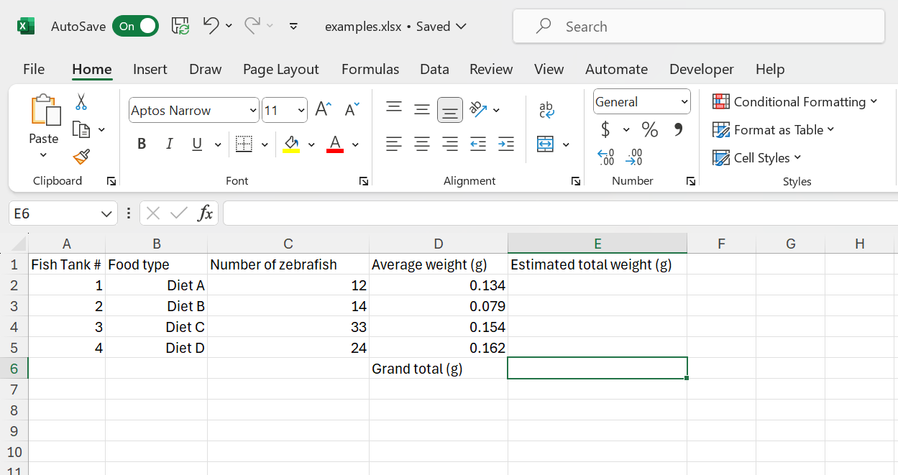
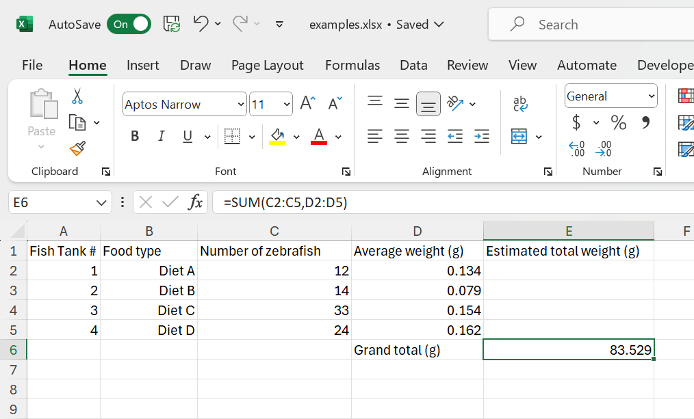
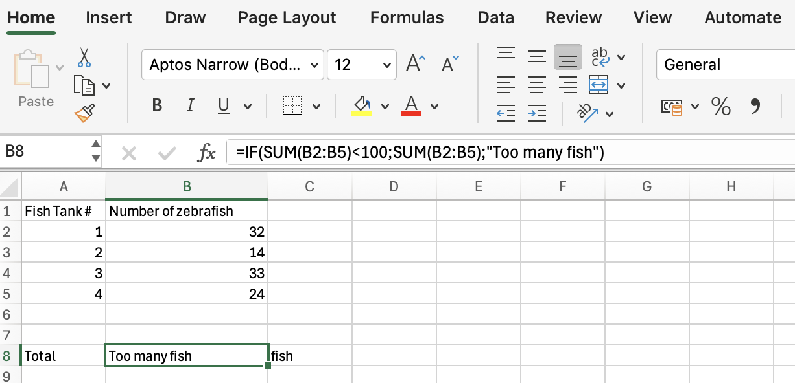
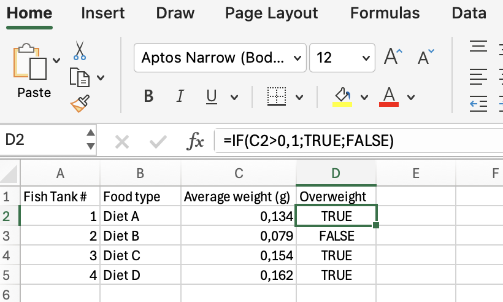
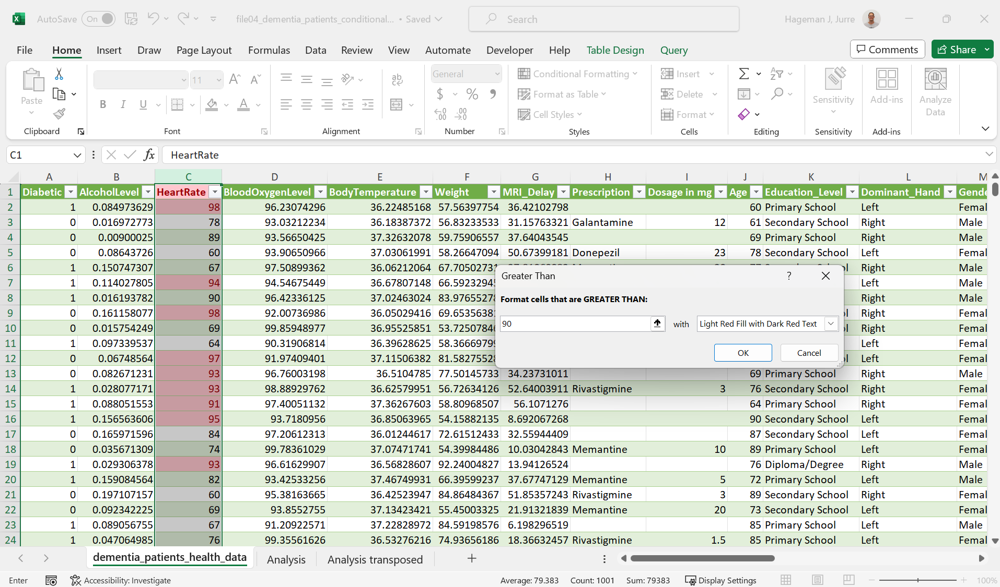
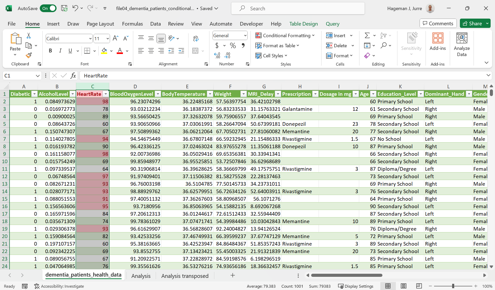
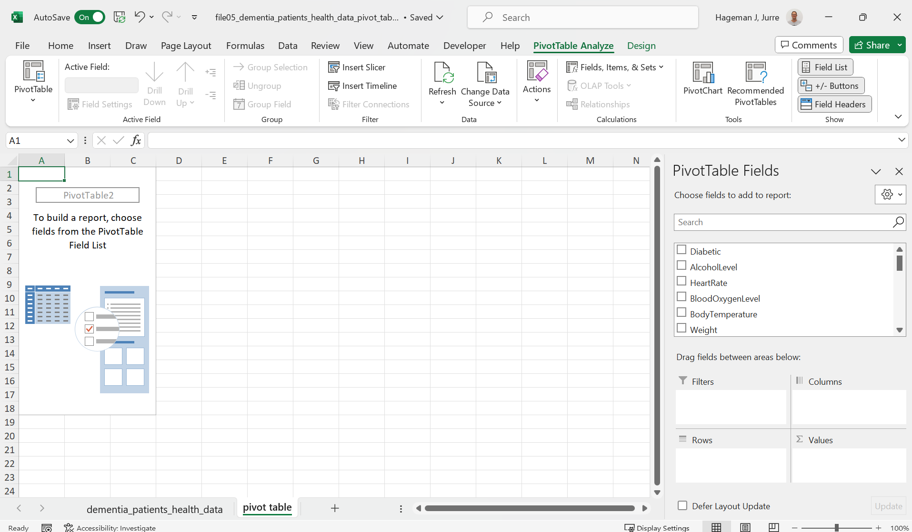




[Go back to the main page](../index.md)


# Excel: Data Analysis



*<sub>Figure 1: Data loaded and ready to be analyzed. Source: https://www.kaggle.com/datasets/mcdonalds/nutrition-facts</sub>*


## Introduction

Now that the data is imported and cleaned. It is time to analyze the data.  
This means that, depending on your specific question, you can do all sorts of calculations using Excel formulas (you can even create custom formulas), sort data, perform conditional formatting and create pivot tables. The creation of plots will be dealt with in the next chapter.

## How to organise your worksheet

Lets first discuss how to organize a worksheet.
[Nutrition facts data](https://www.kaggle.com/datasets/mcdonalds/nutrition-facts) from a fastfood restaurant was imported using the csv import function in Excel:


*<sub>Figure 2: Nutrition facts fastfood menu. Source: https://www.kaggle.com/datasets/mcdonalds/nutrition-facts</sub>*


Imagine that you would like to calculate the percentage of calories from fat as compared to total calories. Obviously, the easiest way to do this is to add a column to the table and calculate the % calories from fat (as related to the total amount of calories):  

We first resize the table to the appropriate dimension:


*<sub>Figure 3: Resizing a table</sub>*

And then we can type the appropriate formula:


*<sub>Figure 4: Adding the formula</sub>*

Note that the IF function was used to prevent a division by zero error.

```
=IF([@Calories]=0;0;[@[Calories from Fat]]/[@Calories]*100)
```

If the denominator is zero, the result will be 0. In this way, a division by zero error will be prevented.

However, it is better to get the output of calculations on whole columns on another sheet.
First of all, there might be new future data records and you can perform calculations on whole columns (not restricted to a block of rows).
In addition, all the values from the column-based analysis can be linked to a variable.

Let's take the `AVERAGE` with `STDEV` and `MEDIAN` with `IQR` as an example:


*<sub>Figure 5: Data analysis on a separate tab.</sub>*

Probably, you have noticed a problem with the organization of this spreadsheet: Records should be in rows and variables in columns.
This is swabbed in the sheet above. So we should transpose the data. 

We can use the `TRANSPOSE` function to accomplish this.
The `TRANSPOSE` function is an array formula which means that it can perform multiple calculations on one or more items in an array. The result is shown below:


*<sub>Figure 6: Result of the transposition of rows and columns.</sub>*

## The anatomy of a function

Excel has a lot of functions ready to use like the `SUM` function, the `AVERAGE` function and the `COUNTIF` function. You can even [create your own function in Excel](https://support.microsoft.com/en-us/office/create-custom-functions-in-excel-2f06c10b-3622-40d6-a1b2-b6748ae8231f) (which is beyond the scope of this course). If you frequently need to create your own function, you are probably better of with R or Python. But what is an function?

>In Microsoft Excel, a function is a built-in formula that is designed to perform a specific calculation. Functions can help you perform a wide range of calculations, from simple arithmetic operations such as addition, subtraction, and multiplication to more complex calculations such as statistical analysis and data manipulation.  

Excel functions are identified by their names, which typically begin with the equal sign (=) followed by the function name and any required arguments. For example, the SUM function adds up a range of numbers and is written as:

```
=SUM(A1:A10) 
```

where A1:A10 is the range of cells to be added.

Other functions require multiple arguments. For example, the COUNTIF function requires 2 arguments. An example notation for the COUNTIF function is written as:

```
=COUNTIF(A1:A10;">10")
```

where A1:A10 (the first argument) is the range of cells to be evaluated and ">10" (the second argument) is the condition to be evaluated.

 
So the basic anatomy of a function is:

```
FUNCTIONNAME(ARGUMENT1;ARGUMENT2)
```

Note that Excel provides some help. Let's consider the `COUNTIFS` function.
The COUNTIFS function counts cells in a range based on one or more true or false condition. It is typed as:

```
=COUNTIFS(criteria_range1, criteria1, [criteria_range2, criteria2], ...)
```


*<sub>Figure 7: Excel provides suggestions for the arguments.</sub>*


The arguments are filled in and the function returns the result in cell A12:


*<sub>Figure 8: The result of the function is returned and shown in cell A12.</sub>*

So to summarize:

>In Microsoft Excel, a function is a built-in formula that is designed to perform a specific calculation. Arguments go in the function. This can be the value of one cell or a range of cells. Excel performs the calculation and the result will be returned in the cell where the formula was typed.

This is the standard behavior of Excel but some functions in Excel are array functions. And they behave a bit different.

## Array formulas

Excel now has the capability of array formulas. A single array formula can perform multiple calculations at once.

Let's have a look at an example:


*<sub>Figure 9: Small dataset to perform a calculation.</sub>*

What we would like to calculate is the total calories from all the beverages of a day. We can of course first calculate the total calories per drink and calculate the sum but using array formulas we can do it all at once:

```
=sum(B2:B5*C2:C5)
```


*<sub>Figure 10: The result of the array formula.</sub>*

As you can see, the answer is directly calculated. If you are not interested in the total calories of the individual beverages but just the total calories of all the beverages this will save you adding an extra column. You can put the calculation directly on an analysis tab.

There is just one detail left out. Although the formula works, it is advised to press the keyboard shortcut CTRL + SHIFT + ENTER to complete the array formula. As a result, Microsoft Excel surrounds the formula with curly braces, which is an indication of an array formula so that people know that we are dealing with an array formula.


*<sub>Figure 11: Curly braces are a visual indication for an array formula.</sub>*

>Thus: An array formula is a formula that gets applied to more than one cell. But although an array formula always gets applied to more than one cell, array functions can return the result in a single cell (as the example above) or in multiple cells (see below).

```
=ROW(1:10)
```


*<sub>Figure 12: Array function with a multiple cell output.</sub>*

Or the example that we have seen before:

```
=TRANSPOSE(A1:A10)
```


*<sub>Figure 13: Another array function with a multiple cell output.</sub>*


## Nesting functions

It is possible to nest functions. Although this is allowed in some cases, be aware that this becomes very complex easily.

Example:

```
=IF(AVERAGE(A1:A3)>5.5;SUM(B1:B3);"Insufficient")
```


*<sub>Figure 14: Nesting functions.</sub>*


*<sub>Figure 15: Nesting functions.</sub>*

>Nested functions are hard to read. It is often better to split up nested functions in different cells.


## Examples of useful functions

There are more than 300 functions in Excel. Fortunately, there are online resources that you can use to select functions.
For example [this one from Microsoft](https://support.microsoft.com/en-us/office/excel-functions-alphabetical-b3944572-255d-4efb-bb96-c6d90033e188).

Excel functions can get complicated easily if you need to nest them.
Fortunately, also an AI-driven [Excel Formulator](https://excelformulator.com/) that creates a formula syntax from a description exists.

Here is a small selection of some useful functions:

### IF

The IF function is one of the most popular functions in Excel, and it allows you to make logical comparisons between a value and what you expect.


*<sub>Figure 16: The IF function.</sub>*

### COUNTIF

COUNTIF can be used to count the number of cells that meet a criterion; for example, to count the number of times a high caloric beverage appears in a list.


*<sub>Figure 17: The COUNTIF function.</sub>*

There is also a COUNTIFS function for multiple arrays and conditions.

### XLOOKUP

The XLOOKUP function searches a range or an array, and then returns the item corresponding to the first match it finds. 


*<sub>Figure 18: The XLOOKUP function.</sub>*

So the XLOOKUP function checks the position of a lookup key and returns the corresponding value.

These are just some examples. Use the online resources or the recommended Excel book to find more useful functions.


## Statistics

Excel has many functions for statistics like `STDEV.P`, `T.TEST`, `F.TEST` and `CHISQ.DIST.RT`. 
A comprehensive list can be found [here](https://support.microsoft.com/en-us/office/statistical-functions-reference-624dac86-a375-4435-bc25-76d659719ffd)

In addition, Excel has a a [statistics analysis pack](https://support.microsoft.com/en-gb/office/load-the-analysis-toolpak-in-excel-6a63e598-cd6d-42e3-9317-6b40ba1a66b4) available as plugin.


Here is an example of a diet intervention. Because the same subjects are measured twice, a paired T-test was used. The is a one-tailed test as we are looking for a weight reduction (alpha = 0.05)


*<sub>Figure 19: A paired T-test in Excel.</sub>*

The result is significant so H1 is true. The diet resulted in a significant weight reduction (alpha = 0.05)
Note that the result is static. If we change the values, we need do redo the test.

Statics in Excel is limited. For example, non-parametric tests like the Mann–Whitney U test are not included in Excel. If you need to do more complex statistics, use R or Python instead.

The actual content of statistics is beyond the scope of this course. Attend a statistics course of you need more background on this subject.

## Sorting of data and filtering of data

Excel has multi-level sorting capabilities.

Have a look at the earlier used [Nutrition facts data](https://www.kaggle.com/datasets/mcdonalds/nutrition-facts) dataset.


*<sub>Figure 20: Data to be sorted.</sub>*

Imagine that we would like to know which Item from the Category "Chicken and Fish" contains the highest amount of calories from fat.
We can do a multi-level sort to accomplish this.
- First level: Category
- Second level: Calories from fat sorted descending.


*<sub>Figure 21: Sorting data.</sub>*

Here is the result:


*<sub>Figure 22: Sorting data.</sub>*

We can accomplish the same using the filters:


*<sub>Figure 23: Filtering data.</sub>*

The result:


*<sub>Figure 24: Filtering data.</sub>*

Note that the first data row shown is row number 86.


## Conditional formatting

Conditional formatting makes it easy to highlight certain values.
Here is an example for Calories from fat for more than 300.


*<sub>Figure 25: Conditional formatting.</sub>*

And the result:


*<sub>Figure 26: Conditional formatting applied.</sub>*


## Pivot tables

Pivot tables come in handy to analyze data quickly and in an organized manner.
Let's pretend that we are mainly interested in comparing the average amount of calories from fat (both total and saturated) of each food category from the earlier used dataset [Nutrition facts data](https://www.kaggle.com/datasets/mcdonalds/nutrition-facts).

We can select the table. Than choose insert > Pivot table:


*<sub>Figure 27: Pivot table.</sub>*

And than select the categories as well as the columns total calories and calories from fat. We also change `SUM` in `AVERAGE`.


*<sub>Figure 28: Pivot table about the calories from fat compared to total calories.</sub>*

As you can see, food items in the category chicken and fish contain the highest average amount of calories from fat. 


---


>This web page is distributed under the terms of the Creative Commons Attribution License which permits unrestricted use, distribution, and reproduction in any medium, provided the original author and source are credited.
>Creative Commons License: CC BY-SA 4.0.

