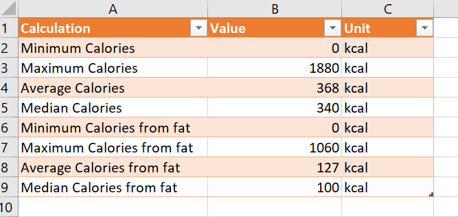
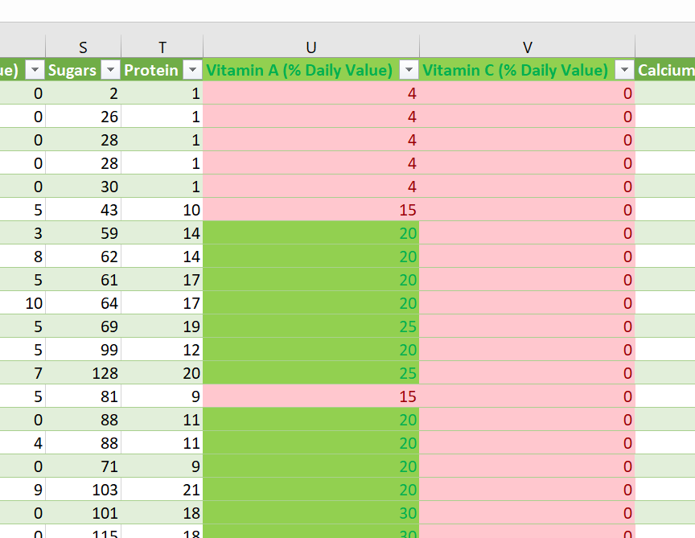
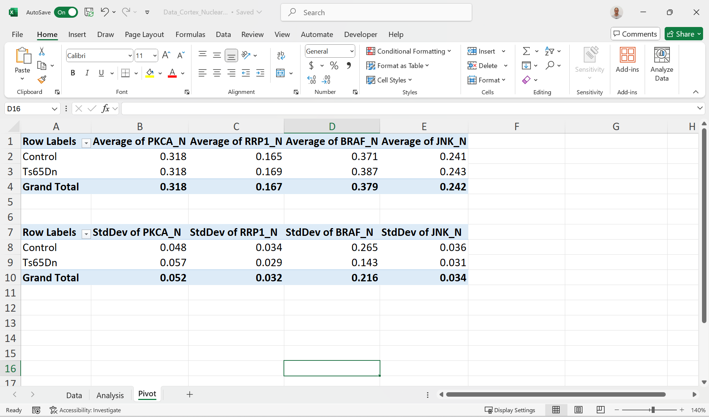




---

[Go back to the main page](../index.md)  
[Go back to the Excel overview page](../excel/excel_01_index.md)  

---


# Excel Data Analysis

## Solutions

---

### Exercise 1

The excel file can be found [here](./files_10_data_analysis_solutions/exercise01/Data_Cortex_Nuclear.xlsx).  
Screenshot of the table below:  



Examples of used functions:  

Minimum:  
```
=MIN(Data!B:B)
```
Maximum:  
```
=MAX(Data!B:B)
```
Average:  
```
=AVARAGE(Data!B:B)
```
Median:
```
=MEDIAN(Data!B:B)
```


### Exercise 2

1. Which mouse has the highest expression of Tau?  
>3516_12 
2. What is the relative expression value in this mouse?   
>0.602768056 
3. Which mouse has the lowest expression of pAKT?  
>3479_9  
4. How many empty cells are in the BAD column? 
>213  
5. Which mouse of the Ts65Dn genotype group has the highest Tau expression (use multi-sort to practice)? (use multi-sort or filters)?  
>293_15  
6. Which mouse of the Ts65Dn genotype, and saline treatment group has the highest Tau expression (Hint: use multi-sort or filters)?  
>J3295_14


### Exercise 3

1. High expression DYRK1A: 255  

 ```
 =COUNTIF(Data!B:B,">0.5")
 ```

2. Count of 218: SYP

 ```
=XLOOKUP(218,B6:BZ6,Table2[[#Headers],[DYRK1A_N]:[CaNA_N]])
 ```

3. pELK > 0.75 AND pERK > 0.25: 1040 

 ```
=COUNTIFS(Data!K:K, ">0.75",Data!L:L,">0.25")
 ```

### Exercise 4

1. Use conditional formatting to indicate a very high expression levels for rows with a relative expression value higher than 2.3 for the pCASP9 protein. Which treatment is mostly found for these selected proteins?  
>It seems that in this selection of mice most are treated with Saline.
2. Use conditional formatting to check for duplicate mouse IDs. Use red markup for these. Are there any duplicate mouse IDs?   
>No
3. Use conditional formatting to indicate the top 10% expression levels for ITSN1. What is the lowest value included?  
> 0.865630205
4. Use conditional formatting to indicate the above average expression levels for NR1? What is the lowest level included?  
> 2.298052977  


The excel file can be found [here](./files_10_data_analysis_solutions/exercise04/Data_Cortex_Nuclear.xlsx).  




### Exercise 5

The excel file can be found [here](./files_10_data_analysis_solutions/exercise05/Data_Cortex_Nuclear.xlsx).  




---

[Go back to the main page](../index.md)  
[Go back to the Excel overview page](../excel/excel_01_index.md)  
<a href="#top">⬆️ Back to Top</a>  

---


>This web page is distributed under the terms of the Creative Commons Attribution License which permits unrestricted use, distribution, and reproduction in any medium, provided the original author and source are credited.
>Creative Commons License: CC BY-SA 4.0.

