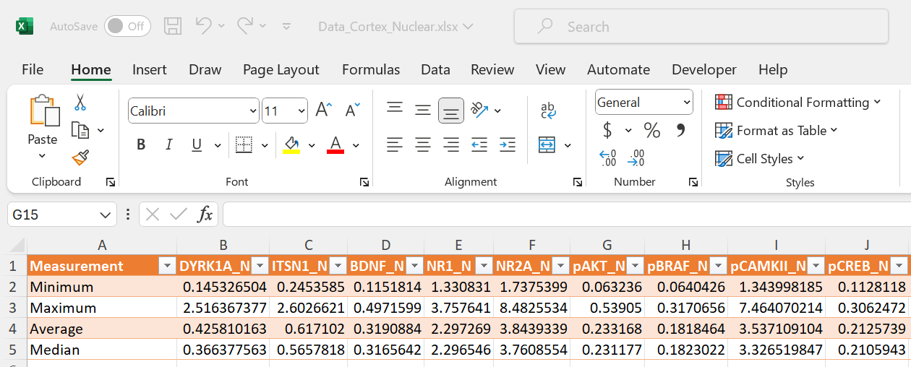




[Go back to the main page](../index.md)


# Excel Data Analysis

## Solutions

---

### Exercise 1

The excel file can be found [here](./files_10_data_analysis_solutions/exercise01/Data_Cortex_Nuclear.xlsx).  
Screenshot of the table below:  



Examples of used functions:  

Minimum:  
```
=MIN(Data!B:B)
```
Maximum:  
```
=MAX(Data!B:B)
```
Average:  
```
=AVARAGE(Data!B:B)
```
Median:
```
=MEDIAN(Data!B:B)
```


### Exercise 2

1. Which mouse has the highest expression of Tau?  
>3516_12 
2. What is the relative expression value in this mouse?   
>0.602768056 
3. Which mouse has the lowest expression of pAKT?  
>3479_9  
4. How many empty cells are in the BAD column? 
>213  
5. Which mouse of the Ts65Dn genotype group has the highest Tau expression (use multi-sort to practice)? (use multi-sort or filters)?  
>293_15  
6. Which mouse of the Ts65Dn genotype, and saline treatment group has the highest Tau expression (se multi-sort or filters)?  
>J3295_14


### Exercise 3

1. high expression DYRK1A: 255  

 ```
 =COUNTIF(Data!B:B,">0.5")
 ```

2. Count of 218: SYP

 ```
=XLOOKUP(218,B6:BZ6,Table2[[#Headers],[DYRK1A_N]:[CaNA_N]])
 ```

3. higher levels NR1 compared to NR2A: 1077 

 ```
=COUNTIFS(Data!E:E, ">0.5", Data!F:F, ">0.5")
 ```

### Exercise 4

1. Use conditional formatting to indicate high energetic food items (>600 calories). Use red markup for these. Which two categories show the highest number of red cells?  
>Breakfast and Chicken & Fish
2. Use conditional formatting to check for duplicate food items. Use red markup for these. Are there any duplicate items?  
>No
3. Use conditional formatting to indicate a % Dalily Value > 100% for Vitamin A. Which catagory are these items mainly found?  
> Salads
4. Use conditional formatting to indicate a % Dalily Value >= 100% for Vitamin C. Use green markup for these. Make sure that you include 100%! How many items do you find that meet this criteria?  
> 7


The excel file can be found [here](./files_10_data_analysis_solutions/exercise01/menu.xlsx).  


### Exercise 5

The excel file can be found [here](./files_10_data_analysis_solutions/exercise01/menu.xlsx).  


---


>This web page is distributed under the terms of the Creative Commons Attribution License which permits unrestricted use, distribution, and reproduction in any medium, provided the original author and source are credited.
>Creative Commons License: CC BY-SA 4.0.

