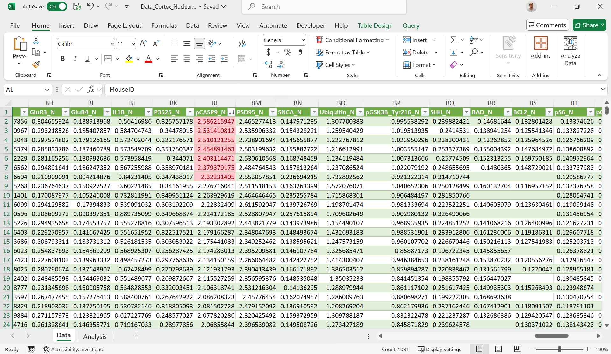




[Go back to the main page](../index.md)


# Excel Data Analysis

## Solutions

---

### Exercise 1

The excel file can be found [here](./files_10_data_analysis_solutions/exercise01/menu.xlsx).  
Screenshot of the table below:  


Examples of used functions:  

Minimum:  
```
=MIN(menu[Calories])
```
Maximum:  
```
=MAX(menu[Calories])
```
Average:  
```
=AVERAGE(menu[Calories])
```
Median:
```
=MEDIAN(menu[Calories])
```


### Exercise 2

1. Chicken McNuggets (40 piece)  
2. Big Breakfast with Hotcakes (Regular Biscuit) and Big Breakfast with Hotcakes (Large Biscuit)  
3. Hamburger  
4. Chocolate Shake (Large)  
5. Iced Coffee with Sugar Free French Vanilla Syrup (Medium)


### Exercise 3

1. high energetic: 37  

 ```
 =COUNTIF(menu[Calories];">600")
 ```

2. 300 > calories > 600: 106  

 ```
=COUNTIFS(menu[Calories];">300";menu[Calories];"<600")
 ```

3. count fl oz cup: 138  

 ```
=COUNTIF(menu[Serving Size];"*fl oz cup*")
 ```

### Exercise 4

The excel file can be found [here](./files_10_data_analysis_solutions/exercise01/menu.xlsx).  




### Exercise 5

The excel file can be found [here](./files_10_data_analysis_solutions/exercise01/menu.xlsx).  


---


>This web page is distributed under the terms of the Creative Commons Attribution License which permits unrestricted use, distribution, and reproduction in any medium, provided the original author and source are credited.
>Creative Commons License: CC BY-SA 4.0.

