

[Go back to the main page](../index.md)

# Excel: Data Visualization

*Figure 1: Data visualization of bacteria grown in the presence of anthocyanins isolated from red grapes.*

## Introduction

Though not as powerful as R or Python, Excel is a user friendly tool for data analysis and visualization. Regardless of the field you are working in, Excel can help you make sense of your data and present your findings in a clear and compelling way. By using Excel's built-in charting features, you can easily create a variety of charts and graphs that visualize key trends and patterns in your data or correlations between different variables. With Excel, you can create professional-looking charts and graphs that are easy to understand and can help you communicate your insights to others. Excel offers a wide range of tools and capabilities that can help you make sense of your food-related data and present it in a way that is meaningful and informative.

## Data visualization charts in Excel

Excel offers a wide variety of chart types, which can be customized to suit your data and presentation needs. Some of the most commonly used chart types in Excel include:
- Column charts: Used to compare values across different categories or to show changes over time.
- Line charts: Used to show trends over time or to compare trends between multiple data sets.
- Pie charts: Used to show how different categories contribute to a whole.
- Bar charts: Similar to column charts, but with horizontal bars instead of vertical columns.
- Scatter charts: Used to show the relationship between two variables.
- Area charts: Similar to line charts, but with the area between the line and the x-axis filled in.
- Radar charts: Used to compare multiple data sets across different categories.
- Surface charts: Used to show trends in three-dimensional data.
- Bubble charts: Similar to scatter charts, but with bubbles of different sizes to represent the data points.

These are just a few of the chart types available in Excel. With its robust set of charting features, Excel offers a wide range of options for visualizing your data and communicating your insights to others.

## What makes a good chart?

A good chart is one that effectively communicates your data in a clear and concise manner. Here are some key characteristics of a good chart:
- Accuracy: The data in the chart should be accurate and clearly labeled. Any sources of error or uncertainty should be clearly indicated.
- Clarity: The chart should be easy to read and understand. The axes and labels should be clearly labeled (with units), and any legends or annotations should be concise and to the point.
- Simplicity: The chart should be simple and straightforward, avoiding unnecessary clutter or complexity (such as colored bars when they are not informative). The message of the chart should be clear and easily - understandable at a glance.
- Relevance: The chart should be relevant to the audience and the purpose of the presentation. It should highlight the key insights or trends in the data, and should be designed with the audience's needs and interests in mind.
- Aesthetics: The chart should be visually appealing and professional-looking, with clear, readable fonts and colors that complement the data being presented.

By focusing on these key characteristics, you can create charts that effectively communicate your data and insights, and help you to make better-informed decisions based on your data.

## Some chart examples

### Column charts

Column charts are suitable for comparing values across different categories or for showing changes in data over time. They are a popular and effective way to visually represent categorical data, and are often used to display data in the form of vertical bars.

>In Excel, charts with vertical bars are called column charts and bars with horizontal bars are called bar charts.

Column charts are particularly useful for:
- Comparing data: Column charts make it easy to compare data across different categories or groups, and to identify trends or patterns in the data.
- Showing changes over time: Column charts can be used to show changes in data over time, such as changes in sales or revenue from one year to the next.
- Highlighting differences: Column charts can be used to highlight differences between groups or categories, making it easy to see which values are larger or smaller than others.
- Displaying large amounts of data: Column charts can be used to display large amounts of data in a clear and concise manner, making it easy to interpret and analyze the data.

Overall, Column charts are a versatile and effective way to visualize categorical data and to communicate important insights and trends to others.

So let's take the [following dataset](https://genomics.senescence.info/species/index.html) as an example:
The AnAge Database of Animal Ageing and Longevity.
It is a curated database of ageing and life history in animals, including extensive longevity records. 

We are interested in the maximum age of different felines (species of cats).
To select the relevant data, we first filter the Order for Carnivora and the Family for Felidae. 

>Note that as all Felidae are also carnivora, this is not strictly necessary.

In addition, the data was filtered for Data quality (acceptable or better).

Next, the data was alphabetically sorted for the common names.

The data sheet looks as follows:

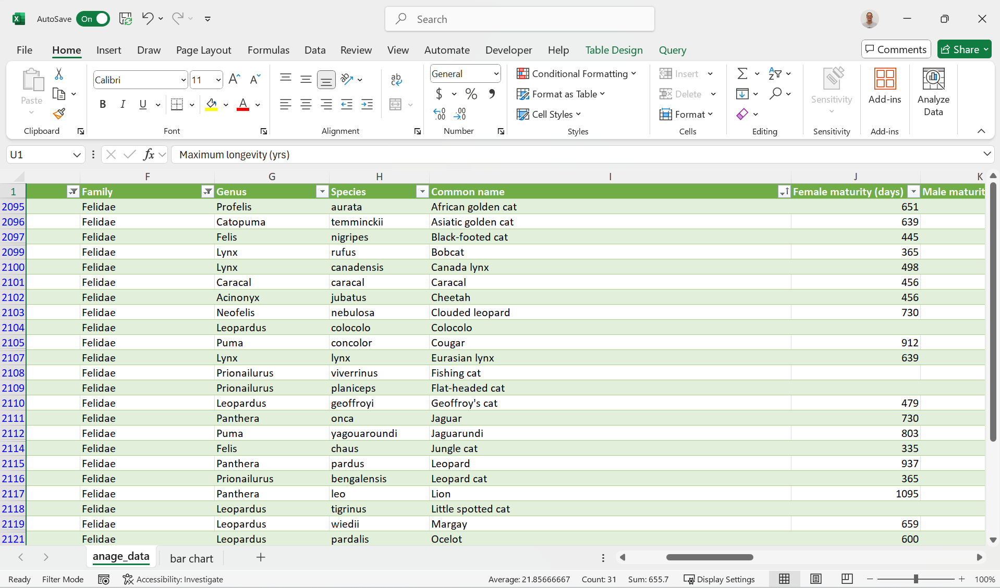
*Figure 2: Data Sheet filtered for the Felidae.*

Let's first start with a Column chart for the maximum life span for the different Felidae:

If you need more help (each individual step explained), have a look [here](https://support.microsoft.com/en-us/office/present-your-data-in-a-column-chart-d89050ba-e6b6-47de-b090-e9ab353c4c00).

*Figure 3a: Column chart representing the maximum life span for different cat species.*

>Note that providing different colors for each different bar does not provide extra information. It will confuse the reader.

Note that the Bobcat has the highest maximum life span.

In a similar way, we can also create a bar chart for the adult body weight:  

*Figure 3b: Column chart representing the adult weight for different cat species.*

Not very surprising, the lion and tiger show the highest adult weights. 

Now if you would like to compare this to the weight at birth, you could create a clustered column chart for this.

However, not every entry contains a Birth weight so we first deselect the blank rows using filters.

Next, we can create the clustered bar chart:

*Figure 4: Clustered column chart representing the animal weight at birth and the adult weight for different cat species.*

>Note that providing different colors for each different set now does provide extra information. Thus, it is highly recommended in this case.

The problem with this chart is that the birth weights are barely visible. To improve this, we can use a logarithmic scale for the y-axis:

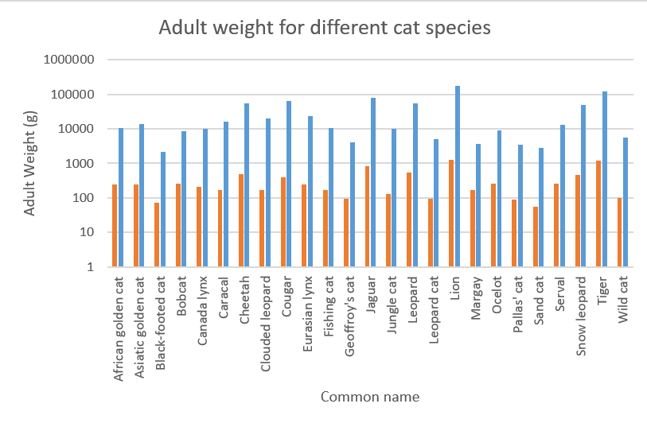
*Figure 4: Clustered column chart representing the animal weight at birth and the adult weight for different cat species. logarithmic scale.*

You could use a stacked column chart to have it all in one overview:

*Figure 5: Stacked column chart representing the animal weight at birth and the adult weight for different cat species. logarithmic scale.*

But how do these birth weights relate relatively to the adult weights?
We could calculate this but Excel provides a plot type that takes this work out of your hands:

*Figure 6: Relative stacked column chart representing the relative animal weight at birth and the adult weight for different cat species. logarithmic scale.*

Like the relative stacked column chart, the pie chart is another chart type that is suitable for such a representation.

## Pie Chart

Pie charts are suitable for displaying data that can be broken down into categories or parts that add up to a whole. They are often used to show proportions or percentages of a whole.

Pie charts are effective for conveying information quickly and intuitively, as the size of each slice corresponds to its percentage of the whole. They are also useful for highlighting the relative sizes of each category or part, making it easy to compare them at a glance.

However, pie charts may not be the best choice for all types of data. For example, they can become difficult to read when there are too many categories or when the differences between the sizes of the slices are small. In these cases, a bar chart or other visualization (Pie of Pie) may be more appropriate.

We take our previous example as an example to create a pie chart.
The problem is that there are too many categories. Therefore, we will narrow down the number of rows by focussing on big cats. According to [Wikipedia](https://en.wikipedia.org/wiki/Big_cat) The term "big cat" is typically used to refer to any of the five living members of the genus Panthera, namely the tiger, lion, jaguar, leopard, and snow leopard, as well as the non-pantherine cheetah and cougar. So we select these species first and then create the Pie Chart:

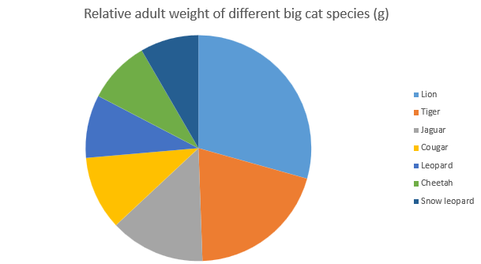
*Figure 7: Pie chart representing the relative weight of big cats in grams*

Or with the data labels and percentages shown connected to the pie slices (choose: chart design > chart elements > Data labels > Outside End):

*Figure 8: Pie chart representing the relative weight of big cats in grams. Data labels and percentages are connected to the pie slices.*

## Pie of Pie

Pie of Pie charts can become handy if the individual slices become small and the Pie chart becomes cluttered. 

Here is an example of a Pie of Pie chart with all the Feline species:

*Figure 9: Pie of Pie chart representing the relative weight of big cats in grams Data labels and percentages are connected to the pie slices.*

As you can see, the second Pie is created from the smallest Pie slices from the first Pie chart. This creates less clutter when the individual slices become to small. 

You can format the secondary Pie by right-clicking it > Format Data Series and then use the drop down to select the appropriate Split Series.

## Radar charts

A radar chart, also known as a spider chart or a star chart, is a graphical representation of data in which values are plotted along a set of axes that radiate from a central point. Each axis represents a different variable, and the data points are connected to form a polygon shape, which can be filled in with color to represent the area covered by the data.

Radar charts are often used to compare multiple variables or data sets, particularly when the values have different units or scales. 

Let's view some (imaginary) protein quantification data for 5 different protein quantification methods (Lowry, Bradford, BCA, UV/VIS and Kjeldahl). These data show the concentration of protein in mg/L. We have these data from three different protein samples.

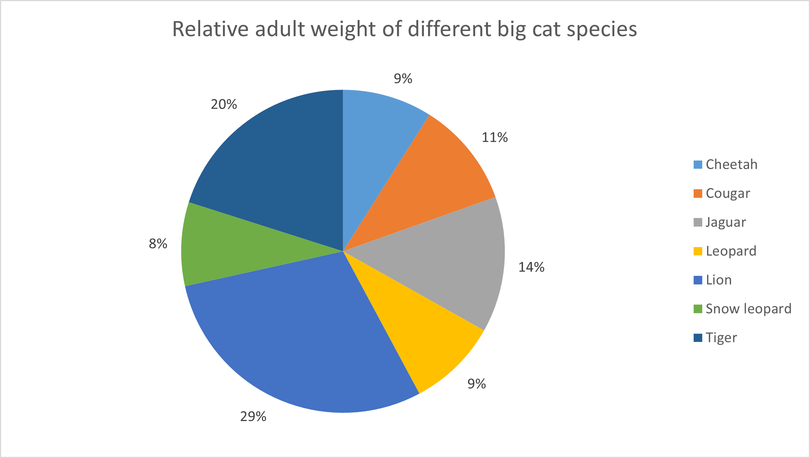
*Figure 10: Data suitable for a radar chart. Protein quantification data for different methods and different samples compared.*

The resulting radar chart is shown below:

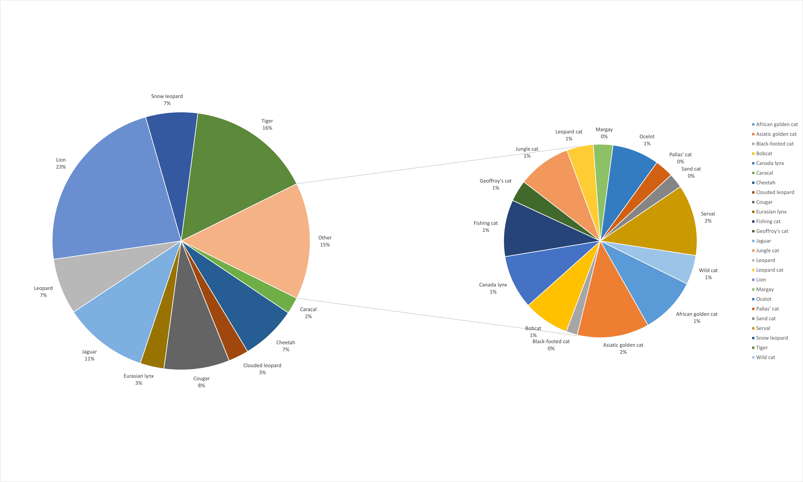
*Figure 11: Radar chart created from the previous data set. Protein quantification data for different methods and different samples compared.*

>Summary here. 

## Box plots

A box plot, also known as a box and whisker plot, is a graphical representation of a dataset that shows the distribution of the data through its quartiles, outliers and extremes. It is called a box plot because it uses a box to represent the second and third quartiles (the inter-quartile range or IQR), and lines to represent the first and fourth quartiles (the lowest and highest data points within the IQR), as well as the outliers, if any.

Box plots are useful for visualizing the distribution and spread of data, as well as for identifying potential outliers. They can also be used to compare the distribution of data between different groups or datasets. Box plots are particularly useful when the data is non-parametric (not normally distributed) or when the distribution is skewed or multi-modal.

Overall, box plots are a useful tool for summarizing and visualizing complex data sets, and for providing insights into the distribution of data and potential outliers.

Let's have a look at the following dataset:

*Figure 12: Data about calories from fat for different food categories.*

And compare the different categories for calories from fat and total calories.

The questions that can be asked are:
- What is the median value per category? 
- What are the minimum and maximum values per category?
- What are the 25% and 75% percentile values per category?
- Are there any outliers?

A box plot will answer all these questions at once:

We choose the columns `Calories from fat` and `Calories` for the series. The food categories are selected as labels. See the result below.

*Figure 13: Box plot about calories from fat for different food Categories.*

The above picture is the standard layout of the box plot in Excel. However, you could argue that it would be better to tweak some things in the plot. First of all, the mean is shown as a cross. Box plots are often used in combination with nonparametric statistics and quantile (including median) values are much more appropriate to use. In addition, inner points are visible and we can not discriminate them from outliers. Finally, we should look if our number of values (N) are odd or even. The median is included in the calculation if N is odd. The median is excluded from the calculation if N is odd. Since this varies per food category, we will choose the excluded method. We can tweak each series (select the series and choose: `Format Data Series`) accordingly. See the result below:

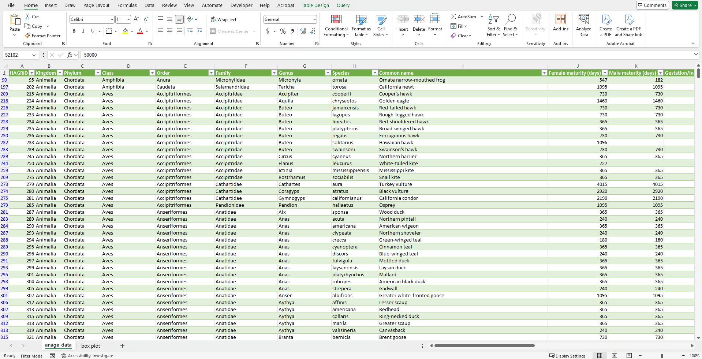
*Figure 14: Tweaked box plot about calories from fat for different food categories.*

## Line and XY-scatter plots

Line charts are useful when you want to visualize trends or changes in data over time or another continuous variable. They are particularly good for showing how a particular variable changes over time or in response to another variable. For example, a line chart can be used to show how a persons weight has changed over time. 

On the other hand, XY scatter plots are useful when you want to visualize the relationship between two variables. They are particularly useful for showing the degree of correlation between two variables or identifying outliers in the data. For example, a scatter plot can be used to show the relationship between a person's height and weight. 

In summary, line charts are best used when you want to show trends or changes over time, while XY scatter plots are best used when you want to visualize the relationship between two variables.

As an example, we take some fictive data about a weight loss program for 3 individuals (taking 3 different diets).

The data is as follows:

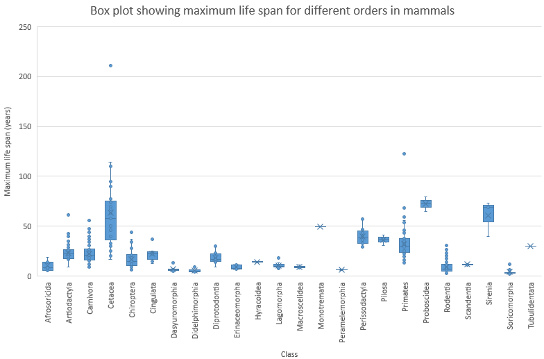
*Figure 15: Fictive data for a weight loss program for three different diets over the course of 1 year.*

The corresponding line plot looks as follows:

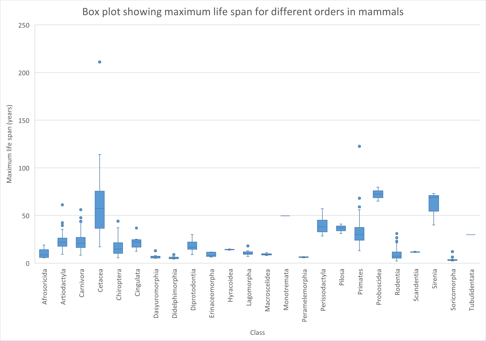
*Figure 16: Line plot of fictive data for a weight loss program for three different diets over the course of 1 year.*

As you can see, diet 2 is relatively ineffective. Not much weight loss. Diet 1 could be considered a crash diet with a sharp initial decline that halts later in the year. Diet 3 shows a very linear weight loss for a much larger period of time and could be considered the dietary intervention of choice.

Of course, one should take into account that only three persons are included in this dietary intervention.

Realize that a line chart is only plotted well if the data points are inter-spaced evenly.

Consider the following mini dataset:

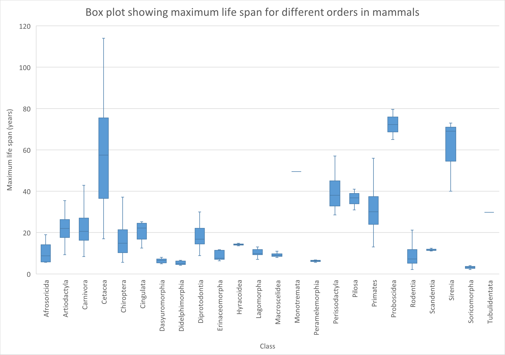
*Figure 17: Dietary intervention for 365 days.*

As you can see, the data points for x are not evenly distributed.
Plotting this with a line plot will go wrong:

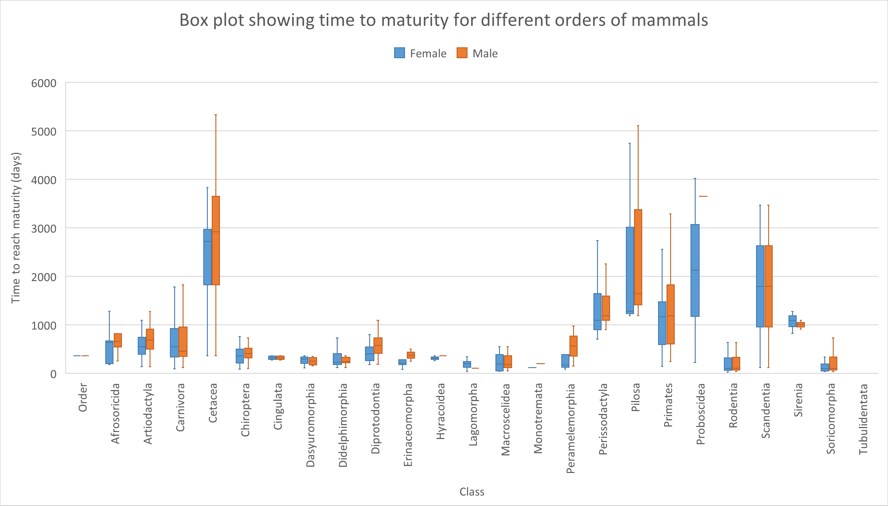
*Figure 18: Line plot for dietary intervention for 365 days.*

As you can see, the data points on the x-axis are just labels and do not correspond to their actual value. Thats why we need an XY-scatter plot for this purpose:

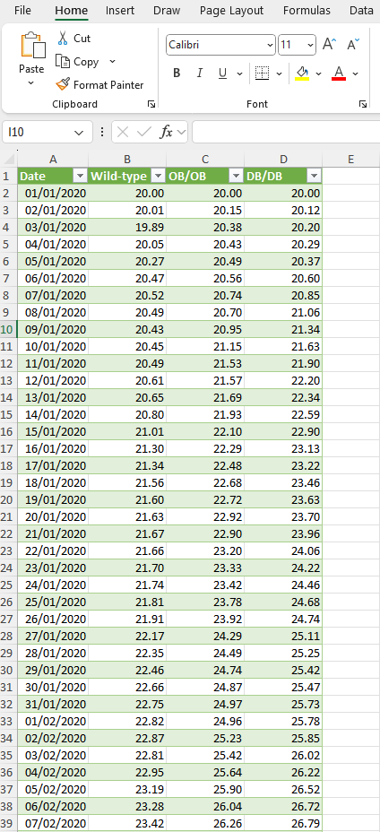
*Figure 19: XY-scatter plot for dietary intervention for 365 days.*

As you can see from the above chart, the data on the x-axis are now separated according to their value.

To show the use of an XY-scatter plot to visualize a correlation, the [ChickWeight dataset](https://github.com/selva86/datasets/blob/master/ChickWeight.csv) from R was used. The weight column represents the body weight of the chick (g). The time column represents the number of days since birth when the measurement was made.

*Figure 20: Chicken weight data set. Dataset was filtered for Diet 1*

The data of all chickens from diet 1 plotted as XY-scatter:
A linear regression model was added as trendline and the equation is shown on the chart (together with the r^2 value).

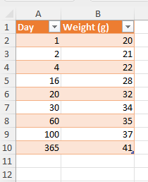
*Figure 21: Chicken weight data set plotted as XY-scatter. Dataset was filtered for Diet 1*

## Bubble chart

If you have data that is most suitable to present in a XY-grid but you have an extra dimension, bubble charts might be a good chart type.

Bubble charts are a great way to display data that includes three variables. In the context of food science, here is an example of a dataset that could be presented in a bubble chart:

Suppose you have collected data on the nutritional content of different types of fruits. Specifically, you have measured the sugar content (in grams per serving) and the vitamin C content (in milligrams per serving) of six different types of fruit: apples, bananas, oranges, strawberries, blueberries, and grapes. In addition, you have collected the number of servings per year for a particular person.

To display this data in a bubble chart, you could use the following format:

X-axis: Sugar content (grams per serving)
Y-axis: Vitamin C content (milligrams per serving)
Bubble size: Represents the number of servings per year of each fruit that were tested.
By using a bubble chart to display this data, you can quickly see patterns and trends among the different types of fruits based on their sugar and vitamin C content, as well as their number of servings per years.

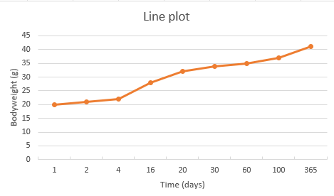
*Figure 22: data set suitable to display in a bubble chart. Note that these are fictive data.*

Below is a bubble chart of this dataset:

*Figure 23: Bubble chart of fruit data. Note that the bubble size (and the numbers in the labels) represents the number of servings per year.*

The Chart includes the following:

X-axis: Sugar content (grams per serving)
Y-axis: Vitamin C content (milligrams per serving)
Bubble size: Represents the number of servings per year of each fruit that were tested.

An extra dimension could be included by using colors. For example you could add categorical data (ordinal data in this case) such as high vitamin B9 (folate) data points in green color, intermediate vitamin B9 content as orange dots and low vitamin B9 content in red.

## Pivot charts

In the [data analysis](./excel_08_data_analysis.md) section, we have seen the use of pivot tables. Pivot tables come in handy to analyze data quickly and in an organized manner. We can use pivot charts to directly visualize the data from pivot tables.

We will use the example from the data analysis section to create a pivot chart.

Let’s pretend that we are mainly interested in comparing the average amount of calories from fat (both total and saturated) of each food category from the earlier used dataset [Nutrition facts](https://www.kaggle.com/datasets/mcdonalds/nutrition-facts) data.

*Figure 24: Nutritional facts data about different food categories of a fast food restaurant*

The corresponding pivot table was as follows:

*Figure 25: Pivot table of average calories and average calories from fat from nutritional facts data.*

So first we choose pivot chart from the ribbon and select the data source as well as the sheet for the output data:

*Figure 26: Data source and the output sheet selected.*

Next, we select the correct fields and the calculations on the data (we use average for this example).

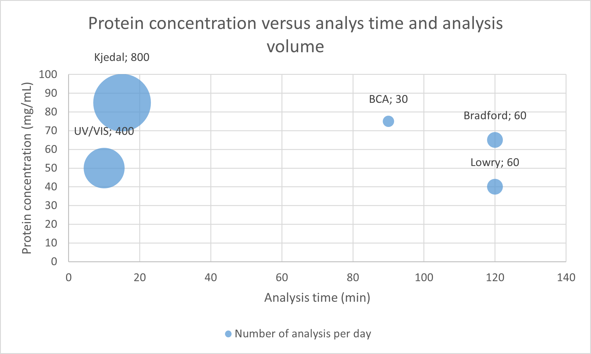
*Figure 27: Select the correct fields and calculation types.*

This results in the following chart. 

*Figure 28: Pivot chart. Average calories and average calories from fat from different food categories.*

Note that you can dynamically select or unselect specific categories. We can for example deselect the drinks:

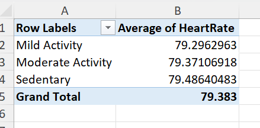
*Figure 29: Pivot chart. Average calories and average calories from fat from different food categories. Drinks deselected. *

The result of the pivot chart (drinks deselected):

*Figure 30: Pivot chart. Average calories and average calories from fat from different food categories. Drinks deselected. *

---

>This web page is distributed under the terms of the Creative Commons Attribution License which permits unrestricted use, distribution, and reproduction in any medium, provided the original author and source are credited.
>Creative Commons License: CC BY-SA 4.0.

