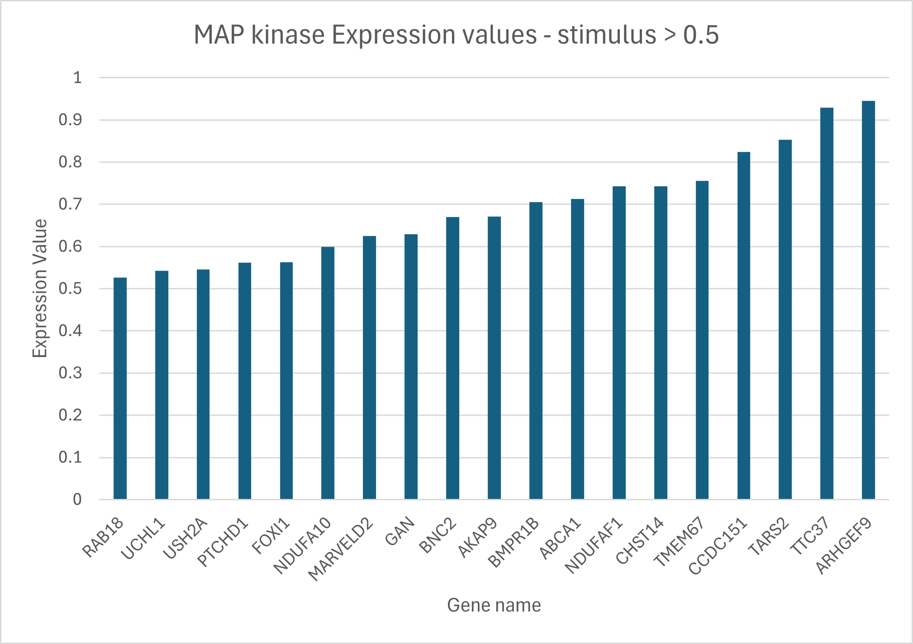
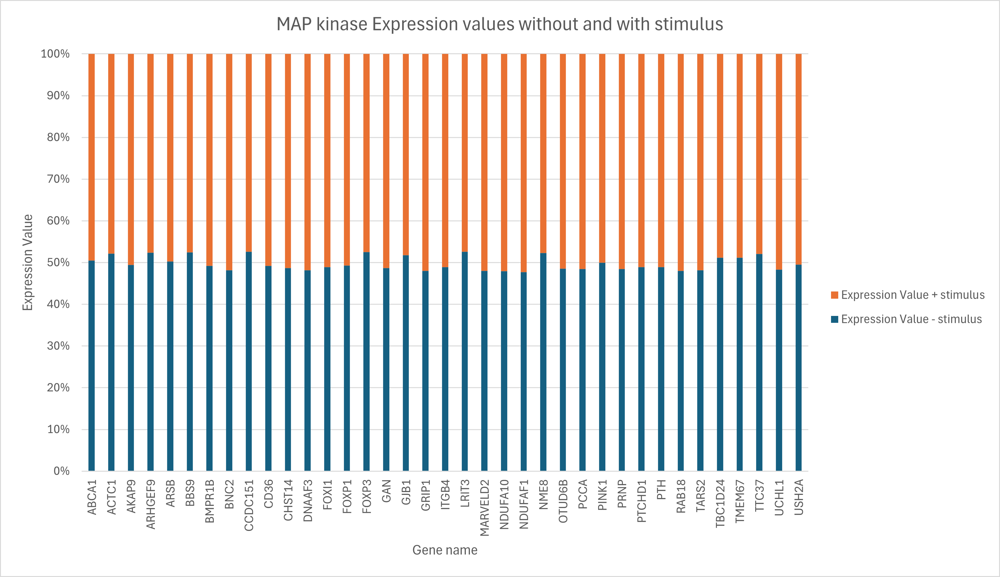
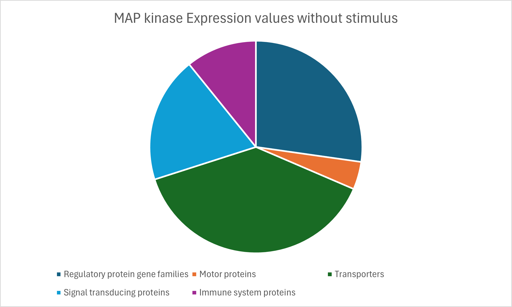
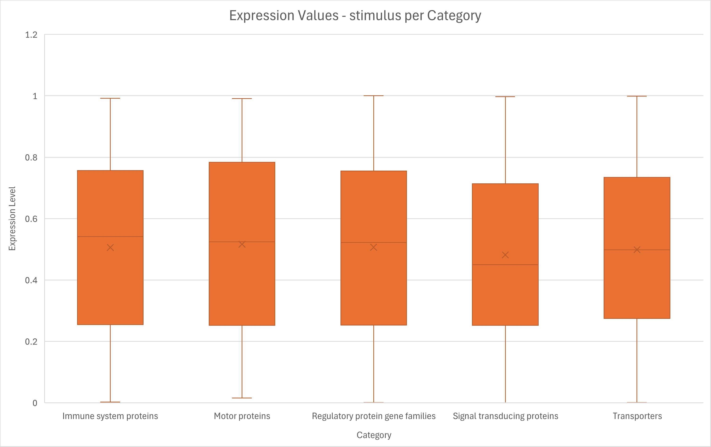
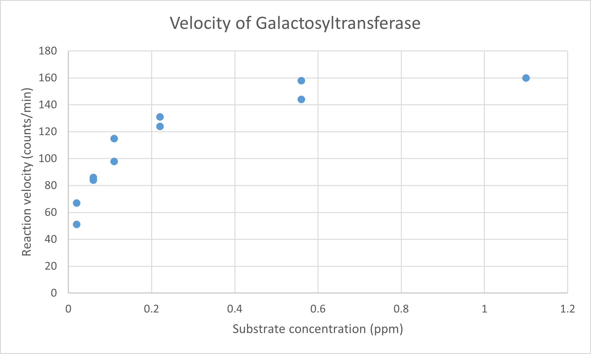



[Go back to the main page](../index.md)

# Excel Data Visualization

## Solutions

---

### Exercise 1

See the Excel file [here](./files_13_data_visualization_solutions/exercise01/exercise01.xlsx) for the solution.

Or the figure below:

There are 19 genes that pass this criteria. 
As you can see, they are sorted lowest to highest.

### Exercise 2

See the Excel file [here](./files_13_data_visualization_solutions/exercise02/exercise02.xlsx) for the solution.

Or the figure below:

### Exercise 3

See the Excel file [here](./files_13_data_visualization_solutions/exercise03/exercise03.xlsx) for the solution.

Or the figure below:

### Exercise 4

See the Excel file [here](./files_13_data_visualization_solutions/exercise04/exercise04.xlsx) for the solution.

Or the figure below:

### Exercise 5

See the Excel file [here](./files_13_data_visualization_solutions/exercise05/exercise05.xlsx) for the solution.

First we need to sum each of the different categories.
The `UNIQUE()` function can be used to retrieve the unique categories.
The `SUMIF()` function can be used to calculate the sum of each category for the Expression values without stimulus.

Thereafter, a PIE chart can be generated.

Or the figure below:

### Exercise 6

See the Excel file [here](./files_13_data_visualization_solutions/exercise06/exercise06.xlsx) for the solution.

Or the figure below:

Signal transduction proteins shows the lowest median.  

### Exercise 7

See the Excel file [here](./files_13_data_visualization_solutions/exercise07/exercise07.xlsx) for the solution.

Or the figure below:

Signal transduction proteins shows the lowest IQR (lowest height of the Whisker box).  

### Exercise 8

See the Excel file [here](./files_13_data_visualization_solutions/exercise08/exercise08.xlsx) for the solution.

Or the figure below:

Chicken number 4 and 5 on Diet number 3 gained the most in weight.  

### Exercise 9

See the Excel file [here](./files_13_data_visualization_solutions/exercise09/exercise09.xlsx) for the solution.

Or the figure below:

Alice shows a relatively low concentration of potassium for the sodium concentration (or a relatively low sodium concentration for the potassium concentration).  

### Exercise 10

See the Excel file [here](./files_13_data_visualization_solutions/exercise10/exercise10.xlsx) for the solution.

Or the figure below for the line plot (without Puromycin):

Or the figure below for the line plot (with and without Puromycin):

Puromycin acts as an activator.

### Exercise 11

Data can be cleaned in various ways. You can use (for instance) the text-to-columns feature to split on a space. But there are other strategies as well (like the `RIGHT` or `LEFT` formula).

See the Excel file [here](./files_13_data_visualization_solutions/exercise11/exercise11.xlsx) for the solution.

Or the figure below:

Motor proteins show the highest expression levels.  
Signal transducing proteins the lowest expression values.  

---

>This web page is distributed under the terms of the Creative Commons Attribution License which permits unrestricted use, distribution, and reproduction in any medium, provided the original author and source are credited.
>Creative Commons License: CC BY-SA 4.0.

