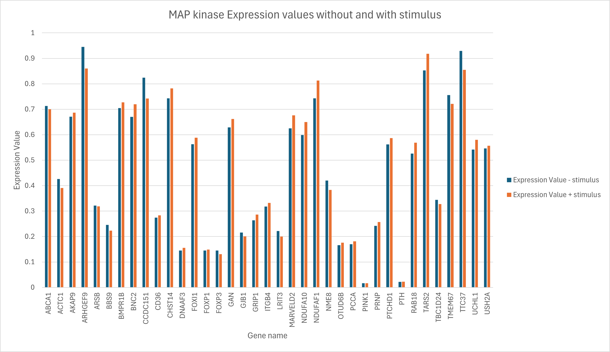
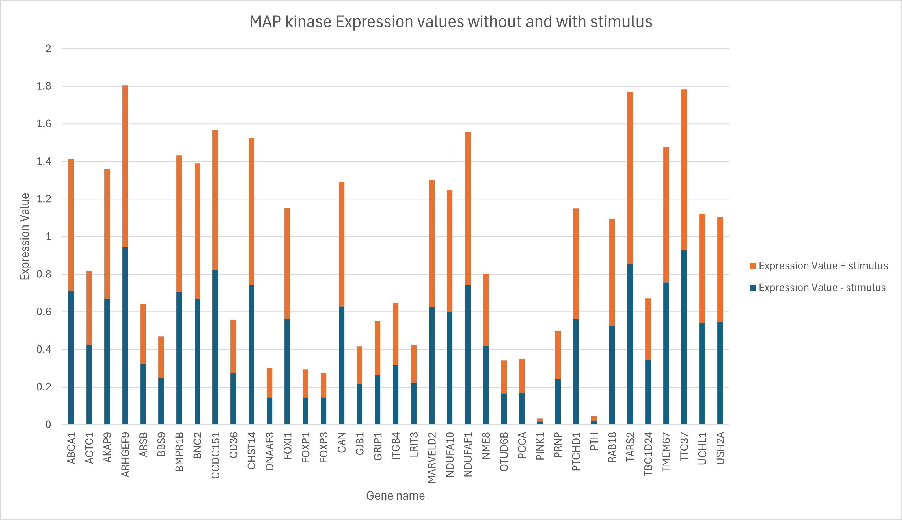
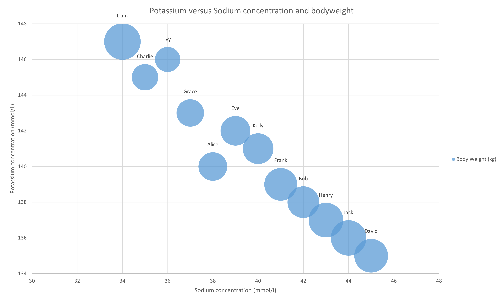
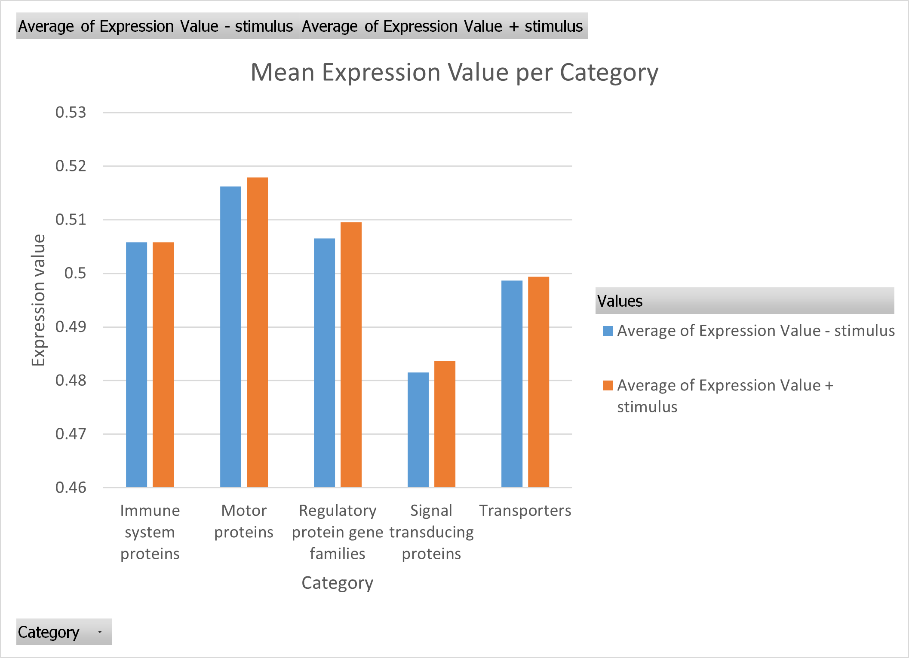



[Go back to the main page](../index.md)

# Excel Data Visualization

## Solutions

---

### Exercise 1

See the Excel file [here](./files_13_data_visualization_solutions/exercise01/exercise01.xlsx) for the solution.

Or the figure below:

Beef (beef herd) represents the highest emission value per kg food product.

### Exercise 2

See the Excel file [here](./files_13_data_visualization_solutions/exercise02/exercise02.xlsx) for the solution.

Or the figure below:

### Exercise 3

See the Excel file [here](./files_13_data_visualization_solutions/exercise03/exercise03.xlsx) for the solution.

Or the figure below:

### Exercise 4

See the Excel file [here](./files_13_data_visualization_solutions/exercise04/exercise04.xlsx) for the solution.

Or the figure below:

### Exercise 5

See the Excel file [here](./files_13_data_visualization_solutions/exercise05/exercise05.xlsx) for the solution.

Or the figure below:

### Exercise 6

See the Excel file [here](./files_13_data_visualization_solutions/exercise06/exercise06.xlsx) for the solution.

Or the figure below:

### Exercise 7

Data can be cleaned in various ways. You can use (for instance) the text-to-columns feature to split on a space. But there are other strategies as well (like the `RIGHT` or `LEFT` formula).

See the Excel file [here](./files_13_data_visualization_solutions/exercise07/exercise07.xlsx) for the solution.

Or the figure below:

Olis & Fats as well as VegetableOils show the highest energy density.  

### Exercise 8

See the Excel file [here](./files_13_data_visualization_solutions/exercise08/exercise08.xlsx) for the solution.

Or the figure below:

Chicken number 4 and 5 on Diet number 3 gained the most in weight.  

### Exercise 9

See the Excel file [here](./files_13_data_visualization_solutions/exercise09/exercise09.xlsx) for the solution.

Or the figure below:

Spinach and Parsley would be consired healthy acoording to the criteria (high K/Na ratio and low caloric).  

### Exercise 10

See the Excel file [here](./files_13_data_visualization_solutions/exercise10/exercise10.xlsx) for the solution.

Or the figure below:

### Exercise 11

Data can be cleaned in various ways. You can use (for instance) the text-to-columns feature to split on a space. But there are other strategies as well (like the `RIGHT` or `LEFT` formula).

See the Excel file [here](./files_13_data_visualization_solutions/exercise11/exercise11.xlsx) for the solution.

Or the figure below:

Olis & Fats as well as VegetableOils show the highest mean energy density. 

---

>This web page is distributed under the terms of the Creative Commons Attribution License which permits unrestricted use, distribution, and reproduction in any medium, provided the original author and source are credited.
>Creative Commons License: CC BY-SA 4.0.

