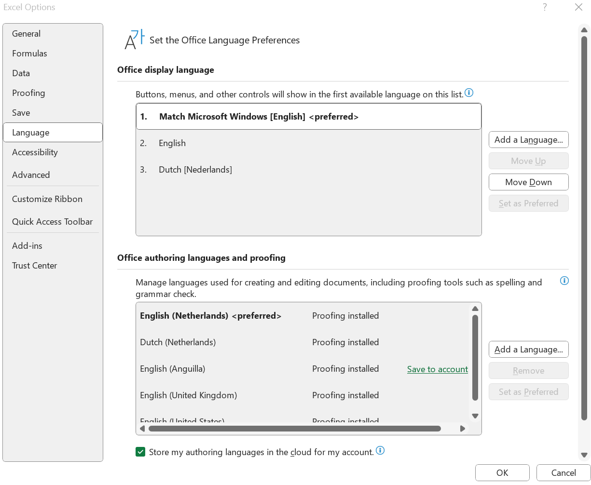
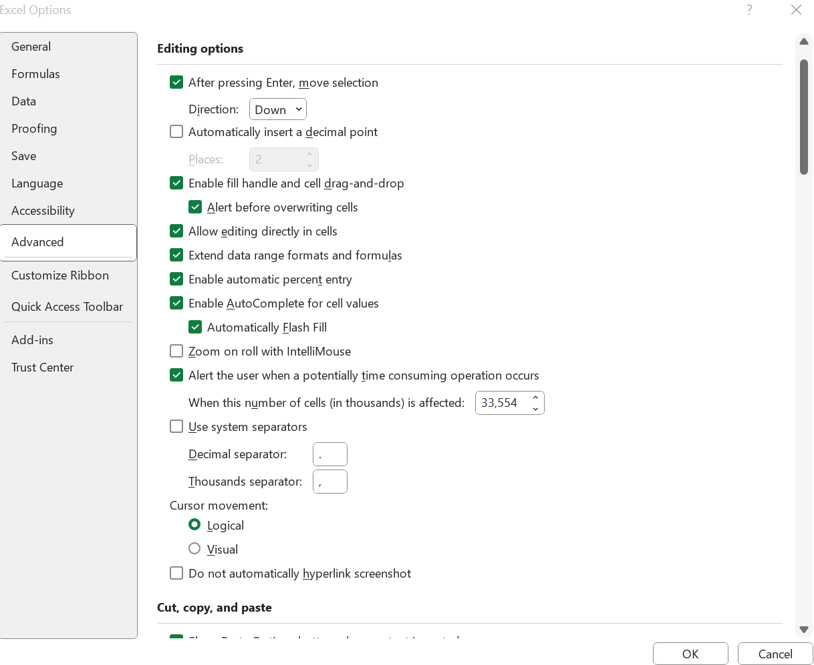
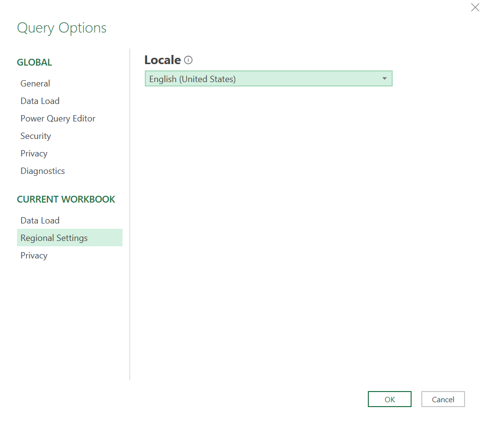
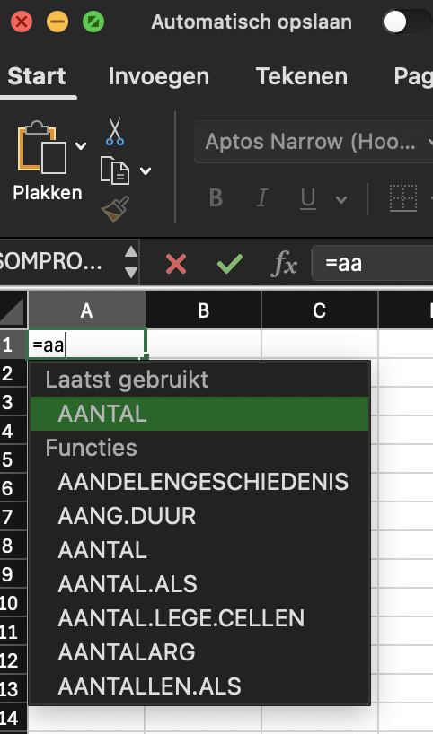
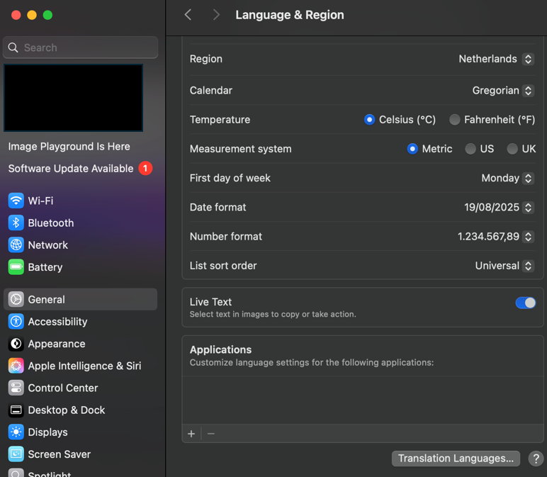
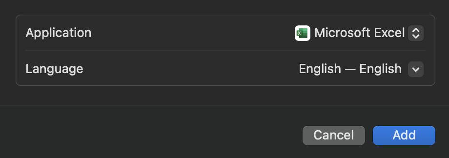
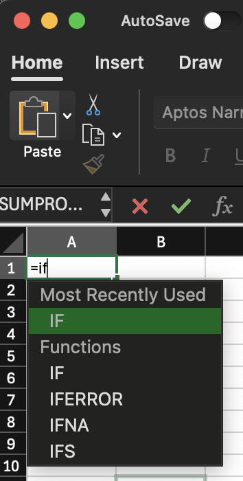




[Go back to the main page](../index.md)


# Installation of Excel, R and RStudio


---

## Windows Users


### MS Excel

As a student and employee of the Hanze University of Applied Sciences Groningen, you can download the latest version of Microsoft Office for free. This applies to both Windows and MacOS and can be done on up to five devices.

How does it work?

- Go to the website https://portal.office.com.  
- Log in with the login details you received from the Hanze.
- Follow the on-screen instructions to download and install Office.

Please note:  
- You need a valid Hanze email address to download Office.
- After your graduation or departure from the Hanze, you will no longer be able to use Office.

After the installation, it is recommended to set the Office display language to English (so that all function names in Excel are set to English).   
To do so, choose `File > More... > Options > Language > English`


*<sub>Figure 1. Set language to English</sub>*

In addition, set the decimal separator to a dot.  

`File > More... > Options > Advanced > Use system separators`

Here you can deselect this option and set the decimal separator to a dot and the thousands separator to a comma. 


*<sub>Figure 2. Set decimal separator</sub>*

Alternatively, on Windows, you can set the decimal separator at the OS level. To do so, click the Windows button and type `intl.cpl`. Then click `Additional settings`. Here you can specify your decimal separator at the OS level.

At last, it is recommended to set the regional settings of PowerQuery to United States.

`Data > Get Data > Query Options > Regional Settings > English (United States)`


*<sub>Figure 3. Set Regional Settings for PowerQuery to English</sub>*

### R and RStudio

First download and install R at:  

https://cran.rstudio.com/

Download R for Windows. Choose install R for the first time.  
Download the 64 bit package.  
Follow the on screen instructions and choose the default settings.

Next download and install RStudio at:  
https://posit.co/download/rstudio-desktop/

Choose DOWNLOAD RSTUDIO DESKTOP FOR WINDOWS.
Follow the on screen instructions and choose the default settings.

Install tidyverse in RStudio using:

```
install.packages("tidyverse")
```


## Mac Users


### MS Excel

As a student and employee of the Hanze University of Applied Sciences Groningen, you can download the latest version of Microsoft Office for free. This applies to both Windows and MacOS and can be done on up to five devices.

How does it work?

- Go to the website https://portal.office.com.  
- Log in with the login details you received from the Hanze.
- Follow the on-screen instructions to download and install Office.

Please note:  
- You need a valid Hanze email address to download Office.
- After your graduation or departure from the Hanze, you will no longer be able to use Office.

After the installation, it is recommended to set the Office display language to English (so that all functions are set to English).   

To do so, see the instructions below.  
First check your language settings in Excel:  



*<sub>Figure 4. Formulas are Dutch</sub>*

Set Language & Region to English in the system settings of your Mac OS.  

Here you can change your region settings. Set the region to United States.


*<sub>Figure 5. Change regional settings.</sub>*

Under Applications you can also set Excel to English.



*<sub>Figure 6. Switch Excel to English.</sub>*

Check the language setting in Excel.


*<sub>Figure 7. Formulas are now set to English.</sub>*

### R and RStudio

First download and install R at:  

https://cran.rstudio.com/

Download R for Mac OS.  
Check your [system information](https://support.apple.com/en-ie/guide/mac-help/syspr35536/mac) if you have an older Intel based Mac or a newer Apple silicon (M1,2,..) based Mac.

Download the 64 bit package (pkg file).  
Follow the on screen instructions and choose the default settings.

Next download and install RStudio at:  
https://posit.co/download/rstudio-desktop/

Download the DMG file and drag to your Applications.
Follow the on screen instructions and choose the default settings.

Install tidyverse in RStudio using:

```
install.packages("tidyverse")
```


## Linux

### MS Excel

Other than a Windows VM there's currently no easy workaround to run Microsoft Office natively on Linux.  
The web version obviously works but lacks a lot of features.
See: https://www.microsoft.com/nl-be/microsoft-365/free-office-online-for-the-web

### R and RStudio

You can install R on Ubuntu 24.04 using:

```
sudo apt-get install r-base
```

The easiest way to install RStudio on Ubuntu Linux is by installing the Snap package:

```
sudo snap install rstudio
```

The easiest way to install Tidyverse is using apt from the Ubuntu repository:

```
sudo apt install r-cran-tidyverse
```

For other distro's (Fedora, OpenSuse) installers can be downloaded at: https://posit.co/download/rstudio-desktop/  
To the best of our knowledge, there is currently no FlatPak version available.

## Chromebooks

Chromebooks are very limited for data analysis and not supported.  

### MS Excel

The web version of Excel obviously works but lacks a lot of essential features.
See: https://www.microsoft.com/nl-be/microsoft-365/free-office-online-for-the-web

### R and RStudio

RStudio can be run from the web with limited capabilities.  
See the posit cloud website: https://posit.cloud/

You can [install Linux on a Chromebook](https://support.google.com/chromebook/answer/9145439?hl=en) but we have never tested it.

---


>This web page is distributed under the terms of the Creative Commons Attribution License which permits unrestricted use, distribution, and reproduction in any medium, provided the original author and source are credited.
>Creative Commons License: CC BY-SA 4.0.

