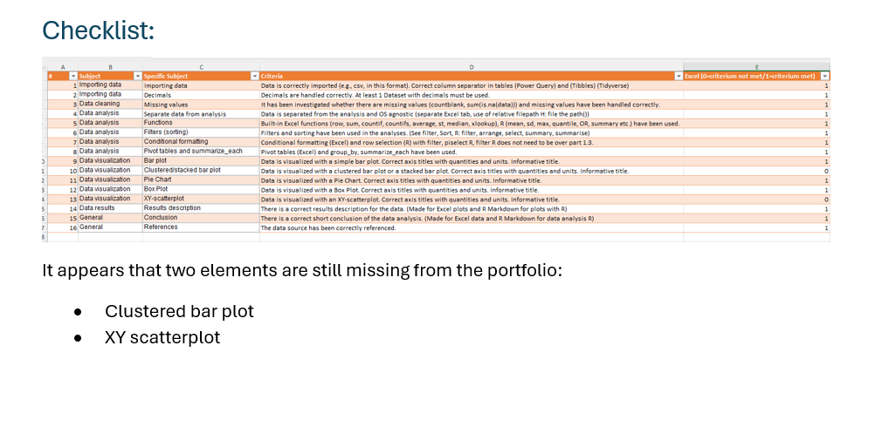
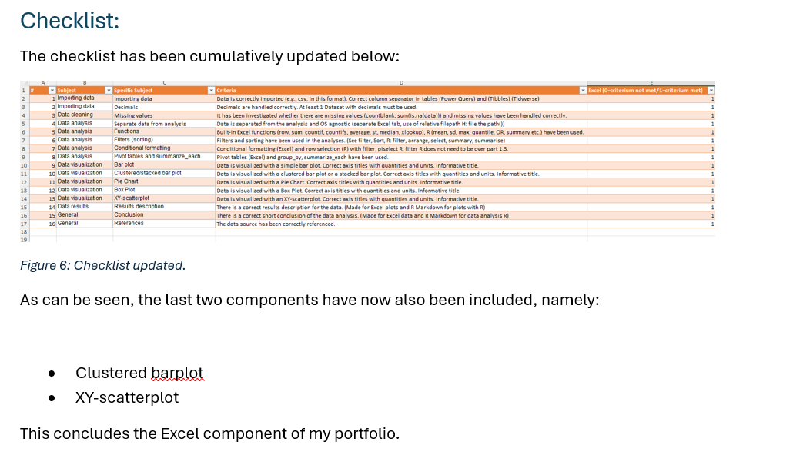
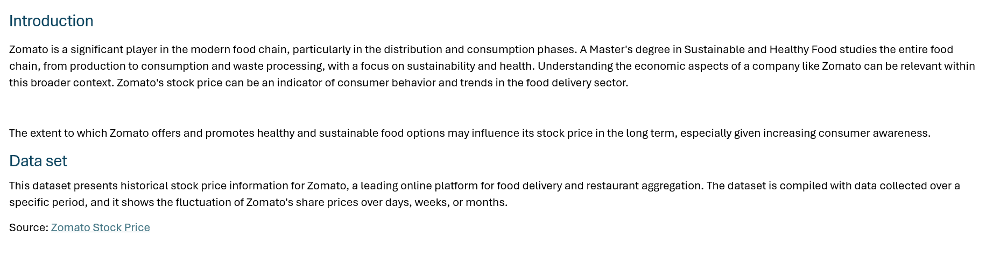
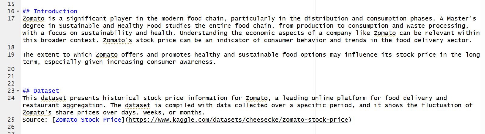
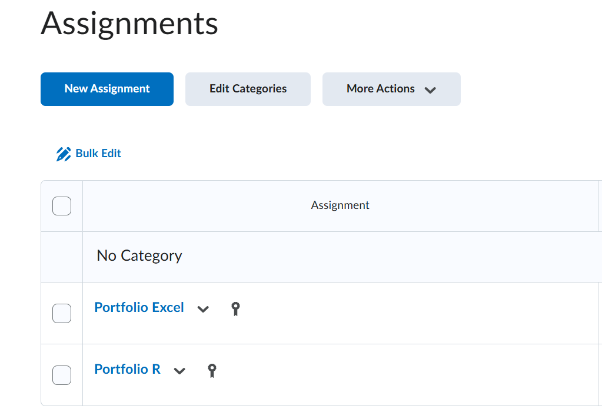




---

[Go back to the main page](../index.md)

---

## Links

- [Checklist](./01_checklist/checklist_data_analysis_portfolio.xlsx)
- [Example portfolio Excel](./02_example_portfolio/example_portfolio_excel.zip)
- [Example portfolio R](./02_example_portfolio/example_porfolio_R.zip)

---

# Example Portfolio

## The Portfolio Assignment

This document outlines the requirements and expectations for your portfolio, designed to showcase your data analysis skills. Think of this as a structured project where you'll apply what you've learned to a real-world dataset. The provided example portfolio aims for a 7.5 level, but you can certainly aim higher!

## Your Workflow: Step-by-Step

Follow these steps to complete your portfolio effectively:

### Dataset Selection:

Search for datasets, for example [Kaggle](https://www.kaggle.com/), and explore the vast collection of datasets. Choose one that genuinely interests you and allows for meaningful analysis relevant to topics covered. In particular, consider datasets from the field of Life Sciences but data sets from other fields are also allowed.  

Crucially, once you've selected your dataset, provide its direct link in the Excel file your instructor will provide. This step is vital to prevent duplicate datasets from being used by different students.

>In order to fulfill all the requirements, you may need to use multiple datasets (see below). 

### Structure of the Portfolio:

Adhere strictly to the **example portfolio's** (see link above) structure. This ensures consistency and helps you present your analysis logically and comprehensively. Don't deviate from this structure unless explicitly instructed or if you have a compelling, justified reason.  

Keep the following in mind:  

- Create a separate folder for the Excel analysis and the R analysis.  
- For each, adhere to the directory hierarchy showed below.  
- Create a zip file for both project folders.  
- Upload both zip files separately in Brightspace.  


### Directory Hierarchy:

Let's take a look at the Example Excel portfolio. The directory hierarchy is as follows:

```
├── example_portfolio_excel.zip/
│   ├── example_portfolio_excel/
│   │   ├── analysis_1_calories_food/
│   │   │   ├── checklist_data_analysis_portfolio.xlsx
│   │   │   ├── analysis/
│   │   │   │   ├── calories_food.docx
│   │   │   │   ├── calories_food.xlsx
│   │   │   ├── data/
│   │   │   │   ├── nutrients_csvfile.csv
│   │   │   │   ├── nutrients_csvfile_modified.csv
│   │   │   │   ├── source.txt
│   │   ├── analysis_2_zomato_stock_price/
│   │   │   ├── checklist_data_analysis_portfolio.xlsx
│   │   │   ├── analysis/
│   │   │   │   ├── zomato_stock_price_analysis.docx
│   │   │   │   ├── zomato_stock_price_analysis.xlsx
│   │   │   ├── data/
│   │   │   │   ├── zomato.csv
```

Likewise, the zip file for R has the following directory structure:

```
├── example_portfolio_R.zip/
│   ├── example_porfolio_R/
│   │   ├── analysis_1_calories_food/
│   │   │   ├── checklist_data_analysis_portfolio.xlsx
│   │   │   ├── analysis/
│   │   │   │   ├── Calories_food.Rmd
│   │   │   │   ├── pics/
│   │   │   │   │   ├── fig01.png
│   │   │   │   │   ├── fig02.png
│   │   │   ├── data/
│   │   │   │   ├── nutrients_csvfile.csv
│   │   │   │   ├── nutrients_csvfile_modified.csv
│   │   │   │   ├── source.txt
│   │   ├── analysis_2_zomato_stock_price/
│   │   │   ├── checklist_data_analysis_portfolio.xlsx
│   │   │   ├── analysis/
│   │   │   │   ├── zomato_stock_price_analysis.Rmd
│   │   │   │   ├── pics/
│   │   │   │   │   ├── fig01.png
│   │   │   │   │   ├── fig02.png
│   │   │   ├── data/
│   │   │   │   ├── zomato.csv

```

You Can use as many datasets as required to meet all the requirements for the checklist (see below). Number your analysis like the example above. If you need to modify your dataset, make sure that you rename it `filename_modified.csv`. This clearly indicates that you made modifications to the source file. These modifications should be explained and justified in the corresponding analysis text.


### The Checklist

You can download the **checklist** (see link above) from this page. Go through each item on this list meticulously. Note a 1 (one) if the corresponding item is present and a 0 (zero) if not. For every row, not only check it off but also clearly justify within your portfolio how you've addressed that requirement. At the end of each analysis, write a  dedicated section to justify the checked items and show a screenshot. This demonstration of compliance is essential for assessing your portfolio. 

An example:  

The first analysis is about the calories in various food products and can be found under within the subfolder `analysis_1_calories_food`. The last paragraph is about the checklist. Put a screenshot of the checklist and also clearly describe what items are missing:




As you can see, the clustered bar plot and the XY-scatterplot are not included in the first analysis. The main reason for this is that the dataset was not suitable for this type of analysis. Therefore a second analysis was performed. The analysis can be found within the subfolder `analysis_2_zomato_stock_price`. Note that the name of the subfolder starts with `analysis_2`. This way, the folder will show as a second item in a file explorer. The last paragraph concerns the checklist again. 



Note that the checklist is check marked cumulative. This means that the previous checklist is used as a starting point to check the last two items (Clustered barplot and XY-scatterplot). This works well only if the analysis folders are also named in a logical manner:  
- `analysis_1_calories_food`  
- `analysis_2_zomato_stock_price`  
If you organize your work in a similar logical way, your instructor will be able to easily determine if all the requirements are met before grading your portfolio.

>If you do not adhere to these guidelines, your portfolio will not be graded!  

### Relative filepaths

Use relative filepaths in your project folders for the analysis in R. The primary reason to use relative filepaths is to ensure portability of your project. Also, use OS-agnostics filepaths so that your analysis can be run on Windows, Mac and Linux computers (all these different OSes are used by your instructors and definitely later in your research team).  

Example:  

Wrong (absolute path Unix system like Mac OS or Linux):
```
/mnt/data/example_portfolio_R_extracted/example_porfolio_R/analysis_1_calories_food/data/nutrients_csvfile.csv
```

Wrong (absolute path Windows system):
```
C:\Users\<YourUsername>\Downloads\example_portfolio_R_extracted\example_porfolio_R\analysis_1_calories_food\data\nutrients_csvfile.csv
```

Right (relative path for Windows and Unix system like Mac OS or Linux):
```
../data/nutrients_csvfile.csv
```

Also make your path OS agnostic:  
Wrong (will break on Unix system like Mac OS or Linux):
```
..\data\nutrients_csvfile.csv
```

Right (will work on all listed systems):

```
../data/nutrients_csvfile.csv
```

Even better: use the `file.path()` function.
Example code:

```
data_path <- file.path("..", "data", "nutrients_csvfile.csv")
data <- read_csv(data_path)
```

### Self plagiarism

As both the Word file and the Rmd file contains the analysis of the same dataset, self plagiarism is allowed.  

Example Word:



Example in Rmd:




### Use of LLM (large language models/generative AI)

Some use of generative AI is permitted but do not rely to heavily on it. It is allowed for debugging little mistakes in your code and correcting and rephrasing small paragraphs. What is not allowed is to use LLM to do entire analysis and create Rmd files from prompts. The resulting code often has a typical "signature" and if instructors suspect that entire blocks of codes or large parts of the text is AI generated, a CGI (involving two instructors) may follow (see below).

### Stronger Narratives and Interpretations

Don't just show plots; tell a story with your data. Clearly articulate what each visualization reveals, connect findings across different analyses, and draw insightful conclusions that directly address potential research questions or hypotheses.
Robust Justification: Consistently explain why you made certain decisions (e.g., why you chose a particular method for handling missing data, why a specific plot type was best suited for a certain variable).
By putting in the extra effort and thoughtful consideration, you can significantly enhance your portfolio and demonstrate a deeper understanding of data analysis principles. 

### What if your dataset does not support specific skills?

Imagine that your dataset is already clean and does not require any cleaning. In that case show what you would have done if missing data was present. Also show how you would handle duplicate rows etc. You can modify your raw data (see above, make sure you rename your file) and show how you would handle missing data and duplicate rows and missing column headers et cetera.

### Beyond the Basics

The example portfolio is a solid foundation, aiming for a 7.5-8.0. To achieve an even higher score, consider these enhancements:

- **Go Beyond Basic Analysis**: Don't just present descriptive statistics. Dive deeper with more advanced analytical techniques (for example, include statistical tests, basic predictive modeling such as linear regression) if applicable).
- **Expand Your Visualizations**: While standard plots (histograms, bar charts, scatter plots) are necessary, incorporating additional, more complex plot types can significantly boost your score. 

Think about:
- Radar charts for comparing multiple quantitative variables of a few items.
- Bubble charts to visualize three dimensions of data in a two-dimensional plot.
- Heatmaps for complex correlation matrices or categorical relationships.
- Or by creatively utilizing other advanced or less common plot types from the extensive libraries offered by tools like Excel and R's ggplot2.


### Submission

Once you're confident that all components are complete and polished, zip your folders (as two separate zip files) and upload and share your zipped portfolio via BrightSpace using the corresponding Excel and R links.  



### Review and Feedback:

Your instructor will first evaluate if all the requirements are met based on your portfolio and the checklist. If this is the case, your instructor will evaluate your portfolio using the rubric shown below. Make sure you're familiar with this form beforehand to understand the grading criteria. Finally, you'll receive your graded rubric via Brightspace. If your instructor suspects the work submitted relies too heavily on AI assistance (beyond code corrections, paragraph edits and rephrasing), it could lead to an investigation for CGI (Communication, Discussion, insight interview). Two instructors will be involved in the CGI.

### CGI

As described above, if your instructor suspects that your work too heavily relies on the use of AI, you will have a brief 15-minute CGI (Communication, Discussion, Insight) session with your instructor and a second instructor. If it turns out that you are not able to explain the process of your analysis and code, the portfolio will not be evaluated any further.


### Rubric (grading scheme)

The Rubric is organized as follows:

|0 points|2 points    |3 points|4 points|5 points|
|:-------|:-----------|:-------|:-------|:-------|
|not done|unsatisfied |satisfied for basic analysis|good analysis and proper conclusions and description|analysis beyond the basics and excellent descriptions|

The items that are scored (both and Excel and R) are:

- Data Import
- Data Cleaning
- Data Analysis
- Data Visualization

The weight of these items is not equal. The weights of the corresponding items and the scaled points can be found in the table below:

|Item              |Weight|Scaled Points (max)|
|:-----------------|:-----|:------------------|
|Data Import       |2     |10                 |
|Data Cleaning     |1     |5                  |
|Data Analysis     |3     |15                 |
|Data Visualization|4     |20                 |


The grade for Excel and R will be calculated as follows:

$Grade = \frac{aquired \ points}{total \ points} \cdot 10$  

You will receive a grade for Excel and a grade for R.
The Excel part counts for 40% and the R for 60%.  
So your end grade will be:  

$End \ grade = 0.4 \cdot Excel \ grade + 0.6 \cdot R \ grade$


Good luck! 🍀


---

[Go back to the main page](../index.md)  
<a href="#top">⬆️ Back to Top</a>  

---


>This web page is distributed under the terms of the Creative Commons Attribution License which permits unrestricted use, distribution, and reproduction in any medium, provided the original author and source are credited.
>Creative Commons License: CC BY-SA 4.0.

