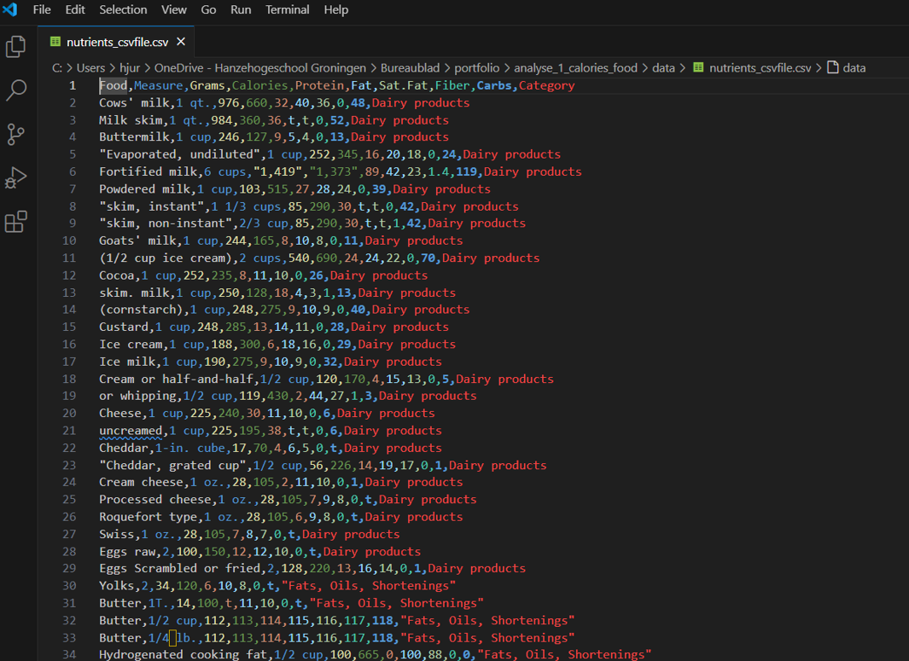
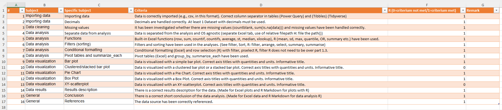

# Analysis of calories in various food products

Name student: Jane Doe
Student number: 123456
Date: 2025-04-10
  

## Introduction
In today's society, there's a widespread awareness regarding food consumption. Quantifying caloric intake and reducing lipid consumption are common recommendations from dietitians and nutritionists. Therefore, knowledge about the nutrient composition of various foods is essential. The dataset analyzed in this report comprises a comma-separated values (CSV) file with data from over 300 food products. For each item, the quantities of calories, lipids, proteins, saturated fatty acids, carbohydrates, and dietary fibers are labeled. Furthermore, the food products are classified into different categories, such as desserts, vegetables, fruits, and so on.

## Dataset
The dataset originates from Kaggle  [Kaggle](https://www.kaggle.com/datasets/niharika41298/nutrition-details-for-most-common-foods).  
The dataset uses [Wikipedia](https://en.wikipedia.org/wiki/Table_of_food_nutrients) as a reference.


## Aim
The primary goal of the data analysis of this dataset is to quantify and compare the calorie content between different food groups and within individual food groups.
The analysis specifically aims to provide the following insights:

•	Identification of the food group(s) with the highest average calorie content. This helps us determine which categories of food generally contribute the most to total energy intake.
•	Identification of the specific food item within the food group that has the highest average calorie count. This pinpoints individual food items that could significantly contribute to high calorie consumption.
•	Identification of the item within the entire dataset with the highest number of calories.
•	Highlighting items with a caloric amount higher than the median.


## Loading libraries

```{r}
library(tidyverse)
```


## Data Import

First, the data was viewed in Visual Studio Code. A screenshot can be seen below.



Looking at the file, it's a CSV file with the comma as the column separator and decimals separated by a period.  
Next, I loaded the file in R via `read_csv`:

```{r}
folder <- "data"
file_name <- "nutrients_csvfile.csv"
file_path <- paste0("../", folder, "/", file_name) # ../ means one directory higher
df1 <- read_csv(file_path)
head(df1)
```

The 'Calories' column is being incorrectly imported as a character data type.
This is the same problem as encountered in Excel.

Check for the elements.

```{r}
head(df1$Calories)
```

Identify the item:

```{r}
df1 %>%
  filter(Calories == "8-44")
```


So here too, elements with a range (8-44).
Check if there are also blanks present (which have been loaded as NAs):

```{r}
df1 %>%
  summarise(missing_calories = sum(is.na(Calories)))
```

One `NA` value was found to be loaded. This was blank and is read as `NA` by default by `read_csv`.

Identify the item:

```{r}
df1 %>%
  filter(is.na(Calories))
```

Consistent with the Excel analysis: `Frozen Peas`.

## Cleaning

Removing the relevant rows:

```{r}
df2 <- df1 %>% 
  filter(!Calories == "8-44")
```


Check if the row is indeed removed:

```{r}
df2 %>%
  filter(Calories == "8-44")
```

Correct! The row is removed.

Now, remove the missing value:

```{r}
df3 <- df2 %>% 
  filter(!Food == "Frozen peas")
```

Check if the row is indeed removed:

```{r}
df3 %>%
  filter(Food == "Frozen peas")
```

Correct! The row is removed.

Now, set the column to the correct data type:

```{r}
df4 <- df3 %>% 
  mutate(Calories = as.numeric(gsub(",", "", Calories))) #gsub will remove the comma's.
head(df4)
```

The `Calories` column is now being read correctly.

## Identification of the food group(s) with the average highest and lowest calorie content

To calculate the averages per category, a new dataframe is created by first grouping all similar category values. Then, the `summarize_each` function is used with the `mean`. Subsequently, the relevant columns are selected.

```{r}
df5 <- df4 %>%
  group_by(Category) %>%
  select(4) %>%
  summarize_each(funs(mean)) 
df5
```

Or via across (new way to achieve this):

```{r}
df5 <- df4 %>%
  group_by(Category) %>%
  summarise(across(Calories, mean)) 
df5
```


Now, create a bar plot from this data:

```{r}
p <- df5 %>% ggplot(aes(x = Category, y = Calories)) +
  geom_bar(stat="identity", fill="steelblue") +
  labs(title="Average of calories from different categories") +
  theme(axis.text.x = element_text(angle = 90, hjust=1, vjust=0.5))
p
```

In this chart, you can see that seeds and nuts have, on average, the highest calorie content, while vegetables have the lowest.

To gain more insight into the data's distribution, I also created a Boxplot:

```{r}
p <- df4 %>%
  ggplot(aes(x = `Category`, y = `Calories`)) + 
  geom_boxplot() +
  labs(title="Calories for different food categories") +
  theme(axis.text.x = element_text(angle = 90, hjust=1, vjust=0.5))
p
```

Here too, it's evident that seeds and nuts rank highest (showing the highest median). Bread and breakfast exhibits a wide spread in its data.

## Identifying the Specific Food Item with the Highest Average Calorie Content

To identify the food items with the highest calorie count within the category that has the highest average, I first filtered for the `Seeds and Nuts` category.

```{r}
df6 <- df4 %>% 
  filter(Category == "Seeds and Nuts")
head(df6)
```

Subsequently, the bar plot was created:

```{r}
p <- df6 %>%
  ggplot(aes(x = Food, y = Calories)) +
  geom_bar(stat="identity", fill="steelblue") +
  labs(title="Average of calories from different Food and Nuts items") +
  theme(axis.text.x = element_text(angle = 90, hjust=1, vjust=0.5))
p
```

Based on this, Brazil nuts and Roasted and salted can be classified as having the highest calories.

I then also created a pie chart for this analysis:


```{r}
p <- df6 %>%
  ggplot(aes(x = "", y = Calories, fill = Food)) +
  geom_bar(stat="identity", width=1) +
  coord_polar("y", start=0) +
  labs(title="Average of calories from different Food and Nuts items") +
  theme_void() # remove background, grid, numeric labels
p
```

## Identifying the Food Item with the Highest Calorie Content Across the Entire Dataset

That's an excellent point! It's absolutely true that an individual item could have an exceptionally high calorie count, even if its overall food group doesn't rank as the highest on average. This is why looking at the absolute highest and lowest values across the entire dataset is crucial for a complete picture.

Therefore, an analysis was also performed on the absolute highest and lowest values within the entire data set.  


The Row with the Highest Value:

```{r}
df4 %>%
  filter(Calories == max(Calories))
```

The Row with the Lowest Value:

```{r}
df4 %>%
  filter(Calories == min(Calories))
```


## Filtering for items with a higher caloric amount than the median.

To select food items with a high caloric value, I used the median. The median is more robust than the mean and less susceptible to individual outliers. I first calculated the median of the calorie count:

```{r}
med_val <- df4 %>%
  summarise(med_val = median(Calories, na.rm = TRUE)) %>%
  pull(med_val)
med_val
```

The number of rows that are higher than the median:

```{r}
df4 %>%
  summarise(count_above_median = sum(Calories > med_val))
```

Next, I sorted for rows with calories higher than the median, and then sorted those by calories from highest to lowest:

```{r}
df7 <- df4 %>% 
  filter(Calories >  med_val) %>% 
  arrange(desc(Calories))
df7
```

## Conclusion and Discussion:

The analysis of calorie content across over 300 food items, categorized into various groups, reveals significant variations. Seeds and nuts were identified as the food group with the highest average calorie count, while vegetables generally showed the lowest calorie content. Within the seeds and nuts category, Brazil nuts and roasted, salted nuts contained the highest individual calorie counts. Notably, pure vegetable oil was identified as the food item with the absolute maximum calories in the entire dataset. Conversely, two food items were found to have a calorie content of zero.

By calculating the median calorie content and applying it for conditional formatting, food items with a relatively high calorie content were visually highlighted in the dataset. These findings underscore the wide range of calories within different food groups and individual products.

The results can be valuable for consumers looking to monitor their calorie intake, as well as for professionals in the food industry and healthcare. The wide spread within some categories, such as bread and cereals, suggests that further, more detailed analyses within these groups could be beneficial.


## Checklist:



It appears that two elements are still missing from the portfolio:
•	Clustered bar plot
•	XY scatterplot

