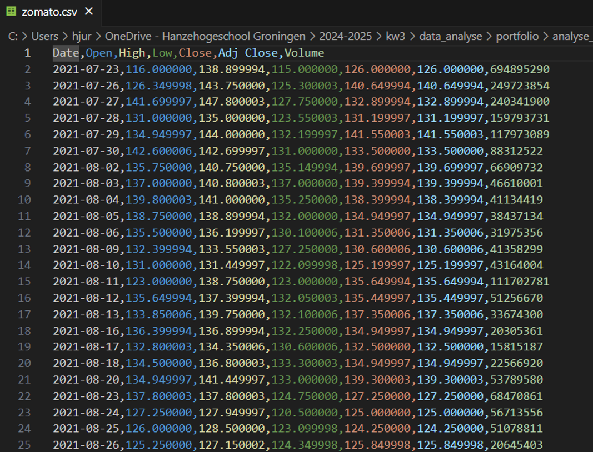
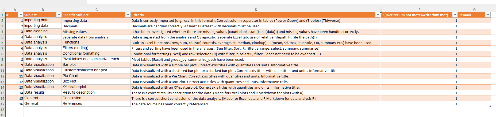

# Zomato Stock Price Analysis

Student Name: Jane Doe
Student ID: 123456
Date: 2025-04-10
  

## Introduction
Zomato is a significant player in the modern food chain, particularly in the distribution and consumption phases. A Master's degree in Sustainable and Healthy Food studies the entire food chain, from production to consumption and waste processing, with a focus on sustainability and health. Understanding the economic aspects of a company like Zomato can be relevant within this broader context. Zomato's stock price can be an indicator of consumer behavior and trends in the food delivery sector.

The extent to which Zomato offers and promotes healthy and sustainable food options may influence its stock price in the long term, especially given increasing consumer awareness.


## Dataset
This dataset presents historical stock price information for Zomato, a leading online platform for food delivery and restaurant aggregation. The dataset is compiled with data collected over a specific period, and it shows the fluctuation of Zomato's share prices over days, weeks, or months.
Source: [Zomato Stock Price](https://www.kaggle.com/datasets/cheesecke/zomato-stock-price)


## Aim
The primary goal of the data analysis of this dataset is to track the stock price over time. Is there an upward or downward trend visible in the last few years? Later, it can then be examined whether the extent to which Zomato offers and promotes healthy and sustainable food options might influence the stock price.

## Loading libraries

```{r}
library(tidyverse)
```


## Loading the Data

The data was first viewed in Visual Studio Code: 



The file appears to be a CSV with commas as column separators and periods for decimals.
I then loaded the file into R using `read_csv`:

```{r}
folder <- "data"
file_name <- "zomato.csv"
file_path <- paste0("../", folder, "/", file_name) # ../ betekent eerst een directory hoger
df1 <- read_csv(file_path)
head(df1)
```

The data appears to have loaded correctly.

## Cleaning

Check if there are no NAs present in the data frame:

```{r}
dim(df1)
dim(drop_na(df1))
```

Both data frames have the same dimensions, so there are no NA values.

Can calculations be performed with the stock prices?

```{r}
mean(df1$High)
```

The first column is also of the date type.

No further cleaning was required.


## Stock Price Analysis

To create an XY-Scatter plot, the data must first be made tidy.

```{r}
df2 <- df1 %>%
  gather(`High`, `Low`, key = "Type", value = "Price") 
head(df2)
```


An XY-scatter plot of the stock prices was then created:

```{r}
p <- ggplot(data= df2, aes(x = Date, y = Price, group = `Type`)) +
  geom_line(aes(color = `Type`)) +
  labs(title="Zoamto Stock Price")
p
```

It can be seen that the stock price decreased between February and August 2022, but increased again between March and October.

A grouped bar plot will be created to visualize the differences between the lowest price, the median, and the highest price over this entire period.

First, a data frame with the data needs to be created:

```{r}
high <- summary(df1$High)
low <- summary(df1$Low)
index <- c(1, 3, 6)
df3 <- tibble("Measurement" = c("Minimum", "Median", "Maximum"), 
               "low" = as.vector(low[index]),
               "high" = as.vector(high[index]))
df3 
```

Make Tidy and Sort:

```{r}
df4 <- df3 %>%
  gather(`low`, `high`, key = "low or high", value = "Stock Price") 
df4
```

We Can change the first two columns to factors that support levels. In that way, we can control the order in the bar graph:

```{r}
df4$Measurement <- factor(df4$Measurement, levels = c("Minimum", "Median", "Maximum"), order = T)
df4
```

The same for low or high:

```{r}
df4$`low or high` <- factor(df4$`low or high`, levels = c("low", "high"))
df4
```


Now, create a grouped bar plot from this data:

```{r}
p <- ggplot(data = df4, aes(x = Measurement, y = `Stock Price`, fill = `low or high`)) +
  geom_bar(stat = "identity", position="dodge") +
  labs(title="Minimum, Median and maximum Stockprice") +
  theme(axis.text.x = element_text(angle = 45, hjust=1))
p
```


## Conclusion and discussion:

The analysis of Zomato's historical share price reveals significant fluctuations in the stock price over the period examined. A clear decline was observed between February and August 2022, followed by a recovery and increase from March to October. The spread between the lowest and highest daily share prices is substantial, with a minimum around 40 dollars and a maximum around 150 dollars. Further research can focus on explaining these fluctuations, possibly in relation to factors such as market conditions and the extent to which Zomato offers and promotes sustainable and healthy food options.

## Checklist:



As can be seen, the last two components have now also been included, namely:

- Clustered barplot
- XY-scatterplot

This concludes the Excel component of my portfolio.


