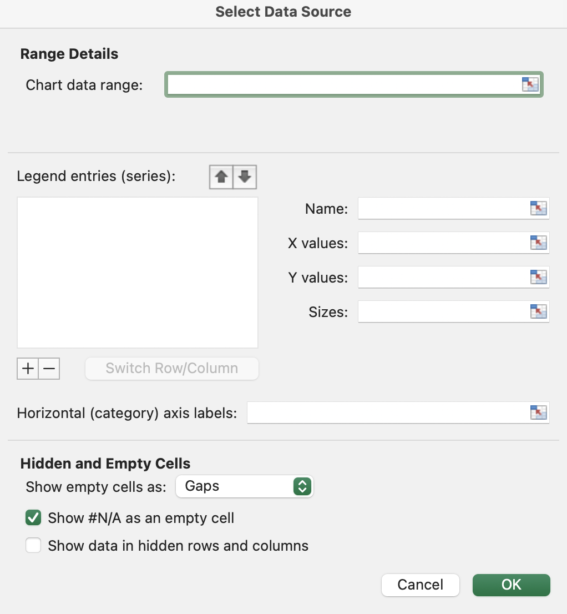
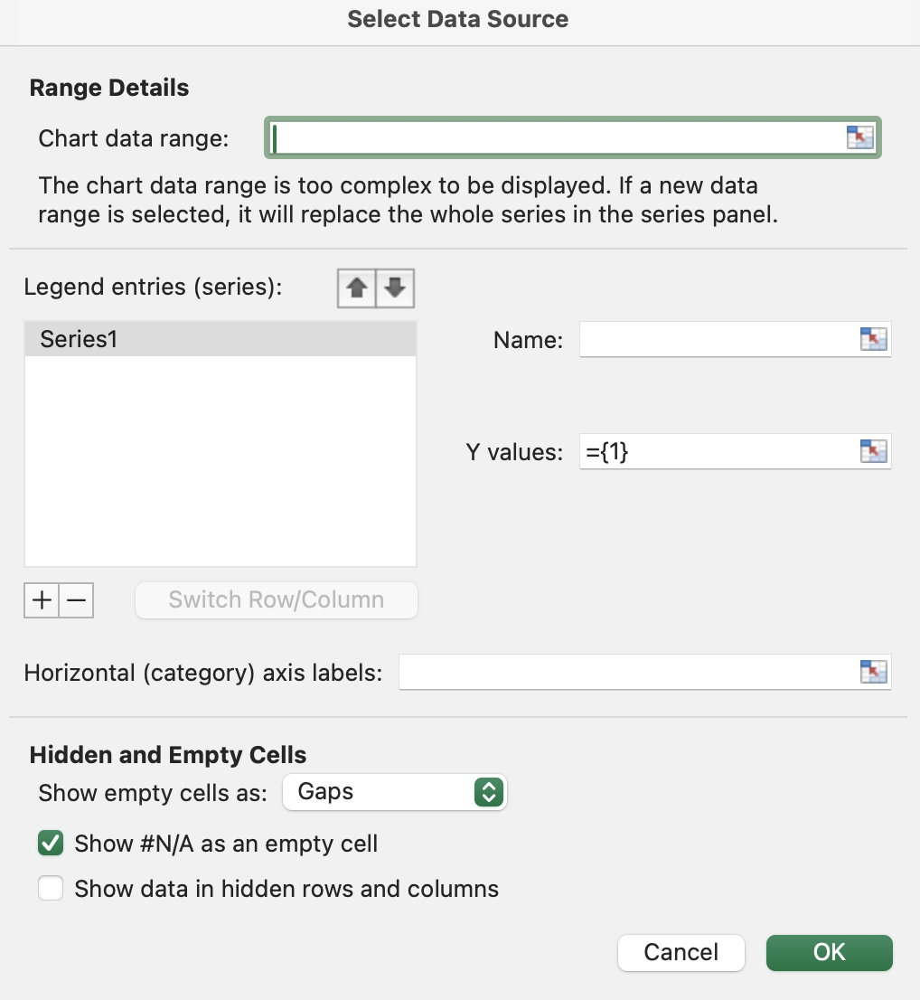
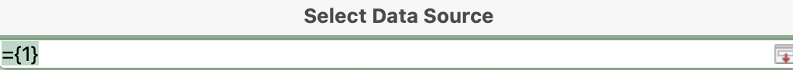
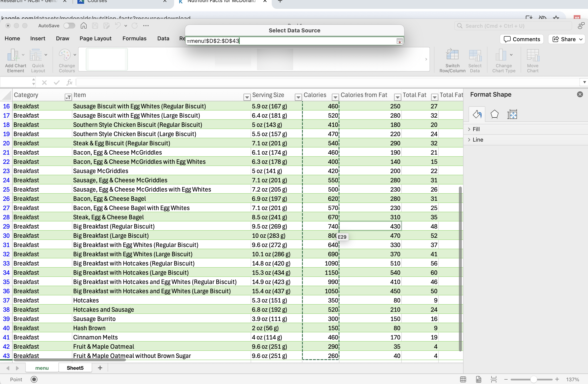
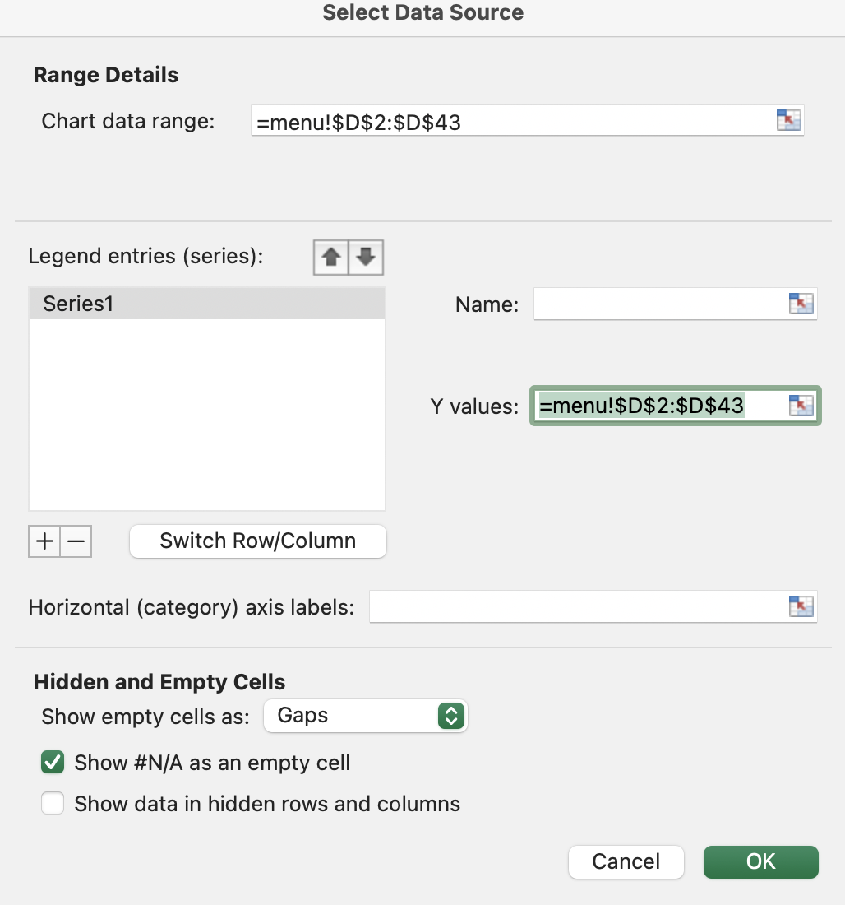
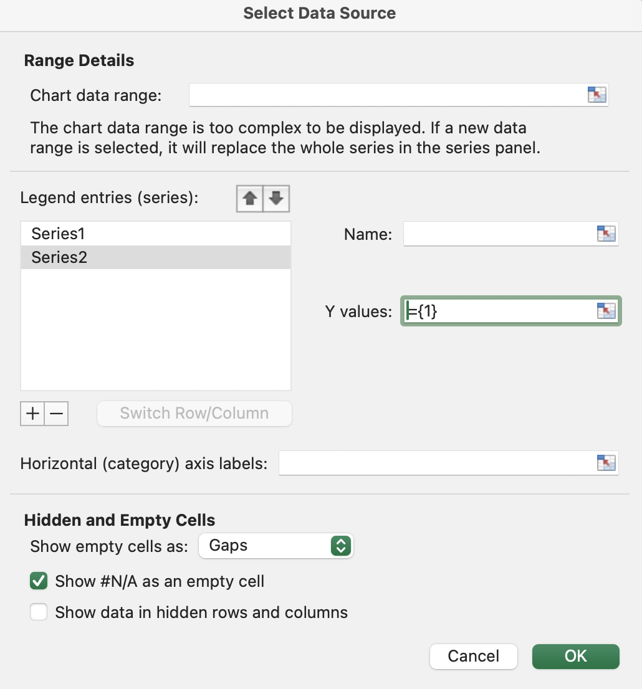
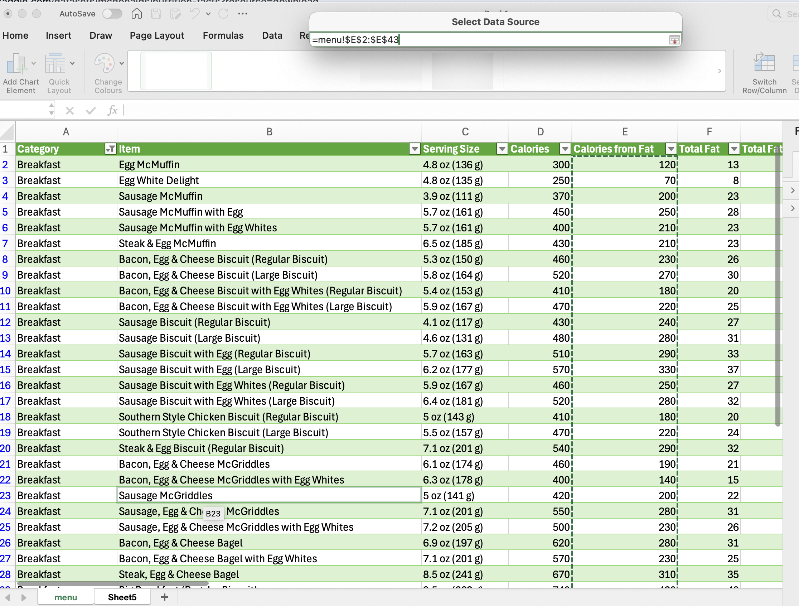
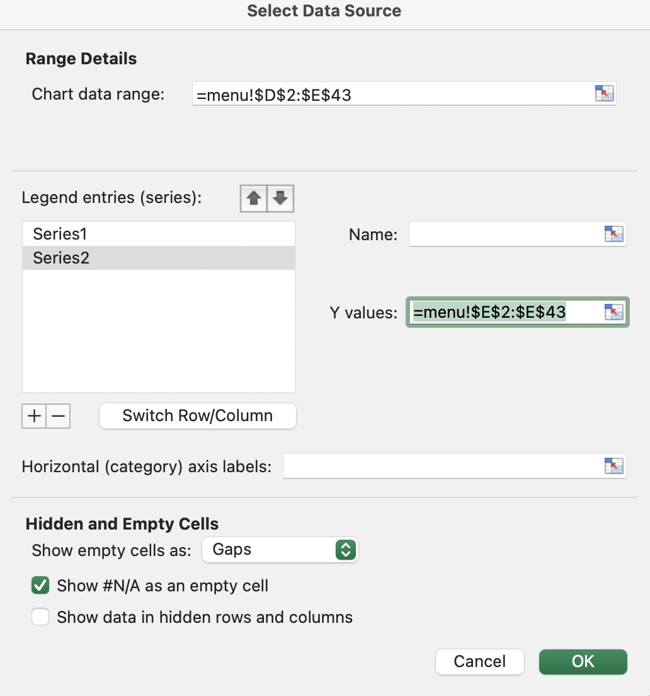
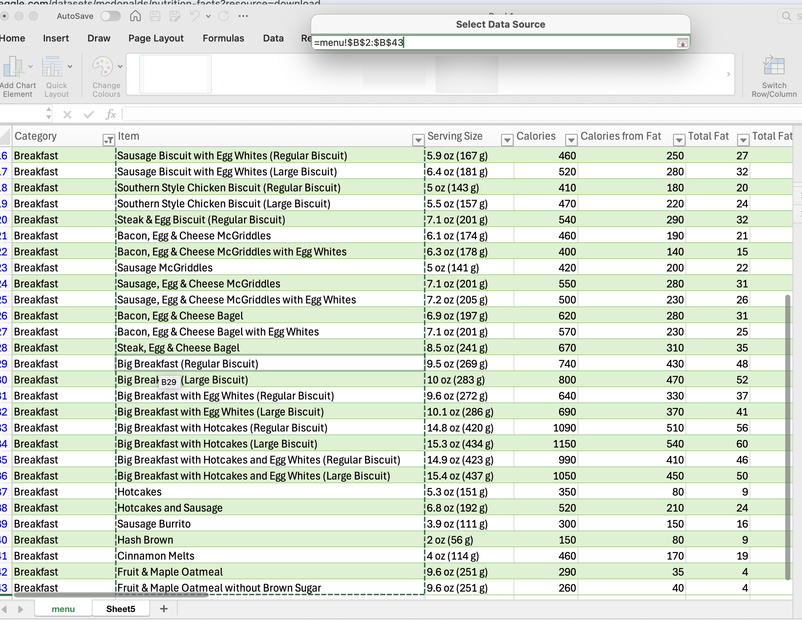
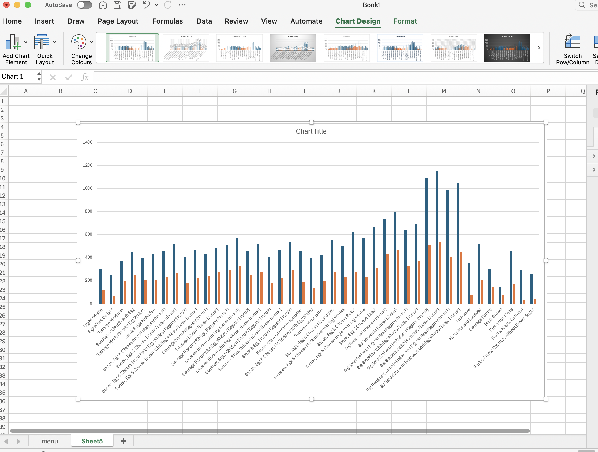




[Go back to the main page](../index.md)


# Excel plotting for Mac users


---

## Excel plotting

Herewith some screenshots for creating Microsoft Excel plots om a Mac.
The OS version used was 15.3.1 (Sequoia).  
Office version: 16.95.3

Dataset used can be accessed [here](https://www.kaggle.com/datasets/mcdonalds/nutrition-facts).

Data was loaded using PowerQuery. 
Category filtered was: Breakfast.

First start with creating a clustered column graph.

```
Insert > Clustered Column
```


*<sub>Figure 1. Insert clustered column graph.</sub>*

Press the `+` sign to add a dataseries.


*<sub>Figure 2. The first series is added.</sub>*

Now select the y-values from the `menu` sheet:


*<sub>Figure 3. Remove text from selection box.</sub>*

>Note: remove any text in the selection box!


*<sub>Figure 4. Text removed from selection box.</sub>*

Select the data range `calories`.


*<sub>Figure 5. Data range selected.</sub>*

The series is now added:


*<sub>Figure 6. The selection is added to the first series.</sub>*

Now add the second series:



*<sub>Figure 7. The second series is added.</sub>*

Now select the second data range `calories from fat` on the `menu` sheet and add it to the series.


*<sub>Figure 8. The second series is added.</sub>*

Now the second series is selected.


*<sub>Figure 9. The selection is added to the second series.</sub>*

Add the horizontal category axis labels:


*<sub>Figure 10. The horizontal axis labels are selected.</sub>*

Now click on OK and your graph will be displayed.


*<sub>Figure 11. The clustered column graph result.</sub>*

>Sometimes you will encounter some warnings. In most cases this can be resolved by removing anything from the selection box.


---


>This web page is distributed under the terms of the Creative Commons Attribution License which permits unrestricted use, distribution, and reproduction in any medium, provided the original author and source are credited.
>Creative Commons License: CC BY-SA 4.0.

